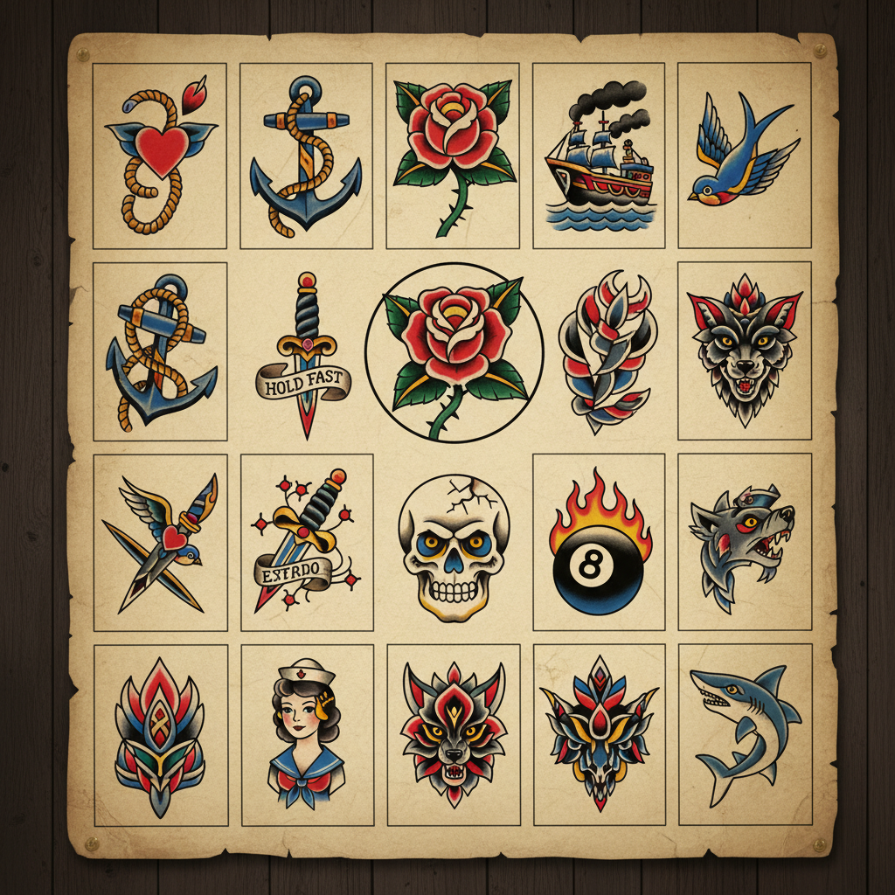

# Tattoo Art 纹身艺术

> **时期：** 史前–至今  
> **关键词：** 皮肤画布、永久标记、部落传统、亚文化身份、当代艺术

## 概述

Tattoo Art（纹身艺术）是人类最古老的身体装饰形式之一，从波利尼西亚的部落图腾到日本的浮世绘全身纹身，从水手的锚和心到当代的写实肖像纹身。纹身将人体皮肤变为永久的画布，每一种风格都承载着特定的文化记忆、身份认同和美学传统。

## 风格特征

- **Old School**：粗黑轮廓、有限色彩、经典图案
- **日式**：浮世绘风格的大面积彩色纹身
- **写实**：照片级别的肖像和场景
- **几何/点刺**：精密的几何图案和点阵
- **水彩**：模拟水彩画效果的无轮廓纹身

## 代表人物与作品

- 三代目彫よし（日式传统纹身大师）
- Sailor Jerry（美式Old School）
- Kat Von D（写实肖像纹身）
- Dr. Woo（精细线条纹身）

## 概念图

