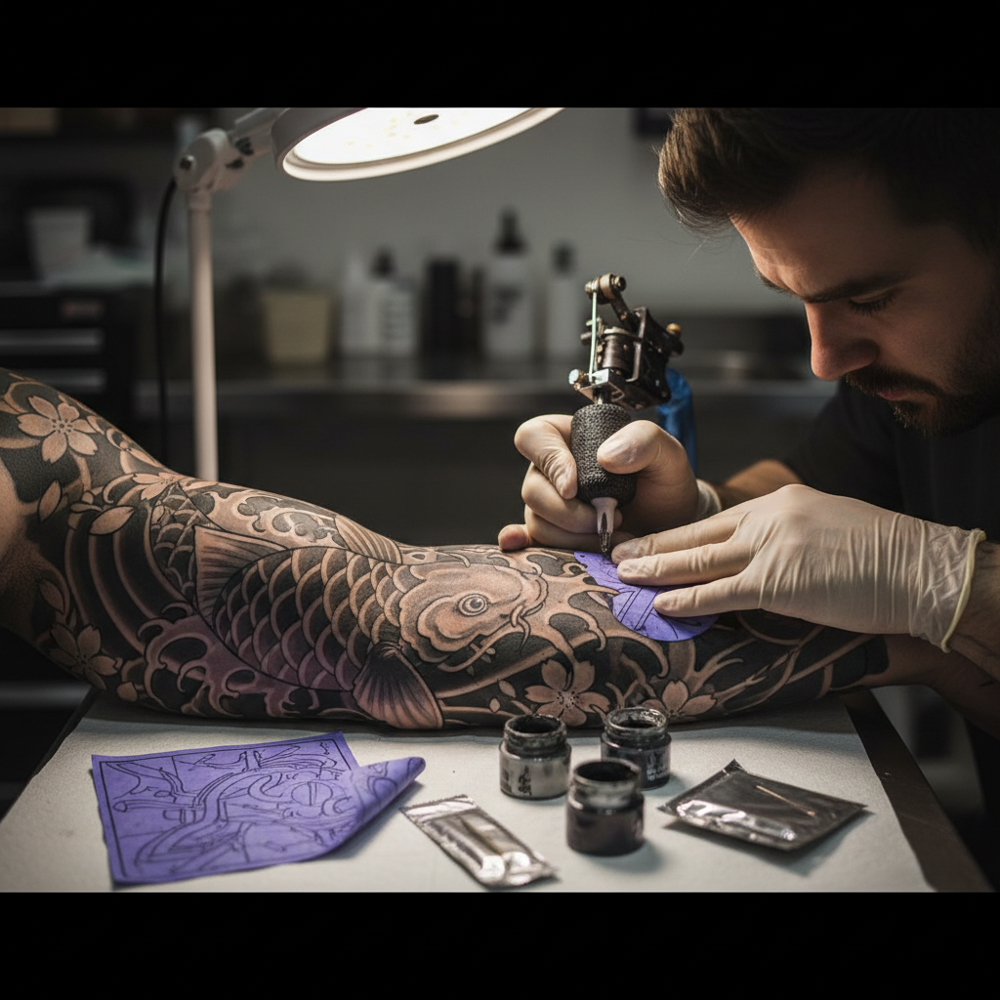

# Tattooing 纹身艺术

> "The body is the oldest canvas — tattooing is humanity's first permanent art." — Unknown

## 概述

纹身艺术（Tattooing）是将颜料注入皮肤真皮层创造永久图案的人体装饰艺术。从5300年前的冰人奥兹到波利尼西亚的部落纹身，从日本的浮世绘全身纹身到当代的写实主义纹身，纹身是人类最古老、最普遍、最持久的艺术形式之一——它将身体本身变成了画布，将艺术与生命融为一体。

纹身的哲学在于：承诺——每一个纹身都是一个永久的决定，一个刻在身体上的故事，一个不可撤销的宣言。

## 核心特征

| 特征 | 描述 |
|------|------|
| 永久 | 注入皮肤的永久图案 |
| 身体 | 以人体为画布 |
| 疼痛 | 创作过程伴随疼痛 |
| 个人 | 高度个人化的表达 |
| 文化 | 深厚的文化象征意义 |
| 多样 | 极其多样的风格和传统 |

## 视觉特征

- **线条**：清晰的轮廓线条
- **色彩**：从黑灰到全彩
- **曲面**：适应身体曲面
- **细节**：精细的细节表现
- **风格**：多种风格并存
- **叙事**：图案的叙事性

## 代表作品

| 作品 | 艺术家 | 年代 | 意义 |
|------|--------|------|------|
| *Ötzi tattoos* | 匿名 | 公元前3300年 | 最古老的纹身 |
| *Polynesian tatau* | 匿名 | 传统 | 波利尼西亚纹身传统 |
| *Japanese irezumi* | 匿名 | 江户时代+ | 日本全身纹身 |
| *Sailor Jerry flash* | Norman Collins | 1930s-70s | 美国传统纹身 |
| *Contemporary realism* | Various | 2000s+ | 当代写实纹身 |

## 历史时间线

| 时期 | 事件 |
|------|------|
| 公元前3300年 | 冰人奥兹——最古老的纹身 |
| 古代 | 各文明的纹身传统 |
| 传统 | 波利尼西亚、日本等纹身文化 |
| 18世纪 | 欧洲水手带回纹身文化 |
| 1891 | 电动纹身机的发明 |
| 1970s-90s | 纹身的文化复兴 |
| 当代 | 纹身作为主流艺术形式 |

## 中国语境

纹身在中国有复杂的文化历史——古代中国既有装饰性纹身（如越人断发文身），也有惩罚性刺字（如"刺配"）。传统儒家文化中"身体发肤受之父母"的观念使纹身长期被边缘化。但当代中国的纹身文化正在快速发展，中国纹身师在国际纹身界有越来越高的地位，特别是在水墨风格和东方美学纹身方面。

## AI生成概念图

## 与其他风格的关系

- **Body Art** → 人体艺术包含纹身
- **Folk Art** → 民间纹身传统
- **Illustration** → 插画风格的纹身
- **Calligraphy** → 书法纹身
- **Japanese Art** → 日本浮世绘纹身
- **Tribal Art** → 部落纹身传统

---

*浮光艺志 | Chronicle of Artistry*
