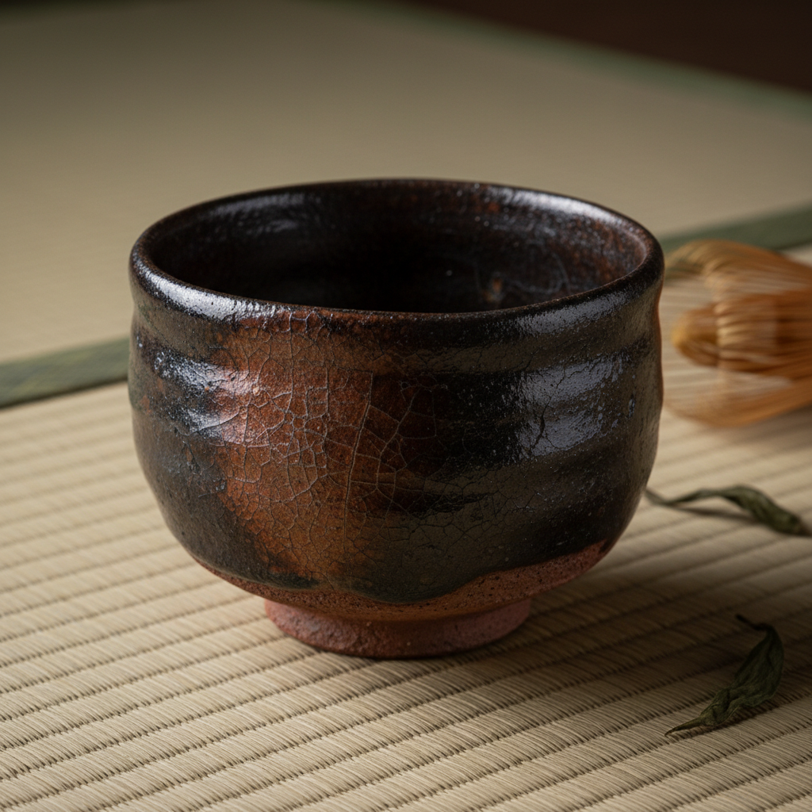

# Tea Bowl Art 茶碗艺术

> "The tea bowl is ceramics distilled to its spiritual essence — a vessel no larger than two cupped hands, yet containing within its curve the entire philosophy of wabi-sabi, each irregularity a meditation, each glaze drip a landscape, the lip shaped to meet the mouth, the foot trimmed to rest in the palm, form following the ritual of tea until bowl and drink and drinker become one moment of perfect attention." — Unknown

## 概述

茶碗艺术（Tea Bowl Art）是一种以茶道器具——茶碗（日语：茶碗/ちゃわん）——为核心的陶瓷艺术形式。茶碗不仅是饮茶的容器，更是东亚美学哲学的物质载体——在日本茶道中，茶碗被视为最重要的道具，承载着侘寂（wabi-sabi）的审美理想。一只好的茶碗应当在手中感觉温暖，在唇边感觉舒适，在眼中呈现宇宙的微缩景观。

茶碗艺术的核心要素包括：1）手感——握在手中的触觉体验；2）口缘——唇边的舒适度；3）高台——碗底足的造型和手感；4）釉色——如风景般的釉面效果；5）不完美——侘寂美学的不规则之美；6）仪式性——茶道仪式的核心器具；7）精神性——超越器物的精神内涵。

## 核心特征

| 特征 | 描述 |
|------|------|
| 手感至上 | 握持的触觉体验最重要 |
| 侘寂美学 | 不完美中的完美 |
| 仪式器具 | 茶道的核心道具 |
| 个性独特 | 每只茶碗都是唯一的 |
| 精神载体 | 承载哲学和精神内涵 |
| 微缩宇宙 | 碗中见天地 |

## 视觉特征

- **不规则造型**：手工的不对称和不规则
- **釉面风景**：如山水般的釉色变化
- **温暖质感**：触感温暖的表面
- **高台造型**：精心修整的碗足
- **口缘变化**：自然起伏的口沿
- **岁月痕迹**：使用留下的茶渍和包浆

## 代表作品

| 作品 | 艺术家/文化 | 年代 | 意义 |
|------|-------------|------|------|
| *曜变天目茶碗* | 中国建窑 | 宋代 | 茶碗的巅峰之作 |
| *长次郎黑乐茶碗* | 长次郎 | 16世纪 | 乐烧茶碗的始祖 |
| *志野茶碗* | 日本美浓 | 16世纪 | 志野烧茶碗经典 |
| *井户茶碗* | 朝鲜 | 15-16世纪 | 朝鲜茶碗之美 |
| *当代茶碗* | 各地陶艺家 | 当代 | 茶碗的当代诠释 |

## 历史时间线

| 时期 | 事件 |
|------|------|
| 宋代 | 中国建窑天目茶碗的辉煌 |
| 15世纪 | 日本茶道兴起，茶碗地位确立 |
| 16世纪 | 千利休确立侘茶美学，乐烧诞生 |
| 17-19世纪 | 各流派茶碗传统的发展 |
| 当代 | 茶碗艺术的全球化传播 |

## 中国语境

茶碗艺术与中国有深厚的渊源——中国宋代的建窑天目茶碗是日本茶道最珍视的器物。中国的斗茶文化催生了建窑、吉州窑等专门烧制茶碗的窑口。虽然中国茶文化后来转向壶泡，但茶碗（茶盏）始终是中国茶器的重要组成。中国当代陶艺中，茶碗创作正在经历复兴——越来越多的中国陶艺家开始创作茶碗，将中国传统审美与日本茶道精神融合。中国的茶碗传统强调"器以载道"——一只好的茶碗不仅是器物，更是修行的工具和审美的载体。

## AI生成概念图

## 与其他风格的关系

- **Raku** → 乐烧
- **Tenmoku** → 天目
- **Wabi-Sabi** → 侘寂美学
- **Shino** → 志野烧
- **Chawan** → 茶碗
- **Tea Ceremony** → 茶道

---

*浮光艺志 | Chronicle of Artistry*
