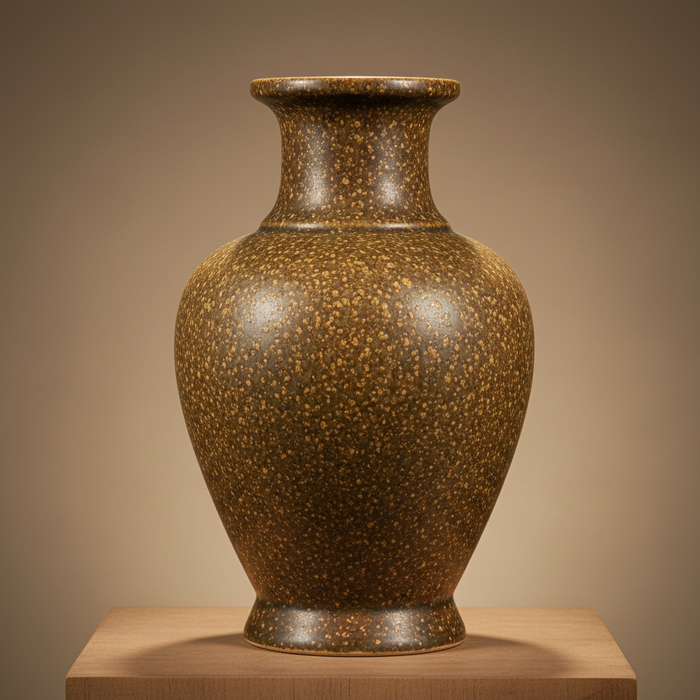

# Tea Dust Art 茶叶末釉艺术

> "Tea dust is earth's own camouflage — a matte olive-brown glaze speckled with tiny golden crystals that form as the kiln cools, resembling dried tea leaves scattered on a forest floor, a glaze that refuses to be showy yet rewards close inspection with an infinite complexity of texture, each crystal a tiny sun in a universe of quiet green-brown." — Unknown

## 概述

茶叶末釉艺术（Tea Dust Art）是一种以橄榄绿褐色底釉中散布细小黄色结晶点为特征的陶瓷釉色艺术。茶叶末釉因其色泽和质感如同研磨的茶叶末而得名——釉面呈现橄榄绿到黄褐色的底色，其中散布着无数细小的黄色结晶颗粒，如同茶叶碎末撒在器物表面。茶叶末釉是铁结晶釉的一种，其独特的质感来自釉中铁的结晶析出。

茶叶末釉艺术的核心要素包括：1）橄榄绿褐——橄榄绿到黄褐的底色；2）结晶颗粒——细小的黄色结晶点；3）铁结晶——铁在冷却中的结晶；4）哑光质感——不同于光亮釉的哑光；5）自然朴素——自然朴素的美感；6）古朴典雅——古朴典雅的气质；7）文人趣味——符合文人的审美趣味。

## 核心特征

| 特征 | 描述 |
|------|------|
| 橄榄绿褐 | 橄榄绿到黄褐底色 |
| 结晶颗粒 | 细小黄色结晶点 |
| 铁结晶 | 铁的结晶析出 |
| 哑光质感 | 哑光的表面质感 |
| 自然朴素 | 自然朴素之美 |
| 古朴典雅 | 古朴典雅气质 |

## 视觉特征

- **橄榄绿底**：橄榄绿到黄褐的底色
- **金色结晶**：散布的金色小结晶点
- **哑光表面**：不反光的哑光质感
- **如茶叶末**：如同茶叶碎末的质感
- **自然纹理**：自然形成的纹理变化
- **古朴感**：古朴沉稳的视觉感受

## 代表作品

| 作品 | 艺术家/文化 | 年代 | 意义 |
|------|-------------|------|------|
| *雍正茶叶末* | 中国清代 | 雍正 | 茶叶末釉的巅峰 |
| *乾隆茶叶末* | 中国清代 | 乾隆 | 茶叶末的继续发展 |
| *茶叶末釉瓶* | 中国清代 | 各时期 | 经典器形 |
| *唐代茶叶末* | 中国唐代 | 唐代 | 早期茶叶末釉 |
| *当代茶叶末* | 当代陶艺家 | 当代 | 当代的诠释 |

## 历史时间线

| 时期 | 事件 |
|------|------|
| 唐代 | 早期茶叶末釉的出现 |
| 宋代 | 茶叶末釉的发展 |
| 清雍正 | 茶叶末釉的巅峰 |
| 清乾隆 | 茶叶末釉的继续精进 |
| 当代 | 茶叶末釉在当代的应用 |

## 中国语境

茶叶末釉是中国陶瓷中最具文人气质的釉色之一。它的美不在于华丽，而在于含蓄和内敛——如同中国文人推崇的"绚烂之极归于平淡"。清代雍正皇帝以其精致的审美品味著称，茶叶末釉正是雍正朝最受推崇的釉色之一。茶叶末釉的名称本身就充满了中国文化的诗意——将一种复杂的铁结晶釉比喻为日常的茶叶末，体现了中国人在日常中发现美的能力。茶叶末釉器物多为陈设器和文房器——其古朴典雅的气质与中国文人书房的氛围完美契合。在中国传统审美中，茶叶末釉代表了一种"不争"的美学——不与青花斗彩争艳，却以其独特的沉静之美赢得文人的青睐。

## AI生成概念图

## 与其他风格的关系

- **Iron Glaze** → 铁釉
- **Crystal Glaze** → 结晶釉
- **Monochrome Glaze** → 单色釉
- **Scholar's Objects** → 文房器
- **Chinese Imperial** → 中国官窑
- **Wabi-Sabi** → 侘寂美学

---

*浮光艺志 | Chronicle of Artistry*
