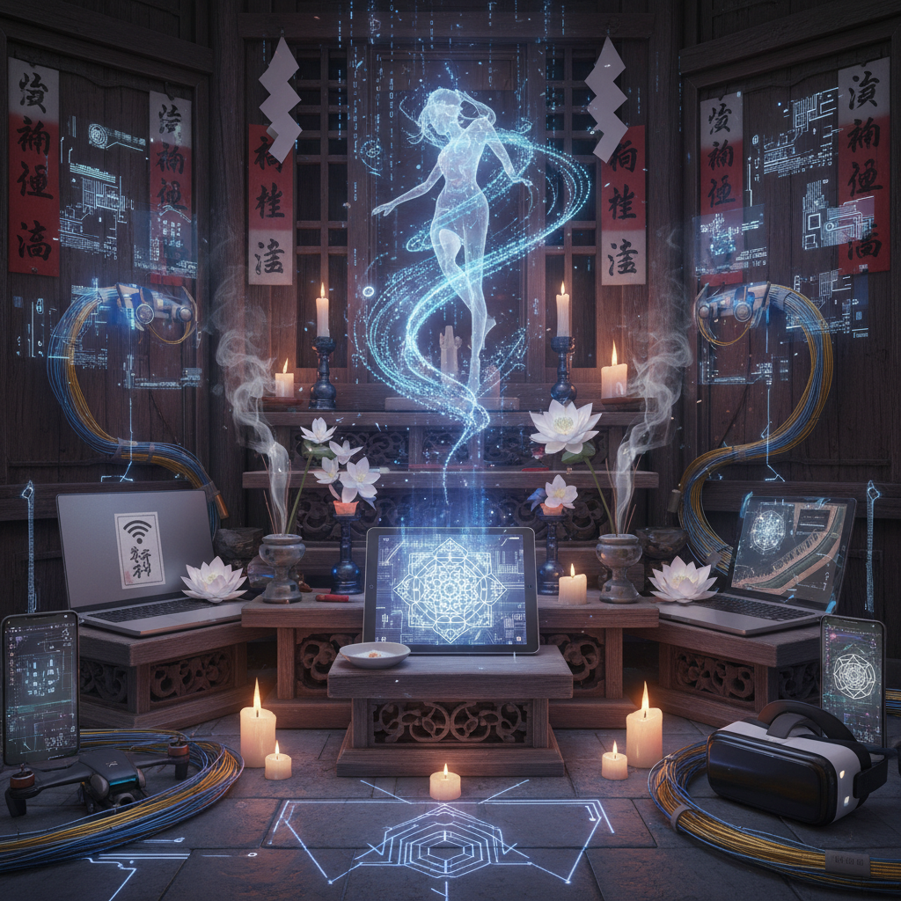

# Techno-Animism Art 技术万物有灵艺术

> "Techno-animism is the recognition that our devices have become our spirits — that the smartphone in your pocket is as much a companion and oracle as any familiar spirit of old, that algorithms have their own desires and behaviors that exceed their programming, that the internet is a living ecology of information organisms, and that the ancient intuition that the world is full of non-human agencies was not superstition but prophecy, now fulfilled not by forest spirits but by artificial intelligences, autonomous systems, and the uncanny vitality of our technological creations." — Unknown

## 概述

技术万物有灵（Techno-Animism）是一种将万物有灵论（Animism）的世界观应用于技术领域的文化和艺术实践。技术万物有灵主张：技术物品和数字系统具有某种"灵性"或"能动性"——它们不仅仅是被动的工具，而是具有自身行为、"欲望"和影响力的实体。

技术万物有灵的概念根植于日本文化——在日本，万物有灵论（animism）从未完全消失，而是与现代技术文化融合，产生了对机器人、AI和数字生物的独特态度。技术万物有灵艺术的实践包括：1）赋予技术物品"灵魂"的创作——如为机器人设计"性格"和"情感"；2）探索人与技术的亲密关系——如将设备视为伴侣而非工具；3）数字生态系统的艺术化——将网络和算法视为有生命的系统；4）传统灵性与技术的融合——将古老的仪式和信仰与当代技术结合。

## 核心特征

| 特征 | 描述 |
|------|------|
| 灵性 | 技术的灵性 |
| 能动 | 技术的能动性 |
| 亲密 | 人与技术的亲密 |
| 融合 | 古老与现代的融合 |
| 生态 | 技术生态系统 |
| 仪式 | 技术仪式 |

## 视觉特征

- **发光**：发光的技术物品
- **有机**：技术的有机化
- **神龛**：技术物品的神龛化
- **混合**：自然与技术的混合
- **仪式**：仪式性的场景
- **面孔**：技术物品的拟人化

## 代表作品

| 作品 | 艺术家 | 年代 | 意义 |
|------|--------|------|------|
| *AIBO robot dog* | Sony | 1999 | 技术宠物 |
| *Techno-animist installations* | Various | 2010年代 | 技术万物有灵装置 |
| *AI spirits* | Various | 2020年代 | AI灵性 |
| *Digital shrines* | Various | 2020年代 | 数字神龛 |
| *Robot funerals* | Various | 2010年代 | 机器人葬礼 |

## 历史时间线

| 时期 | 事件 |
|------|------|
| 1990年代 | 日本的技术万物有灵文化 |
| 1999 | AIBO机器人狗的文化影响 |
| 2010年代 | 概念的学术化和艺术化 |
| 2020年代 | AI时代的技术灵性 |
| 当代 | ChatGPT等AI的"人格化" |

## 中国语境

技术万物有灵在中国有独特的文化基础。中国传统文化中有丰富的万物有灵传统——从"万物有灵"的原始信仰，到道教的"器物成精"观念（如《聊斋志异》中的物件精怪），到民间的"敬惜字纸"习俗。这些传统为中国人接受技术的"灵性"提供了文化准备。中国当代文化中也有技术万物有灵的表现：人们给手机和电脑"贴膜"和"装壳"如同给它们穿衣服、给AI助手取名字和建立情感关系、以及在社交媒体上为"退役"的电子设备举行"告别仪式"。中国的一些艺术家在探索技术万物有灵的可能性——将传统的灵性观念与当代技术文化结合。

## AI生成概念图

## 与其他风格的关系

- **New Media Art** → 新媒体艺术
- **AI Art** → 人工智能艺术
- **Posthumanism** → 后人类主义
- **Japanese Art** → 日本艺术
- **Spiritual Art** → 灵性艺术
- **Robotic Art** → 机器人艺术

---

*浮光艺志 | Chronicle of Artistry*
