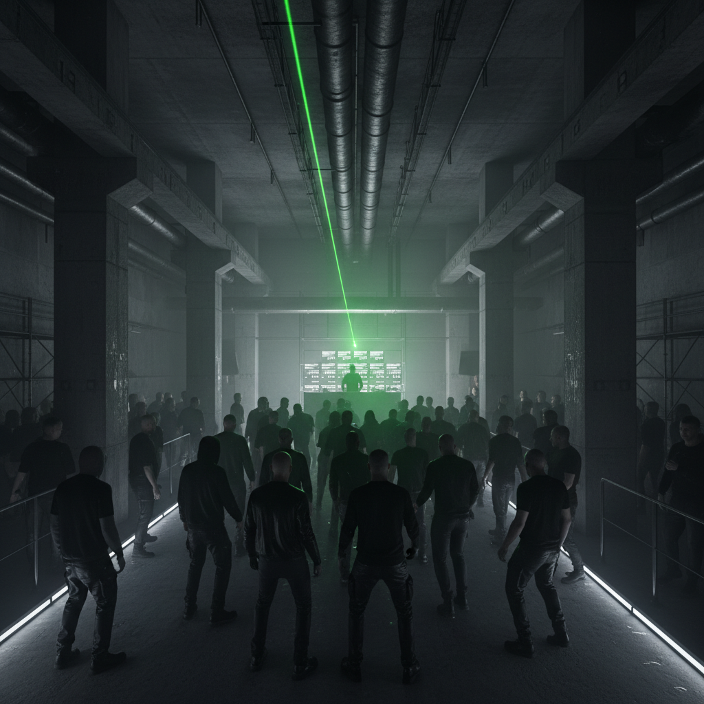

# Techno Berlin 柏林科技



> **"四四拍、工业废墟、Berghain——柏林墙倒塌后的自由之声。"**

## 概述

| 维度 | 描述 |
|------|------|
| 时期 | 1989–至今 |
| 别名 | Berlin Techno, Minimal Techno, Industrial Techno |
| 核心色彩 | 黑色、灰色、混凝土色、暗绿 |
| 关键元素 | 四四拍(4/4)、工业空间、极简、黑色着装 |
| 代表人物 | Tresor, Berghain, Ben Klock, Marcel Dettmann, Ellen Allien |
| 关联风格 | Detroit Techno, Industrial, Minimal, Ambient |

---

## 历史脉络

| 年份 | 事件 |
|------|------|
| 1989 | 柏林墙倒塌——东柏林废弃空间成为舞池 |
| 1991 | Tresor 俱乐部开业——柏林Techno的圣殿 |
| 1993 | Love Parade——百万人的街头锐舞 |
| 1998 | Berghain/Panorama Bar 前身 Ostgut |
| 2004 | Berghain 开业——"世界上最好的俱乐部" |
| 2010s | 柏林 Techno 成为联合国非物质文化遗产候选 |
| 2022 | 柏林 Techno 正式列入德国非物质文化遗产 |

### 核心哲学

Techno Berlin 的精神是**"自由——在废墟中跳舞，在黑暗中找到自己"**：
- 自由 = 核心（"柏林墙倒了——我们在废墟中跳舞"）
- 匿名 = 平等（"在黑暗中没有身份——只有音乐"）
- 极简 = 纯粹（"去掉一切多余——只留节奏"）
- 持续 = 仪式（"从周五跳到周一——时间不存在"）
- "Berghain 不是俱乐部——是一座教堂"

---

## 视觉语法

### 色彩系统

```
主色：
  黑色 (#000000) — 绝对主导
  灰色 (#555555) — 混凝土
  深灰 (#1A1A1A) — 工业

辅色：
  暗绿 (#003300) — 激光
  白色 (#FFFFFF) — 闪光灯
  深红 (#330000) — Berghain灯光

规则：
  - 黑色为绝对主导
  - 极简
  - 工业质感
  - 无装饰

质感：
  混凝土 — 墙壁、地板
  金属 — 工业管道
  烟雾 — 俱乐部
  皮革 — 着装
```

### 标志性元素

| 类别 | 元素 |
|------|------|
| 空间 | 工业废墟、发电厂、地下室、混凝土 |
| 着装 | 全黑、皮革、极简、运动鞋 |
| 音乐 | 4/4拍、极简、工业、持续 |
| 俱乐部 | Berghain, Tresor, ://about blank |
| 文化 | 无手机、匿名、LGBTQ+友好 |
| 态度 | 自由、匿名、极简、持续、地下 |

---

## 与千禧怀旧的关系

### 后冷战时代的文化产物
- 柏林 Techno = 柏林墙倒塌的直接文化产物
- "在东德的废墟中——年轻人发明了新的自由"
- Love Parade (1989-2010) = 一代人的集体记忆
- Berghain = 2000s/2010s 全球俱乐部文化的圣地

### 对全球电子音乐的影响
- 柏林模式 = 全球地下电子音乐的模板
- "每个城市都想有自己的Berghain"
- 工业空间+电子音乐 = 柏林发明的公式

---

## 中国语境

- 中国 Techno 场景（上海、北京）
- 中国工业空间改造俱乐部
- 与中国"地下电子"的关系
- 柏林作为中国电子音乐人的朝圣地

---

## 设计应用

| 场景 | 应用方式 |
|------|----------|
| 空间 | 工业+混凝土+极简+黑色+无装饰 |
| 品牌 | 极简+黑色+地下+自由+匿名 |
| 时尚 | 全黑+皮革+极简+功能性 |
| 数字 | 极简+黑白+工业字体+无装饰 |

---

## 相关风格

← [Trance 迷幻电子](trance.md) | [Acid House 酸屋](acid-house.md) →

↑ [返回千禧怀旧目录](README.md) | [返回总目录](../README.md)
