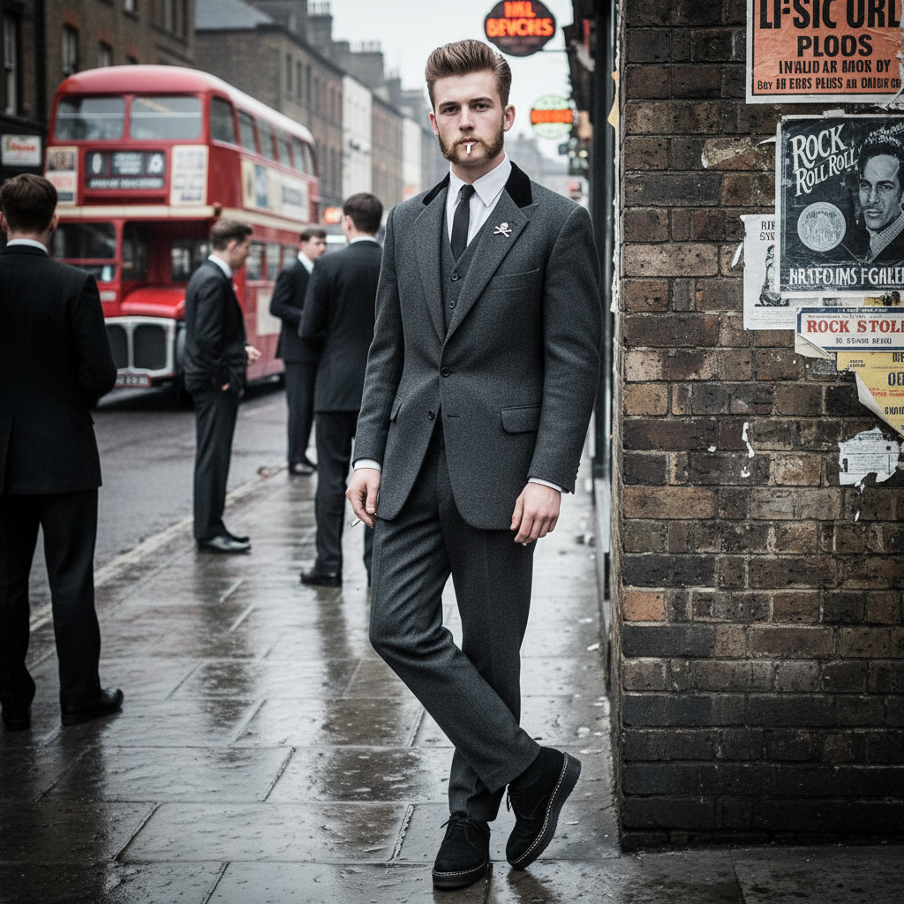

# Teddy Boy 泰迪男孩



> **"长外套、绉底鞋、飞机头——50年代英国第一个青年亚文化。"**

## 概述

| 维度 | 描述 |
|------|------|
| 时期 | 1950s–1960s/复兴至今 |
| 别名 | Teddy Boy, Ted, Edwardian |
| 核心色彩 | 黑色、深蓝、酒红、灰色 |
| 关键元素 | 爱德华长外套、绉底鞋、飞机头/鸭尾头、细领带 |
| 代表人物 | 50s 英国工人阶级青年 |
| 关联风格 | Rockabilly, Greaser, Mod, Punk (后期交叉) |

---

## 历史脉络

| 年份 | 事件 |
|------|------|
| 1950 | 伦敦 Savile Row 裁缝复兴爱德华风格 |
| 1953 | 工人阶级青年采纳——"Teddy Boy"命名 |
| 1954 | Rock & Roll 传入英国——Teds 的音乐 |
| 1956 | 电影院骚乱——Teddy Boy 成为"道德恐慌" |
| 1970s | Teddy Boy 复兴——与 Punk 并存 |
| 至今 | 作为复古亚文化继续存在 |

### 核心哲学

Teddy Boy 的精神是**"工人阶级也可以穿得像绅士——但我们的绅士会打架"**：
- 优雅 = 反叛（"穿得比老板好"）
- 爱德华 = 挪用（"贵族的衣服，我们的态度"）
- Rock & Roll = 生命（"Bill Haley 改变了一切"）
- 帮派 = 归属（"我们是 Teds"）
- "英国第一个真正的青年亚文化"

---

## 视觉语法

### 色彩系统

```
主色：
  黑色 (#000000) — 外套、裤子
  深蓝 (#000080) — 外套
  酒红 (#722F37) — 天鹅绒领
  灰色 (#808080) — 裤子

辅色：
  白色 (#FFFFFF) — 衬衫
  粉色 (#FF69B4) — 袜子（叛逆细节）
  金色 (#DAA520) — 配饰

质感：
  羊毛 — 长外套（Drape Jacket）
  天鹅绒 — 领子
  绉底 — 鞋（Brothel Creepers）
  发油 — 飞机头
```

### 标志性元素

| 类别 | 元素 |
|------|------|
| 服装 | 爱德华长外套(Drape)、窄裤、细领带 |
| 鞋 | 绉底鞋(Brothel Creepers)、尖头鞋 |
| 发型 | 飞机头(Quiff)、鸭尾头(DA)、鬓角 |
| 配饰 | Bootlace领带、梳子、弹簧刀(形象) |
| 音乐 | Rock & Roll、Skiffle |
| 态度 | 工人阶级骄傲、帮派、优雅、叛逆 |

---

## 与千禧怀旧的关系

### 所有英国亚文化的"祖先"
- Teddy Boy (1950s) → Mod (1960s) → Skinhead → Punk → ...
- "英国亚文化的历史从 Teddy Boy 开始"
- 第一个被媒体"道德恐慌"的青年群体
- 建立了"亚文化 = 服装 + 音乐 + 态度"的模板

### Rockabilly 的英国版本
- Teddy Boy = 英国对 Rock & Roll 的回应
- 与美国 Greaser 平行但不同
- Teddy Boy 更"优雅"（长外套 vs 皮夹克）
- "同样的音乐，不同的制服"

---

## 中国语境

- 作为"英国亚文化史"的起点被研究
- 与中国"复古绅士"风格的交叉
- 绉底鞋在中国潮流市场的存在
- 作为"青年反叛"的历史案例

---

## 设计应用

| 场景 | 应用方式 |
|------|----------|
| 时尚 | 长外套+窄裤+绉底鞋+发油+50s |
| 品牌 | 复古+英国+工人阶级+优雅+叛逆 |
| 音乐 | Rock & Roll+50s海报+复古 |
| 空间 | 50s英国+理发店+唱片店+咖啡馆 |

---

## 相关风格

← [Rockabilly 摇滚比利](rockabilly.md) | [Mod 摩德文化](mod.md) →

↑ [返回千禧怀旧目录](README.md) | [返回总目录](../README.md)
