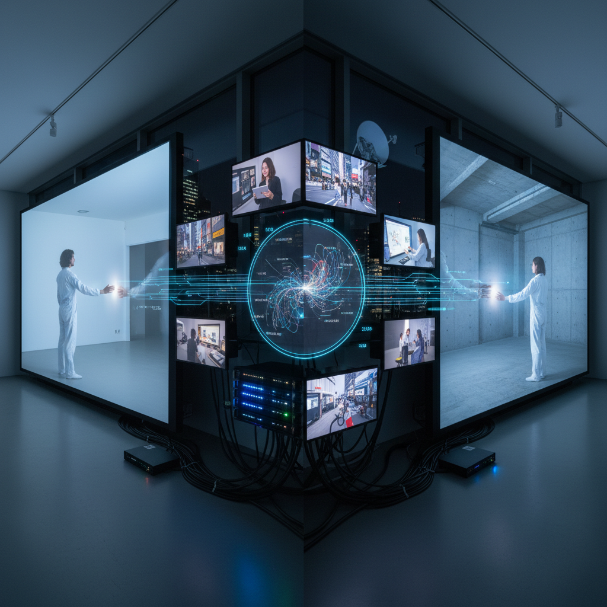

# Telematic Art 远程通信艺术

> "Telematic art collapses distance — it creates shared spaces of consciousness across the globe, connecting minds and bodies through networks in real time, proving that presence is not a matter of physical proximity but of attention, intention, and connection. In the telematic embrace, two people on opposite sides of the planet can dance together, paint together, think together, creating a third space that belongs to neither location but exists only in the network between them." — Roy Ascott

## 概述

远程通信艺术（Telematic Art）是利用电信网络（电话、卫星、互联网等）创造跨越地理距离的共享艺术体验的实践。远程通信艺术的核心理念是：通过网络技术，分散在不同地点的人们可以在一个"第三空间"中共同创作、表演和体验艺术。

远程通信艺术的先驱是Roy Ascott，他在1980年代提出了"远程通信拥抱"（telematic embrace）的概念。远程通信艺术的实践包括：1）远程协作创作——分布在不同地点的艺术家通过网络共同创作；2）远程表演——表演者和观众分布在不同地点，通过网络连接；3）网络作为媒介——将网络本身（延迟、带宽、连接/断开）作为创作材料；4）远程感知——通过传感器和机器人在远处"感知"和"行动"。

## 核心特征

| 特征 | 描述 |
|------|------|
| 距离 | 跨越地理距离 |
| 网络 | 网络作为媒介 |
| 共享 | 共享的空间 |
| 实时 | 实时的连接 |
| 协作 | 远程协作 |
| 在场 | 远程在场 |

## 视觉特征

- **屏幕**：多屏幕的连接
- **投影**：远程投影
- **数据流**：可见的数据流
- **分屏**：分屏的并置
- **延迟**：网络延迟的可视化
- **连接**：连接线和网络图

## 代表作品

| 作品 | 艺术家 | 年代 | 意义 |
|------|--------|------|------|
| *La Plissure du Texte* | Roy Ascott | 1983 | 早期远程通信艺术 |
| *Hole in Space* | Kit Galloway & Sherrie Rabinowitz | 1980 | 卫星连接 |
| *Telematic Dreaming* | Paul Sermon | 1992 | 远程身体 |
| *Telegarden* | Ken Goldberg | 1995 | 远程花园 |
| *Zoom performances* | Various | 2020年代 | 疫情远程表演 |

## 历史时间线

| 时期 | 事件 |
|------|------|
| 1977 | 卫星艺术的早期实验 |
| 1980 | Hole in Space |
| 1983 | Roy Ascott的远程通信艺术理论 |
| 1990年代 | 互联网远程通信艺术 |
| 2020 | 疫情推动的远程艺术爆发 |

## 中国语境

远程通信艺术在中国有独特的发展背景。中国的互联网和移动通信的快速发展为远程通信艺术提供了技术基础——中国拥有世界上最大的互联网用户群体和最发达的移动支付和社交网络。2020年疫情期间，中国的艺术家和表演者大规模转向线上——直播表演、远程协作创作、虚拟展览等形式爆发式增长。中国的一些当代艺术家在探索远程通信艺术的可能性：利用中国独特的社交平台（微信、抖音、B站）创作远程参与式作品，探索中国城乡之间的数字鸿沟，以及利用5G技术创造新的远程体验。中国的"网络春晚"和大规模在线互动活动也可以被视为一种大众化的远程通信艺术。

## AI生成概念图

## 与其他风格的关系

- **Net Art** → 网络艺术
- **New Media Art** → 新媒体艺术
- **Performance Art** → 行为艺术
- **Interactive Art** → 互动艺术
- **Satellite Art** → 卫星艺术
- **Telepresence Art** → 远程在场艺术

---

*浮光艺志 | Chronicle of Artistry*
