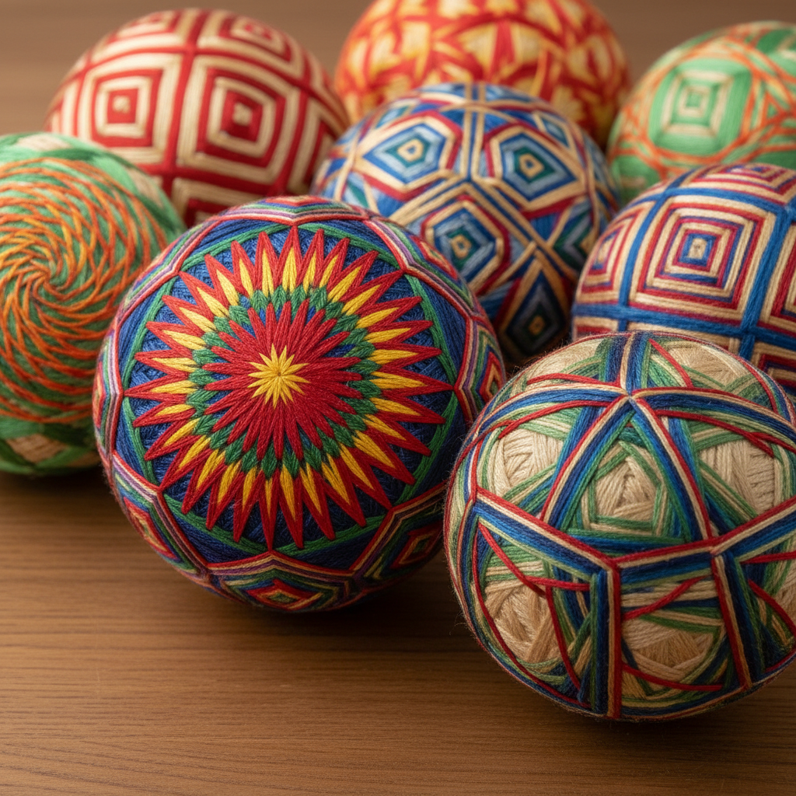

# Temari Art 手鞠艺术

> "Temari are jewels made of thread — perfectly round balls wrapped in layers of yarn and then embroidered with geometric patterns of such mathematical precision that they seem to have been calculated by a computer rather than stitched by hand. Each temari is a sphere divided into sections by guide threads, then filled with interlocking stars, chrysanthemums, and spirals that tessellate across the curved surface. They are geometry made tangible, mathematics made beautiful." — Unknown

## 概述

手鞠艺术（Temari Art）是一种日本传统的球形刺绣工艺——在完美的球体表面用彩色丝线绣制精密的几何图案。手鞠（てまり）原本是儿童玩具，后来发展为精美的装饰艺术品，以其数学般的精确性和万花筒般的色彩著称。

手鞠艺术的实践包括：1）球体制作——用碎布和纱线缠绕成完美球体；2）分割——用导线将球体分割成等分区域；3）基础图案——菊花、星形、旋涡等基本图案；4）组合图案——多种基本图案的组合；5）渐变色——利用色彩渐变创造深度；6）复杂分割——更多等分的复杂分割；7）当代手鞠——将传统技法与现代设计结合的创作。

## 核心特征

| 特征 | 描述 |
|------|------|
| 球形 | 在球体上的刺绣 |
| 几何 | 精密的几何图案 |
| 数学 | 数学般的精确性 |
| 色彩 | 万花筒般的色彩 |
| 日本 | 日本传统工艺 |
| 精密 | 极其精密的制作 |

## 视觉特征

- **球形**：完美的球体形态
- **几何**：精密的几何图案
- **色彩**：丰富的色彩搭配
- **对称**：精确的多轴对称
- **星形**：星形和花形图案
- **精密**：极其精密的线条

## 代表作品

| 作品 | 艺术家/文化 | 年代 | 意义 |
|------|-------------|------|------|
| *Traditional temari* | 日本 | 江户时代 | 传统手鞠 |
| *Sanuki temari* | 日本香川 | 传统 | �的岐手鞠 |
| *Matsumoto temari* | 日本长野 | 传统 | 松本手鞠 |
| *NanaAkua works* | 日本 | 当代 | 当代手鞠大师 |
| *Contemporary temari* | 全球 | 当代 | 当代手鞠 |

## 历史时间线

| 时期 | 事件 |
|------|------|
| 7-8世纪 | 手鞠从中国传入日本 |
| 江户时代 | 手鞠从玩具到艺术品的转变 |
| 明治时代 | 手鞠的地方传统形成 |
| 20世纪 | 手鞠的文化遗产保护 |
| 当代 | 手鞠的全球传播和创新 |

## 中国语境

手鞠艺术与中国有深厚的历史渊源。手鞠最初从中国传入日本——中国古代的"蹴鞠"和装饰球是手鞠的前身。中国传统的"绣球"与手鞠有相似之处——都是球形的装饰品，但技法和风格不同。中国广西壮族的"绣球"是重要的民族工艺品——虽然制作方法不同于日本手鞠，但都体现了球形装饰的美学。中国当代的手工艺爱好者中，日本手鞠正在获得关注——因为其数学美感和冥想般的制作过程。中国的一些手工艺社区开始教授手鞠制作——将其作为一种放松和创意活动。中国的一些艺术家将手鞠的几何美学与中国传统图案结合——创造具有中国特色的球形刺绣作品。

## AI生成概念图

## 与其他风格的关系

- **Sashiko** → 刺子绣
- **Geometric Art** → 几何艺术
- **Japanese Art** → 日本艺术
- **Mathematical Art** → 数学艺术
- **Textile Art** → 纺织艺术
- **Folk Art** → 民间艺术

---

*浮光艺志 | Chronicle of Artistry*
