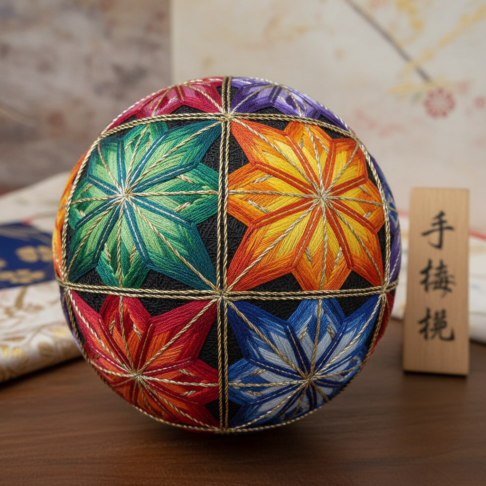

# Temari 手毬 | 手毬

> **"丝线的星球——日本母亲用彩色丝线在球体上绣出宇宙的几何。"**

## 概述

手毬（Temari / 手毬 てまり）是日本传统的丝线刺绣球体艺术，用彩色丝线在球形基底上绣制精美的几何图案。"手毬"意为"手中的球"。最初是中国唐代的蹴鞠传入日本后演变而来，从贵族儿童的玩具逐渐发展为母亲送给女儿的祝福礼物和精湛的装饰艺术。每一个手毬都是独一无二的——母亲在丝线中缝入祝福，祈愿女儿一生幸福。当代手毬已成为一种融合数学、几何和色彩的冥想性手工艺。

## 核心特征

- **球体载体**：在球形基底上刺绣
- **几何分割**：将球面精确分割为等分
- **丝线刺绣**：彩色丝线的精密缠绕
- **数学性**：基于球面几何的图案
- **祝福意义**：母亲对女儿的祝福
- **独一无二**：每一个都不重复

## 常见图案

| 图案 | 特征 |
|------|------|
| 菊花 | 放射状花瓣 |
| 星形 | 多角星的交织 |
| 麻叶 | 六角形几何 |
| 樱花 | 五瓣花形 |
| 龟甲 | 六角形网格 |
| 万华镜 | 复杂对称 |

## 视觉特征

- 完美球体上的几何图案
- 鲜艳丝线的色彩层次
- 精确的数学对称
- 丝线的光泽质感
- 小巧精致的掌中尺寸
- 万花筒般的视觉效果

## 与其他风格的关系

| 风格 | 关系 |
|------|------|
| 曼陀罗 Mandala | 共享球面几何和对称 |
| Zentangle | 共享几何冥想性 |
| 伊斯兰几何 | 共享精密几何美学 |
| 刺子绣 Sashiko | 共享日本刺绣传统 |
| 当代纤维艺术 | 手毬的现代转化 |

## 概念图

---

*浮光艺志 | Chronicle of Artistry*
