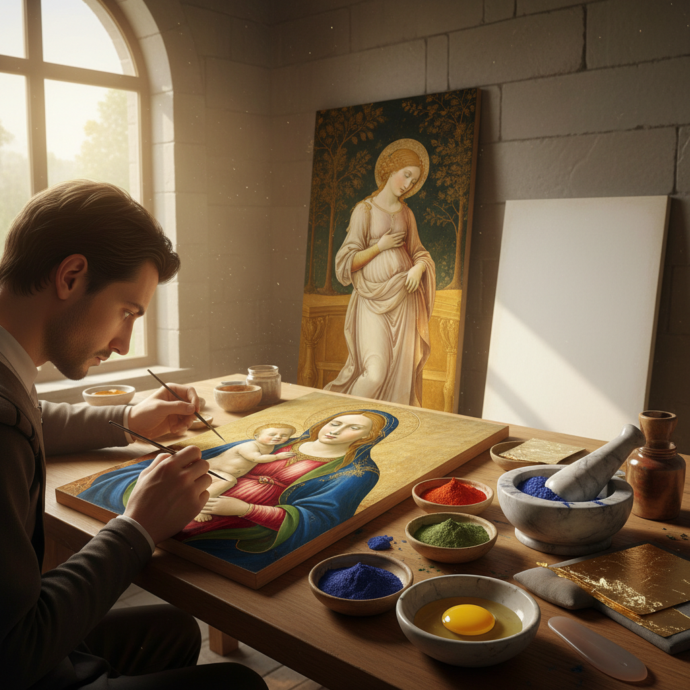

# Tempera Art 蛋彩画艺术

> "Tempera is painting with patience — each thin layer dries almost instantly, demanding that the artist build an image stroke by careful stroke, unable to blend on the surface as oil allows. Yet this very limitation produces a luminosity that oil can never match: light passes through each transparent layer and bounces back from the white ground beneath, giving tempera paintings an inner glow that has survived six hundred years without fading." — Unknown

## 概述

蛋彩画艺术（Tempera Art）是以蛋黄（或全蛋）为粘合剂，将颜料粉末调和后在木板或纸张上绑画的艺术形式——蛋彩画是文艺复兴之前欧洲最主要的绑画技法，以其色彩的持久性、细腻的笔触和独特的光泽著称。蛋彩画在15世纪被油画逐渐取代，但从未完全消失。

蛋彩画艺术的实践包括：1）传统蛋彩画——文艺复兴时期的经典蛋彩技法；2）圣像画——东正教传统的蛋彩圣像画；3）现代蛋彩画——20世纪以来的蛋彩画复兴；4）蛋彩与金箔——蛋彩画与金箔装饰的结合；5）蛋彩壁画——在墙面上的蛋彩绑画；6）微型蛋彩画——小尺幅的精细蛋彩作品；7）当代蛋彩画——当代艺术家对蛋彩技法的重新探索。

## 核心特征

| 特征 | 描述 |
|------|------|
| 速干 | 极快的干燥速度 |
| 透明 | 透明的薄层叠加 |
| 持久 | 极其持久的色彩 |
| 精细 | 精细的笔触 |
| 光泽 | 独特的蛋壳光泽 |
| 不可混 | 不能在画面上混色 |

## 视觉特征

- **光泽**：独特的半哑光蛋壳质感
- **精细**：极其精细的笔触
- **明亮**：明亮持久的色彩
- **层次**：透明层叠加的深度
- **线条**：可见的细线条笔触
- **平整**：平整光滑的表面

## 代表作品

| 作品 | 艺术家 | 年代 | 意义 |
|------|--------|------|------|
| *The Birth of Venus* | Botticelli | 1485 | 文艺复兴蛋彩杰作 |
| *Christina's World* | Andrew Wyeth | 1948 | 现代蛋彩画经典 |
| *Rublev Trinity* | Andrei Rublev | 1411 | 俄罗斯圣像画 |
| *Annunciation* | Fra Angelico | 1440s | 早期文艺复兴蛋彩 |
| *Primavera* | Botticelli | 1482 | 蛋彩画的色彩典范 |

## 历史时间线

| 时期 | 事件 |
|------|------|
| 古代 | 古埃及和古希腊的蛋彩技法 |
| 中世纪 | 蛋彩画成为欧洲主要绑画技法 |
| 14-15世纪 | 蛋彩画的黄金时代 |
| 15世纪后 | 油画逐渐取代蛋彩 |
| 20世纪 | Andrew Wyeth等人的蛋彩画复兴 |

## 中国语境

蛋彩画艺术在中国并非传统绑画技法——中国传统绑画以水墨和矿物颜料为主。然而，中国的一些当代艺术家和美术院校开始关注和实践蛋彩画技法——将其作为一种独特的绑画媒介进行探索。中国的敦煌壁画中使用的矿物颜料技法与蛋彩画有某些相似之处——都使用矿物颜料粉末，只是粘合剂不同。中国的一些宗教艺术（如藏传佛教唐卡）也使用类似的矿物颜料薄层叠加技法。中国当代的一些写实画家对蛋彩画的精细表现力感兴趣——将蛋彩技法与中国传统工笔画的精细理念相结合。中国的美术教育中，蛋彩画作为一种重要的传统技法被纳入教学——帮助学生理解色彩和媒介的关系。

## AI生成概念图

## 与其他风格的关系

- **Oil Painting** → 油画
- **Icon Painting** → 圣像画
- **Fresco** → 湿壁画
- **Egg Tempera** → 蛋彩
- **Renaissance Art** → 文艺复兴艺术
- **Miniature Painting** → 细密画

---

*浮光艺志 | Chronicle of Artistry*
