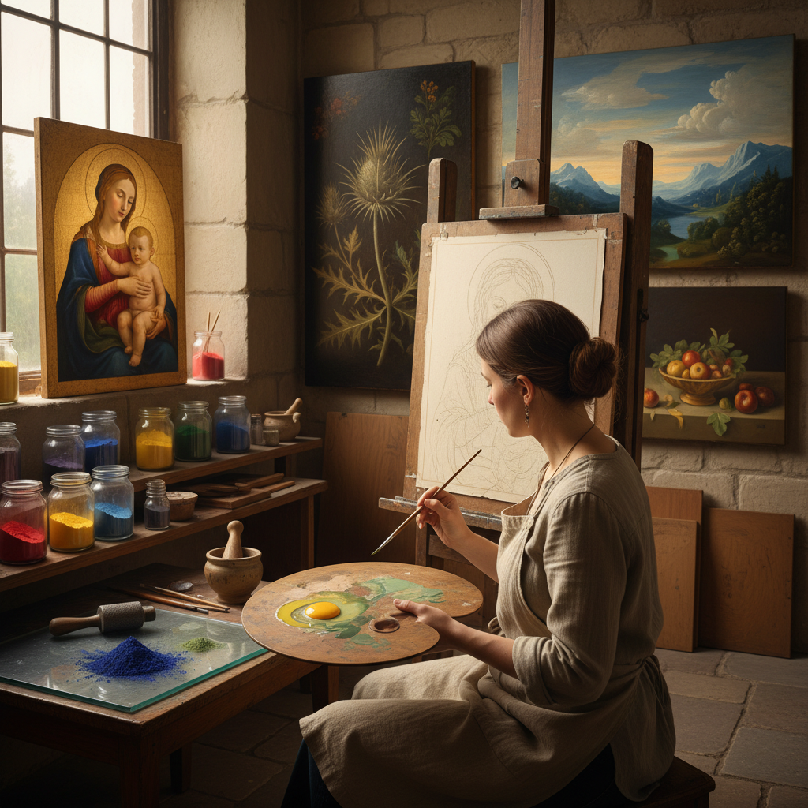

# Tempera Painting 蛋彩画

> "Tempera is the discipline of patience — each stroke dries in seconds, each layer must be thin as breath, and yet from this accumulation of translucent veils emerges a luminosity that oil paint, for all its richness, can never quite match." — Unknown

## 概述

蛋彩画（Tempera Painting）是一种以蛋黄（或全蛋）为粘合剂、将颜料粉末调和后绑定到画面上的绘画技法。蛋彩画是文艺复兴之前欧洲最主要的绘画媒介——从中世纪的圣像画到早期文艺复兴的祭坛画，几乎都是蛋彩画。蛋彩画在15世纪被油画逐渐取代，但从未完全消失，20世纪以来经历了显著的复兴。

蛋彩画的特点是：干燥极快（几秒钟）、色彩明亮清澈、表面呈现柔和的哑光质感、极其耐久（中世纪的蛋彩画至今色彩鲜艳）。蛋彩画需要用细小的笔触逐层叠加——不能像油画那样大面积涂抹或混合。这种"积累式"的工作方式要求极大的耐心和精确性，但能产生独特的发光感和精细度。

## 核心特征

| 特征 | 描述 |
|------|------|
| 蛋黄 | 蛋黄为粘合剂 |
| 速干 | 干燥极快 |
| 薄层 | 薄层叠加 |
| 明亮 | 色彩明亮清澈 |
| 耐久 | 极其耐久 |
| 精细 | 精细的笔触 |

## 视觉特征

- **明亮**：明亮清澈的色彩
- **哑光**：柔和的哑光表面
- **精细**：精细的笔触可见
- **发光**：内在的发光感
- **平整**：平整的画面
- **清晰**：清晰的轮廓

## 代表作品

| 作品 | 艺术家 | 年代 | 意义 |
|------|--------|------|------|
| *The Birth of Venus* | Botticelli | 1485 | 文艺复兴蛋彩画杰作 |
| *Maestà* | Duccio | 1308-11 | 中世纪蛋彩画巅峰 |
| *Christina's World* | Andrew Wyeth | 1948 | 现代蛋彩画代表 |
| *Byzantine icons* | Various | 中世纪 | 圣像画传统 |
| *Contemporary tempera works* | Various | 当代 | 当代蛋彩画复兴 |

## 历史时间线

| 时期 | 事件 |
|------|------|
| 古埃及 | 早期蛋彩画的使用 |
| 拜占庭 | 圣像画中的蛋彩画传统 |
| 中世纪 | 欧洲绘画的主要媒介 |
| 15世纪 | 油画的兴起，蛋彩画衰落 |
| 20世纪 | Andrew Wyeth等艺术家的复兴 |
| 当代 | 蛋彩画的持续复兴和创新 |

## 中国语境

蛋彩画在中国的美术教育和创作中有一定的知名度。中国的一些美术院校开设蛋彩画课程。中国的画家对蛋彩画的"薄层叠加"技法感兴趣——这与中国传统工笔画的"三矾九染"有相似之处。蛋彩画的精细、耐心和层次感与中国传统绘画的审美有共鸣。一些中国当代画家尝试将蛋彩画技法与中国传统绘画元素结合。

## AI生成概念图

## 与其他风格的关系

- **Egg Tempera** → 蛋黄蛋彩
- **Oil Painting** → 油画
- **Fresco** → 湿壁画
- **Icon Painting** → 圣像画
- **Gouache** → 水粉画
- **Casein Painting** → 酪蛋白画

---

*浮光艺志 | Chronicle of Artistry*
