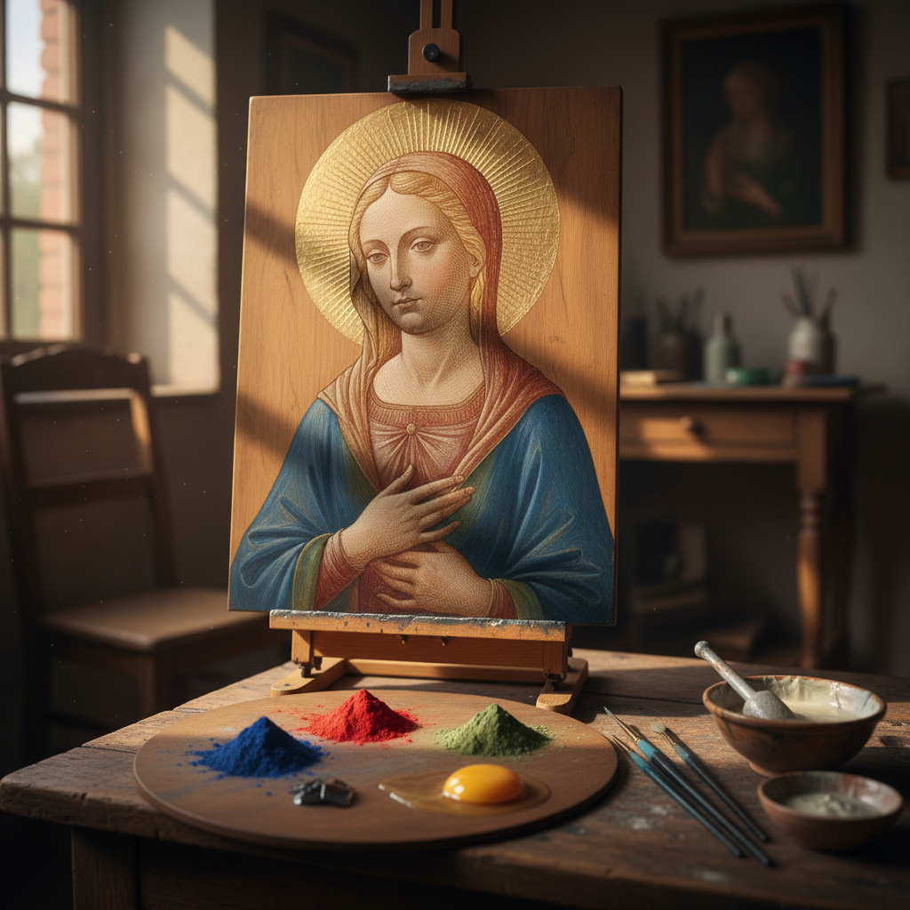

# Tempera 蛋彩画

> "Tempera is unforgiving. Every stroke is permanent, every decision final." — Andrew Wyeth

## 概述

蛋彩画（Tempera / Egg Tempera）是以蛋黄为粘合剂、混合颜料粉末的绘画技法，是文艺复兴之前欧洲绘画的主要媒介。从拜占庭圣像到乔托的壁画、从波提切利的《春》到安德鲁·怀斯的美国风景，蛋彩画跨越了近两千年的历史。

蛋彩画在15世纪被油画取代后逐渐衰落，但20世纪以来经历了复兴——它的精确性、光泽感和永久性使它重新获得当代画家的青睐。

## 核心特征

| 特征 | 描述 |
|------|------|
| 蛋黄媒介 | 蛋黄作为颜料的粘合剂 |
| 快干性 | 几秒内干燥——不允许混色 |
| 层叠法 | 通过薄层叠加建立色彩和明暗 |
| 精确性 | 每一笔都不可修改——要求极高的控制力 |
| 永久性 | 正确制作的蛋彩画可保存数百年 |
| 光泽 | 独特的半哑光丝绸般光泽 |

## 视觉特征

- **光泽**：介于油画的光亮和水彩的哑光之间
- **色彩**：清澈、明亮、不会随时间变黄
- **笔触**：细密的交叉排线（hatching）
- **表面**：光滑、精细、有丝绸般的质感
- **细节**：适合极精细的描绘
- **基底**：通常画在石膏底的木板上

## 代表作品

| 作品 | 艺术家 | 年代 | 意义 |
|------|--------|------|------|
| *春 (Primavera)* | Sandro Botticelli | 1482 | 文艺复兴蛋彩画的巅峰 |
| *圣母领报* | Fra Angelico | 1440s | 蛋彩画的神圣光辉 |
| *Christina's World* | Andrew Wyeth | 1948 | 20世纪蛋彩画的复兴标志 |
| *拜占庭圣像* | Various | 6-15世纪 | 蛋彩画的宗教传统 |
| *The Arnolfini Portrait* | Jan van Eyck | 1434 | 从蛋彩到油画的过渡 |
| *Landscapes* | George Tooker | 1950s-60s | 蛋彩画的超现实主义 |

## 历史时间线

| 时期 | 事件 |
|------|------|
| 1世纪 | 法尤姆肖像——早期蛋彩画 |
| 6-15世纪 | 拜占庭圣像画——蛋彩画的宗教传统 |
| 13-14世纪 | 乔托、杜乔——意大利蛋彩画的黄金时代 |
| 15世纪初 | 波提切利——蛋彩画的最高成就 |
| 15世纪中 | 油画兴起——蛋彩画逐渐被取代 |
| 1930s-40s | Andrew Wyeth——蛋彩画的20世纪复兴 |
| 1950s-60s | Tooker、Cadmus——美国蛋彩画家群体 |
| 2000s-至今 | 蛋彩画在当代写实绘画中的持续实践 |

## 子类型

| 子类型 | 特征 |
|--------|------|
| 拜占庭蛋彩 | 圣像画——金底、正面、神圣 |
| 意大利蛋彩 | 文艺复兴——木板上的精细绘画 |
| 美国蛋彩 | Wyeth——写实风景和人物 |
| 当代蛋彩 | 当代画家对古老技法的重新探索 |
| 混合技法 | 蛋彩打底+油画罩染的混合 |

## 中国语境

蛋彩画在中国不是传统媒介，但中国的工笔画在精神上与蛋彩画有相似之处——都追求精细、层叠、耐心和控制。当代中国的一些写实画家开始实验蛋彩画技法，将其与中国传统绘画的审美结合。中国的矿物颜料传统（如敦煌壁画使用的颜料）与蛋彩画的颜料制备有技术上的相似性。

## 争议与遗产

- **争议**：在油画和丙烯如此方便的时代，为什么还要用蛋彩？
- **技术门槛**：需要自己研磨颜料、调配媒介——是否过于繁琐？
- **保守性**：蛋彩画家是否只是在模仿古人？
- **遗产**：证明了最古老的技法在当代仍有不可替代的表现力
- **当代回响**：慢艺术运动、手工颜料复兴、传统技法工坊

## AI生成概念图

## 与其他风格的关系

- **Renaissance** → 文艺复兴是蛋彩画的黄金时代
- **Icon Painting** → 圣像画是蛋彩画最持久的传统
- **Realism** → 写实主义画家（Wyeth）复兴了蛋彩画
- **Pre-Raphaelites** → 拉斐尔前派对中世纪技法的回归
- **Hyperrealism** → 超写实主义的精细与蛋彩画的精确相通
- **Fresco** → 湿壁画与蛋彩画共享矿物颜料传统

---

*浮光艺志 | Chronicle of Artistry*
