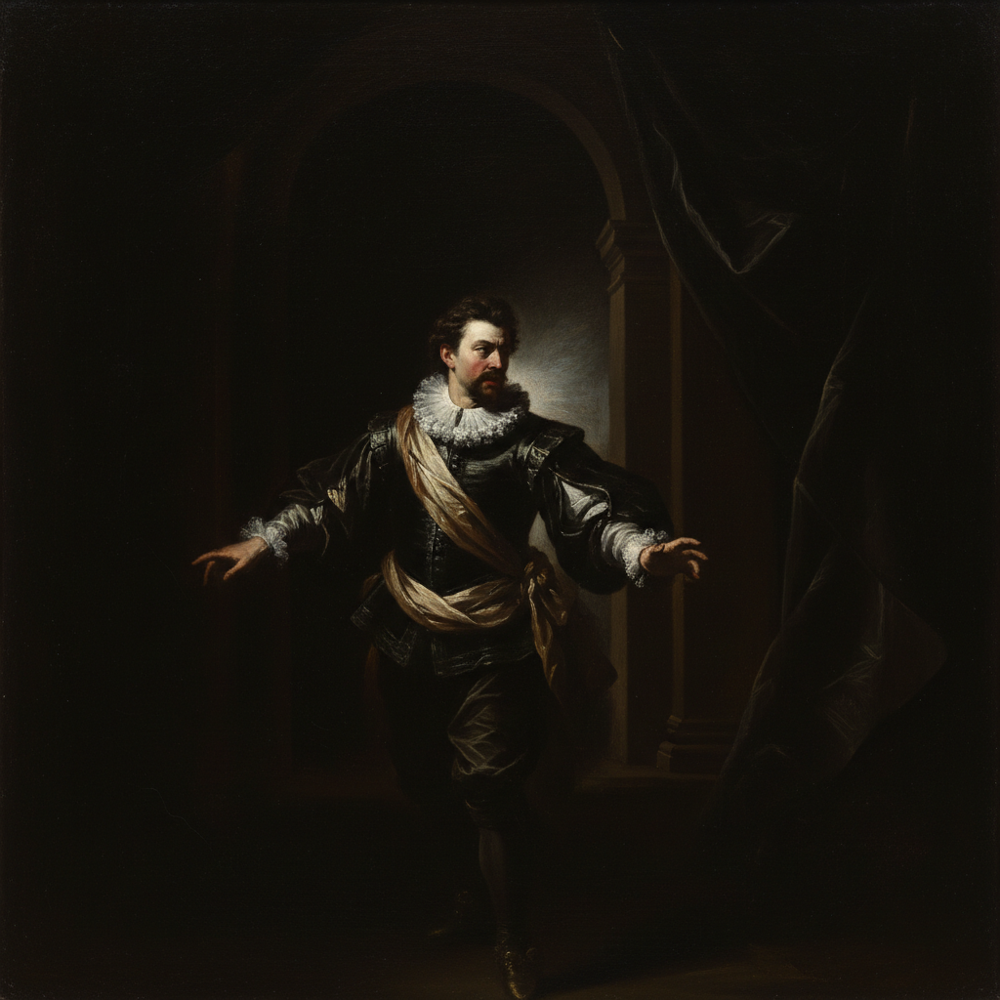

# Tenebrism Painting 暗色主义绘画

> **时期：** 1590年代–1650年代  
> **关键词：** 极端明暗、卡拉瓦乔、戏剧性光线、黑暗背景、巴洛克

## 概述

Tenebrism Painting（暗色主义绘画，源自意大利语"tenebroso"意为阴暗）是巴洛克早期由卡拉瓦乔开创的极端明暗对比技法。与一般的明暗法不同，暗色主义将画面大部分区域沉入深黑，仅用一束强烈的聚光照亮主体——如同舞台上的追光灯。这种戏剧性的光线处理让观者的目光被强制引导到画面焦点，创造出震撼的视觉冲击力和心理张力。

## 风格特征

- **极端对比**：大面积深黑与集中亮光
- **聚光效果**：如同单一光源的舞台照明
- **戏剧张力**：通过光暗制造情感冲击
- **深色背景**：几乎不可辨认的黑暗空间
- **写实人物**：强光下的肌肤和织物质感

## 代表人物与作品

- 卡拉瓦乔《圣马太蒙召》《犹滴斩杀荷罗孚尼》
- 胡塞佩·德·里贝拉 殉道场景
- 乔治·德·拉图尔 烛光系列
- 亚当·埃尔斯海默 夜景

## 概念图

