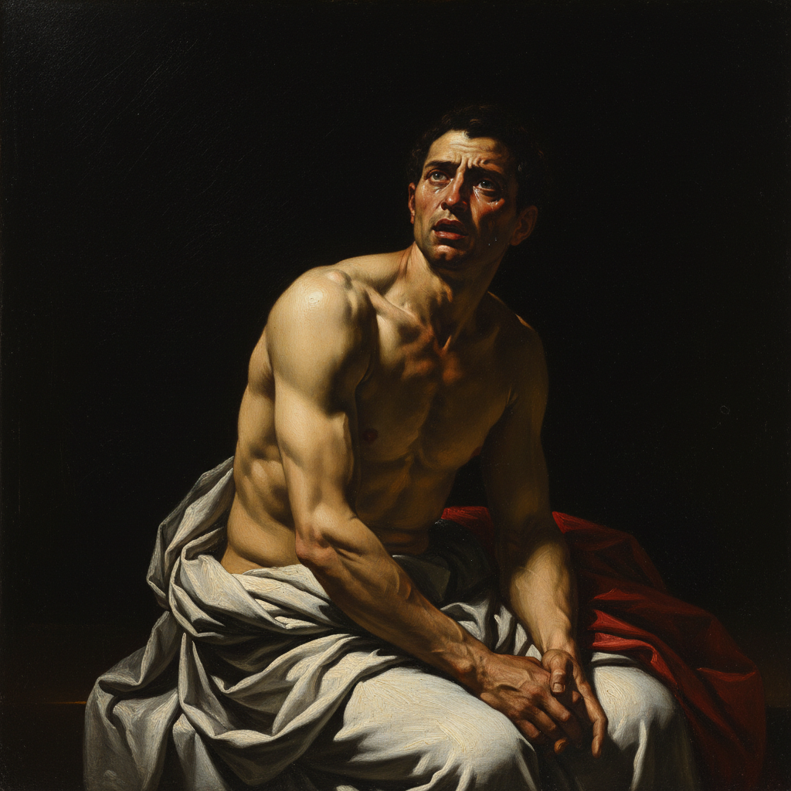

# Tenebrism 暗色主义

> "Every painter paints himself." — Caravaggio

## 概述

暗色主义（Tenebrism，源自意大利语 *tenebroso*，意为"阴暗的"）是巴洛克时期（约1600–1650）的一种极端明暗对比绘画风格，由卡拉瓦乔开创并推广。与一般的明暗法（Chiaroscuro）不同，暗色主义将画面大部分区域沉入深黑之中，仅用强烈的聚光灯式光源照亮关键人物和物体，制造出戏剧性的舞台效果。

这种风格深刻影响了整个欧洲巴洛克绘画，从西班牙的里贝拉到荷兰的伦勃朗，从法国的拉图尔到意大利的真蒂莱斯基。

## 核心特征

| 特征 | 描述 |
|------|------|
| 极端明暗 | 画面大部分为深黑，光线集中于局部 |
| 聚光效果 | 如同舞台聚光灯，光源方向明确 |
| 戏剧张力 | 通过光暗对比制造情感冲击 |
| 写实主义 | 人物形象取自真实模特，不理想化 |
| 暗色背景 | 背景几乎全黑，无环境细节 |
| 宗教/世俗 | 常用于宗教殉道场景或酒馆场景 |

## 视觉特征

- **光线**：单一强光源，通常从画面左上方射入
- **阴影**：浓重的黑色阴影，几乎不透明
- **人物**：从黑暗中浮现，皮肤质感强烈
- **色彩**：有限的色域——肉色、白色、红色在黑暗中发光
- **构图**：紧凑的人物群像，逼近观者
- **质感**：极度写实的皮肤、织物、金属质感

## 代表人物

| 画家 | 代表作 | 特点 |
|------|--------|------|
| Caravaggio | *The Calling of Saint Matthew* (1600) | 暗色主义创始人 |
| Jusepe de Ribera | *Martyrdom of Saint Bartholomew* | 西班牙暗色主义 |
| Georges de La Tour | *The Penitent Magdalene* | 烛光大师 |
| Artemisia Gentileschi | *Judith Slaying Holofernes* | 女性暗色主义画家 |
| Adam Elsheimer | 夜景小品 | 德国暗色主义先驱 |
| Gerrit van Honthorst | 烛光场景 | 荷兰卡拉瓦乔主义者 |

## 历史背景

1. **1599-1600年**：卡拉瓦乔为罗马圣路易吉教堂创作《圣马太蒙召》
2. **1600-10年代**：卡拉瓦乔主义者（Caravaggisti）遍布罗马
3. **1620-40年代**：风格传播到西班牙、法国、荷兰
4. **1650年后**：逐渐被更明亮的巴洛克风格取代

## 与其他风格的关系

- **Chiaroscuro** → 暗色主义是明暗法的极端化
- **Baroque** → 巴洛克戏剧性的核心视觉手段
- **Realism** → 卡拉瓦乔的写实主义影响了后世
- **Rembrandt** → 伦勃朗发展出更柔和的明暗处理
- **Film Noir** → 20世纪电影继承了暗色主义的光影美学

## 概念图

---

*浮光艺志 | Chronicle of Artistry*
