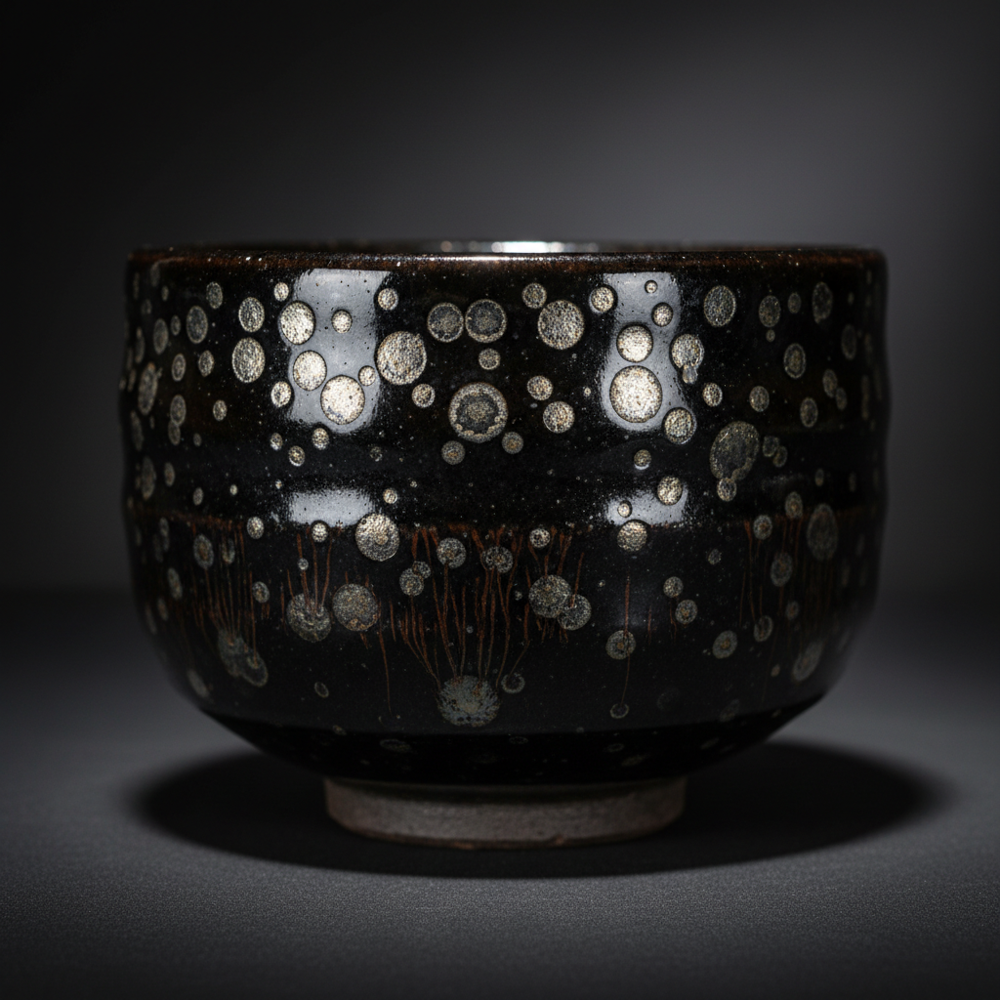

# Tenmoku Art 天目釉艺术

> "Tenmoku is the night sky captured in a bowl — iron-rich glaze fired to extremes until it crystallizes into patterns no human hand could draw: oil spots floating like distant galaxies, hare's fur streaming like meteor showers, and leaf fossils preserved in glass-dark pools, each bowl a unique cosmology born from the marriage of chemistry and chance in the dragon kiln's inferno." — Unknown

## 概述

天目釉艺术（Tenmoku Art）是一种以高铁含量釉料在高温下烧制而成的黑釉陶瓷艺术。天目釉以其深邃的黑色底釉和丰富的结晶变化著称——油滴、兔毫、曜变等效果使每一件作品都独一无二。天目釉源于中国宋代建窑，因日本僧人从天目山带回而得名，在中日两国的茶道文化中占有崇高地位。

天目釉艺术的核心要素包括：1）高铁釉——含铁量极高的釉料配方；2）高温烧制——在1300°C以上的高温中烧成；3）结晶效果——铁在冷却过程中形成的各种结晶；4）油滴——釉面上浮现的圆形银色或金色斑点；5）兔毫——釉面上流淌的细长条纹；6）曜变——极其罕见的彩虹色光晕效果；7）茶碗——天目釉最经典的器形。

## 核心特征

| 特征 | 描述 |
|------|------|
| 高铁黑釉 | 含铁量极高的深色底釉 |
| 油滴结晶 | 银色或金色圆形结晶斑点 |
| 兔毫纹 | 细长流淌的条纹效果 |
| 曜变 | 极罕见的彩虹光晕 |
| 高温烧成 | 1300°C以上的极端温度 |
| 偶然性 | 每件作品的独特不可复制性 |

## 视觉特征

- **深黑底色**：浓郁深邃的黑色釉面
- **银色油滴**：如星空般的银色圆斑
- **金色光泽**：某些结晶呈现金色
- **兔毫流纹**：如兔毛般的细长纹理
- **彩虹光晕**：曜变天目的七彩效果
- **釉面深度**：多层次的视觉深度

## 代表作品

| 作品 | 艺术家/窑口 | 年代 | 意义 |
|------|-------------|------|------|
| *曜变天目茶碗* | 建窑 | 南宋 | 日本国宝，世界仅存三件 |
| *油滴天目茶碗* | 建窑 | 宋代 | 油滴效果的典范 |
| *兔毫盏* | 建窑 | 宋代 | 兔毫纹的代表 |
| *吉州窑木叶天目* | 吉州窑 | 宋代 | 木叶贴花技法 |
| *当代天目* | 各地陶艺家 | 当代 | 天目釉的现代探索 |

## 历史时间线

| 时期 | 事件 |
|------|------|
| 宋代 | 建窑天目釉达到巅峰 |
| 12-13世纪 | 日本僧人从天目山带回茶碗 |
| 镰仓时代 | 天目茶碗在日本茶道中确立地位 |
| 室町时代 | 曜变天目被视为至宝 |
| 20世纪 | 现代陶艺家重新探索天目釉 |
| 当代 | 科学分析与艺术创作结合 |

## 中国语境

天目釉源于中国宋代福建建窑（建阳窑），是宋代斗茶文化的产物。宋人斗茶以黑盏为上——黑色釉面最能衬托白色茶沫，因此建窑黑釉茶盏成为斗茶首选。建窑的兔毫盏、油滴盏在宋代即为名品，而极其罕见的曜变天目更是陶瓷史上的奇迹——目前世界上仅存三件完整曜变天目，均在日本被列为国宝。吉州窑的木叶天目、玳瑁天目则代表了另一种创造性。当代中国陶艺家正在通过科学研究和反复实验，试图重现和超越宋代天目釉的辉煌。

## AI生成概念图

## 与其他风格的关系

- **Jian Ware** → 建窑
- **Tea Ceremony** → 茶道文化
- **Iron Glaze** → 铁釉
- **Crystalline Glaze** → 结晶釉
- **Song Dynasty Ceramics** → 宋代陶瓷
- **Reduction Firing** → 还原烧成

---

*浮光艺志 | Chronicle of Artistry*
