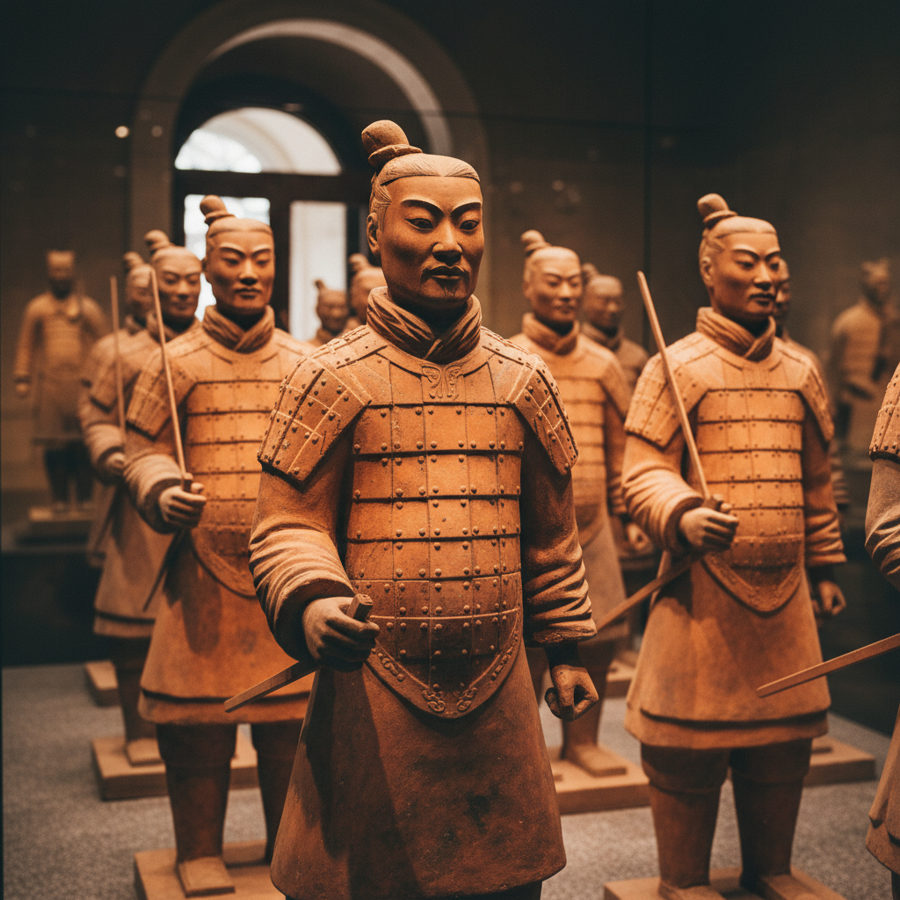

# Terra Cotta Art 赤陶艺术

> "Terra cotta is earth made permanent — raw clay fired just hot enough to harden but not to vitrify, retaining the warm orange-red color of iron-rich soil baked by the sun, the material of the world's first sculptures, architectural ornaments, and garden vessels, humble enough for a flowerpot yet noble enough for the army that guards an emperor's tomb for two thousand years." — Unknown

## 概述

赤陶艺术（Terra Cotta Art）是一种使用含铁粘土在相对较低温度（900-1100°C）下烧制而成的陶器艺术。赤陶因其温暖的橙红色而得名（terra cotta在意大利语中意为"烧过的土"）。赤陶是人类最古老的陶瓷材料之一——从史前的陶俑到秦始皇兵马俑，从古希腊的陶瓶到文艺复兴的建筑装饰，赤陶贯穿了整个人类文明史。

赤陶艺术的核心要素包括：1）含铁粘土——富含氧化铁的红色粘土；2）低温烧制——900-1100°C的烧制温度；3）多孔性——未完全玻化的多孔结构；4）温暖色调——特征性的橙红色；5）可塑性——适合雕塑和模制；6）建筑应用——广泛用于建筑装饰；7）园艺用途——花盆和园艺器物的经典材料。

## 核心特征

| 特征 | 描述 |
|------|------|
| 橙红色 | 含铁粘土的温暖色调 |
| 低温烧制 | 相对较低的烧制温度 |
| 多孔结构 | 未完全玻化的透气性 |
| 可塑性强 | 适合雕塑和精细造型 |
| 历史悠久 | 最古老的陶瓷材料之一 |
| 用途广泛 | 从雕塑到建筑到园艺 |

## 视觉特征

- **温暖橙红**：特征性的赤陶色
- **土质感**：未施釉的自然土质
- **温暖触感**：多孔表面的温暖触感
- **雕塑性**：适合精细雕塑的质感
- **自然老化**：随时间产生的自然包浆
- **朴素美感**：不加修饰的质朴之美

## 代表作品

| 作品 | 艺术家/文化 | 年代 | 意义 |
|------|-------------|------|------|
| *秦始皇兵马俑* | 中国秦代 | 公元前3世纪 | 赤陶雕塑的巅峰 |
| *古希腊赤陶瓶* | 古希腊 | 公元前6-4世纪 | 希腊赤陶传统 |
| *文艺复兴赤陶装饰* | 意大利 | 15-16世纪 | 建筑赤陶 |
| *Della Robbia釉陶* | Della Robbia家族 | 15世纪 | 釉面赤陶 |
| *当代赤陶雕塑* | 各地艺术家 | 当代 | 赤陶的现代应用 |

## 历史时间线

| 时期 | 事件 |
|------|------|
| 公元前25000年 | 最早的赤陶雕塑（维纳斯像） |
| 新石器时代 | 赤陶器物的广泛使用 |
| 古代文明 | 各大文明的赤陶传统 |
| 文艺复兴 | 赤陶在建筑装饰中的复兴 |
| 当代 | 赤陶在艺术和建筑中的持续应用 |

## 中国语境

赤陶在中国有极其辉煌的历史。秦始皇兵马俑——8000多个真人大小的赤陶武士——是世界上最伟大的赤陶艺术品，展现了中国古代赤陶技术的巅峰水平。中国新石器时代的彩陶——仰韶文化的人面鱼纹盆、马家窑文化的旋涡纹罐——都是赤陶。唐三彩的胎体也是赤陶。中国传统建筑中的砖雕、瓦当也属于赤陶范畴。在中国当代艺术中，赤陶作为一种质朴有力的材料继续被艺术家使用。中国的陶艺教育中，赤陶是最基础的材料之一。

## AI生成概念图

## 与其他风格的关系

- **Earthenware** → 陶器
- **Sculpture** → 雕塑
- **Architecture** → 建筑装饰
- **Ancient Art** → 古代艺术
- **Garden Art** → 园艺艺术
- **Brick Art** → 砖雕

---

*浮光艺志 | Chronicle of Artistry*
