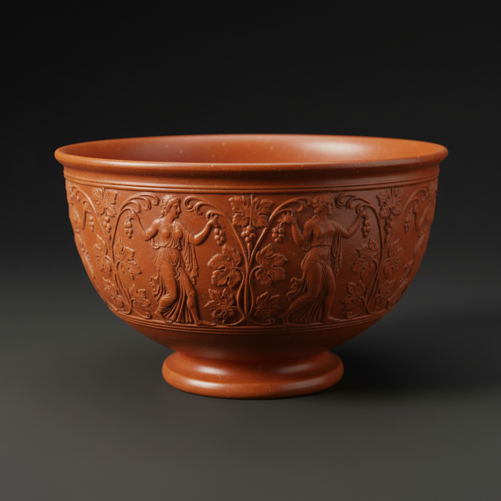

# Terra Sigillata Art 化妆土陶艺

> "Terra sigillata is clay refined to its purest essence — a slip so fine that its particles measure less than one micron, creating a surface that fires to a natural sheen without any glaze. The ancient Romans perfected this technique, producing tableware with a luminous red surface that needed no additional treatment. It is the clay itself, purified and burnished by fire alone, that creates the beauty." — Unknown

## 概述

化妆土陶艺（Terra Sigillata Art）是一种使用极细颗粒的泥浆（化妆土）涂覆在陶器表面，烧制后形成天然光泽的陶瓷技法——Terra Sigillata（拉丁语"印章土"）最初指古罗马的红色光泽陶器，现在泛指使用超细颗粒泥浆创造天然光泽表面的技法。这种技法不使用釉料，而是依靠极细的粘土颗粒在烧制中形成的天然光泽。

化妆土陶艺的实践包括：1）泥浆制备——通过沉淀法分离最细的粘土颗粒；2）涂覆——将化妆土涂覆在坯体表面；3）抛光——在半干状态下用光滑工具抛光；4）低温烧制——在较低温度下烧制保持光泽；5）烟熏——在还原气氛中烟熏创造黑色效果；6）多层涂覆——多次涂覆增加光泽度；7）当代化妆土——将传统技法与现代陶艺结合的创作。

## 核心特征

| 特征 | 描述 |
|------|------|
| 超细 | 亚微米级的颗粒 |
| 光泽 | 天然的丝绸光泽 |
| 无釉 | 不使用釉料 |
| 古老 | 古罗马的传统 |
| 纯粹 | 粘土本身的美 |
| 精制 | 需要精心制备 |

## 视觉特征

- **光泽**：天然的丝绸般光泽
- **温暖**：温暖的土色调
- **平滑**：极其平滑的表面
- **纯粹**：纯粹的材料之美
- **古典**：古典优雅的气质
- **触感**：令人愉悦的触感

## 代表作品

| 作品 | 艺术家/文化 | 年代 | 意义 |
|------|-------------|------|------|
| *Arretine ware* | 古罗马 | 1世纪 | 阿雷佐红陶 |
| *Samian ware* | 古罗马 | 1-3世纪 | 萨摩斯陶器 |
| *Greek black-figure pottery* | 古希腊 | 6世纪BC | 希腊黑绘陶 |
| *Contemporary terra sigillata* | 当代 | 当代 | 当代化妆土陶艺 |
| *Smoke-fired terra sigillata* | 当代 | 当代 | 烟熏化妆土 |

## 历史时间线

| 时期 | 事件 |
|------|------|
| 公元前6世纪 | 古希腊的化妆土技法 |
| 1-3世纪 | 古罗马化妆土陶器的巅峰 |
| 中世纪 | 技法的衰落 |
| 20世纪 | 现代陶艺家重新发现 |
| 当代 | 化妆土的艺术化发展 |

## 中国语境

化妆土技法在中国陶瓷传统中有重要地位。中国古代的白化妆土技法——在深色坯体上涂覆白色化妆土——是磁州窑等北方窑口的重要技法。中国宋代的磁州窑系使用化妆土创造了丰富的装饰效果——包括刻花、剔花、珍珠地等。中国的建窑黑釉茶盏在施釉前也使用化妆土——改善坯体表面质量。中国当代的陶艺家开始探索西方式的化妆土抛光技法——将其与中国传统陶瓷美学结合。中国的陶瓷教育中，化妆土作为一种重要的表面处理技法——在各大美术学院的陶艺课程中教授。中国的一些陶艺工作室将化妆土与柴烧结合——创造出独特的自然光泽效果。

## AI生成概念图

## 与其他风格的关系

- **Ceramics** → 陶瓷艺术
- **Burnishing** → 抛光技法
- **Smoke Firing** → 烟熏烧制
- **Raku** → 乐烧
- **Slip Decoration** → 泥浆装饰
- **Ancient Pottery** → 古代陶器

---

*浮光艺志 | Chronicle of Artistry*
