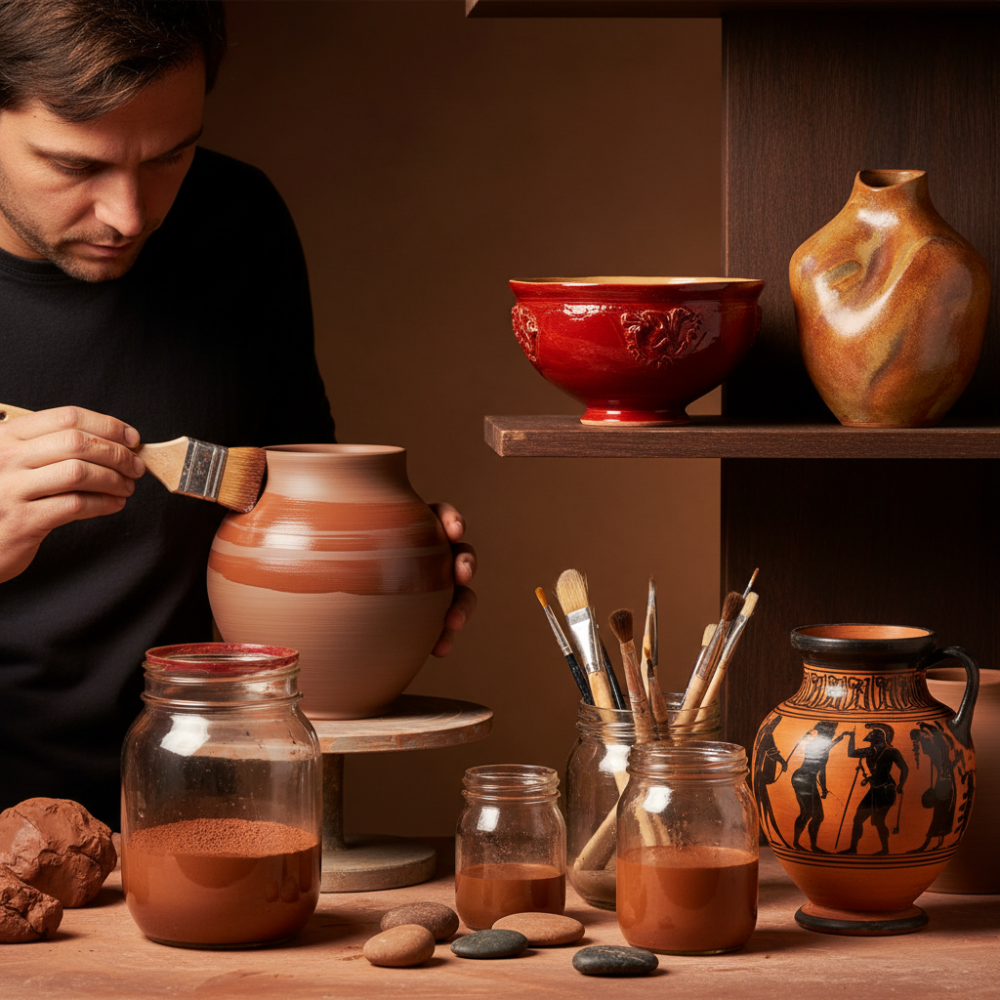

# Terra Sigillata 化妆土

> "Terra sigillata is clay refined to its essence — particles so fine they float in water like dust in sunlight, and when burnished onto a pot, they seal the surface with a sheen that needs no glaze." — Unknown

## 概述

化妆土（Terra Sigillata，拉丁语意为"密封的土"）是一种极细的黏土浆料——通过沉淀法（levigation）将黏土中最细的颗粒分离出来，得到一种如丝般光滑的泥浆。将这种超细泥浆涂刷在陶器表面，干燥后用光滑的石头或勺子背面打磨（burnishing），可以获得一种不需要釉料就能呈现的柔和光泽。

Terra Sigillata最著名的应用是古罗马的红色细陶器（Samian ware）——表面光滑如漆，色泽温暖。当代陶艺家使用Terra Sigillata来创造独特的表面效果——它可以与坑烧、匣钵烧等技法结合，烟气和矿物在光滑的表面上留下更加鲜明的痕迹。

## 核心特征

| 特征 | 描述 |
|------|------|
| 超细 | 极细的黏土颗粒 |
| 沉淀 | 通过沉淀法制备 |
| 光泽 | 不需釉料的光泽 |
| 打磨 | 需要打磨抛光 |
| 薄层 | 极薄的涂层 |
| 低温 | 适合低温烧制 |

## 视觉特征

- **光泽**：柔和的丝质光泽
- **光滑**：极其光滑的表面
- **色彩**：自然的土色系
- **温暖**：温暖的色调
- **细腻**：细腻的质感
- **自然**：自然的美感

## 代表作品

| 作品 | 艺术家 | 年代 | 意义 |
|------|--------|------|------|
| *Roman Samian ware* | 匿名 | 罗马时期 | 古罗马红陶 |
| *Arretine ware* | 匿名 | 公元前1世纪 | 阿雷佐红陶 |
| *Greek black-figure pottery* | 匿名 | 古希腊 | 希腊黑绘陶 |
| *Contemporary terra sig* | Various | 当代 | 当代化妆土 |
| *Burnished terra sig vessels* | Various | 当代 | 打磨化妆土器物 |

## 历史时间线

| 时期 | 事件 |
|------|------|
| 古希腊 | 黑绘和红绘陶的化妆土 |
| 罗马时期 | Samian ware的大规模生产 |
| 中世纪 | 技术的失传 |
| 20世纪 | 化妆土技术的重新发现 |
| 当代 | 当代陶艺中的广泛应用 |
| 当代 | 与替代烧制技法的结合 |

## 中国语境

化妆土在中国陶瓷传统中有着重要的对应——中国古代的"化妆土"（白色泥浆涂层）被广泛用于改善粗糙胎体的外观。磁州窑的白地黑花装饰就是在化妆土上进行的。中国的化妆土传统与西方的Terra Sigillata在原理上相似——都是用细腻的泥浆来改善陶器表面。当代中国的陶艺家也在探索Terra Sigillata技法——将其与中国传统的烧制方法结合。

## AI生成概念图

## 与其他风格的关系

- **Burnishing** → 打磨
- **Pit Firing** → 坑烧
- **Saggar Firing** → 匣钵烧
- **Ceramics** → 陶瓷
- **Roman Pottery** → 罗马陶器
- **Slip Decoration** → 泥浆装饰

---

*浮光艺志 | Chronicle of Artistry*
