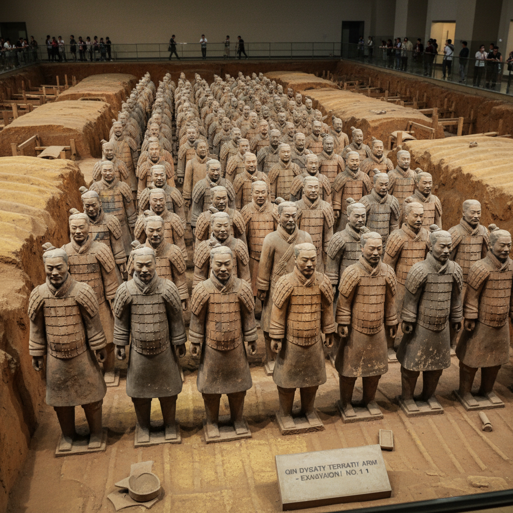

# Terracotta Warrior Art 兵马俑艺术

> "The Terracotta Army is death's greatest parade — eight thousand clay soldiers standing in eternal formation beneath the earth, each face unique, each uniform precise, an emperor's belief that an army of fired clay could guard him in the afterlife as faithfully as living men, the most ambitious ceramic project ever undertaken, where art serves power and clay becomes immortal." — Unknown

## 概述

兵马俑艺术（Terracotta Warrior Art）是中国秦代（前221-前206年）创造的大规模陶塑艺术，以秦始皇陵兵马俑为代表。兵马俑是世界上最大规模的陶塑群——约8000个真人大小的陶制士兵、战马和战车，排列成完整的军事阵列，守护秦始皇的地下帝国。兵马俑是中国古代雕塑艺术的巅峰之作——每一个陶俑都有独特的面部特征、发型和表情，展现了秦代工匠非凡的写实能力。

兵马俑艺术的核心要素包括：1）真人尺度——与真人等大的陶塑；2）个性化——每个陶俑面容独特；3）军事主题——完整的军事阵列；4）批量生产——标准化与个性化结合；5）彩绘装饰——原有鲜艳的彩绘；6）殉葬功能——替代活人殉葬；7）帝国意志——秦始皇的权力象征。

## 核心特征

| 特征 | 描述 |
|------|------|
| 真人尺度 | 与真人等大陶塑 |
| 个性化 | 每个面容独特 |
| 军事主题 | 完整军事阵列 |
| 批量生产 | 标准化与个性化 |
| 彩绘装饰 | 原有鲜艳彩绘 |
| 帝国意志 | 权力象征 |

## 视觉特征

- **真人大小**：约1.8米高的真人尺度
- **面容各异**：每个陶俑面容不同
- **军装细节**：精确的铠甲和服饰
- **阵列排布**：严整的军事阵列
- **灰陶质地**：灰色陶土的质感
- **庄严肃穆**：庄严肃穆的气势

## 代表作品

| 作品 | 艺术家/文化 | 年代 | 意义 |
|------|-------------|------|------|
| *将军俑* | 秦代工匠 | 前210年 | 最高级别的陶俑 |
| *跪射俑* | 秦代工匠 | 前210年 | 保存最完好的陶俑 |
| *铜车马* | 秦代工匠 | 前210年 | 精密的铜制车马 |
| *军吏俑* | 秦代工匠 | 前210年 | 中级军官陶俑 |
| *立射俑* | 秦代工匠 | 前210年 | 射击姿态的陶俑 |

## 历史时间线

| 时期 | 事件 |
|------|------|
| 前246年 | 秦始皇即位，陵墓开始修建 |
| 前221年 | 秦统一六国 |
| 前210年 | 秦始皇驾崩，陵墓封闭 |
| 1974年 | 农民打井发现兵马俑 |
| 1987年 | 列入世界文化遗产 |

## 中国语境

兵马俑是中国乃至世界陶瓷艺术史上最伟大的成就之一。秦始皇陵兵马俑的发现震惊了世界——被誉为"世界第八大奇迹"。兵马俑的制作工艺体现了秦代高度发达的陶瓷技术——工匠们采用模制与手塑相结合的方法，先用模具制作身体的基本部分，再手工塑造面部特征和细节。兵马俑原本都有鲜艳的彩绘——红、绿、蓝、紫等颜色描绘铠甲和服饰的细节，但出土后颜色迅速氧化脱落。兵马俑的发现改变了人们对秦代艺术的认识——证明了秦代不仅有强大的军事力量，还有高度发达的艺术创造力。兵马俑已成为中国文化的标志性符号——代表了中国古代文明的辉煌成就。

## AI生成概念图

## 与其他风格的关系

- **Mingqi** → 明器
- **Chinese Sculpture** → 中国雕塑
- **Funerary Art** → 殉葬艺术
- **Terracotta** → 赤陶
- **Imperial Art** → 帝王艺术
- **Archaeological Discovery** → 考古发现

---

*浮光艺志 | Chronicle of Artistry*
