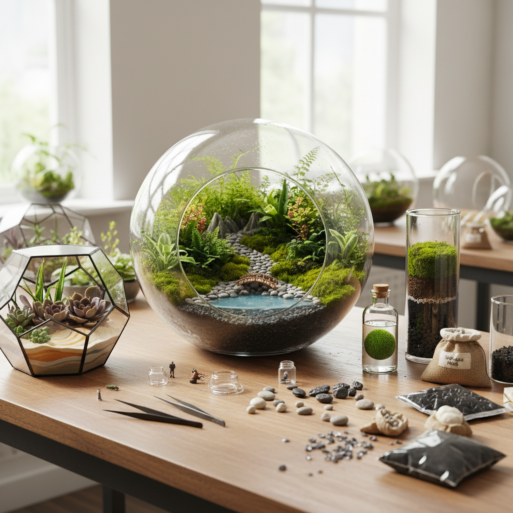

# Terrarium Art 生态瓶艺术

> "A terrarium is a world in a bottle — a self-sustaining ecosystem sealed in glass, where water cycles endlessly between soil and air, where plants breathe in what they breathe out, where the only input is light and the only output is beauty. It is gardening distilled to its essence: the creation of a living landscape that tends itself, a miniature wilderness that asks nothing but to be watched." — Unknown

## 概述

生态瓶艺术（Terrarium Art）是在透明玻璃容器中创造微型生态系统和景观的艺术形式——通过精心选择植物、苔藓、石头、土壤和装饰元素，在密封或开放的玻璃容器中构建自给自足的微型世界。生态瓶艺术是园艺、景观设计和微缩艺术的交汇。

生态瓶艺术的实践包括：1）密封生态瓶——完全密封的自循环生态系统；2）开放生态瓶——需要少量维护的开放式微型花园；3）苔藓生态瓶——以苔藓为主的微型景观；4）水陆生态瓶——结合水景和陆景的生态瓶；5）沙漠生态瓶——以多肉植物为主的干旱景观；6）微型盆景——在玻璃容器中的微型盆景；7）艺术生态瓶——以艺术表达为目的的创意生态瓶。

## 核心特征

| 特征 | 描述 |
|------|------|
| 微缩 | 微缩的世界 |
| 生态 | 自给自足的生态系统 |
| 透明 | 透明容器的展示 |
| 活体 | 活的植物为媒介 |
| 景观 | 微型景观设计 |
| 持续 | 可长期维持 |

## 视觉特征

- **绿色**：丰富的绿色植物
- **透明**：玻璃容器的透明
- **层次**：土壤、植物、空气的层次
- **微缩**：微缩的景观元素
- **湿润**：密封瓶内的水汽
- **精致**：精致的细节安排

## 代表作品

| 作品 | 艺术家 | 年代 | 意义 |
|------|--------|------|------|
| *Wardian Case* | Nathaniel Ward | 1842 | 最早的生态瓶 |
| *David Latimer's bottle garden* | David Latimer | 1960 | 53年未开封的生态瓶 |
| *Contemporary terrariums* | Various | 当代 | 当代生态瓶艺术 |
| *Moss terrariums* | Various | 当代 | 苔藓生态瓶 |
| *Aqua terrariums* | Various | 当代 | 水陆生态瓶 |

## 历史时间线

| 时期 | 事件 |
|------|------|
| 1842 | Nathaniel Ward发明沃德箱 |
| 19世纪 | 维多利亚时代的蕨类热 |
| 1960年代 | 生态瓶的流行 |
| 2010年代 | 生态瓶艺术的复兴 |
| 当代 | 生态瓶的多元化发展 |

## 中国语境

生态瓶艺术在中国近年来发展迅速。中国的生态瓶文化与中国传统的盆景艺术有深层的文化联系——两者都追求在有限空间中创造完整的自然景观。中国的苔藓生态瓶特别受欢迎——中国丰富的苔藓资源为生态瓶创作提供了多样的材料。中国的一些生态瓶艺术家将中国传统山水美学融入生态瓶设计——在玻璃容器中创造"一拳代山、一勺代水"的微型山水世界。中国的生态瓶市场在快速增长——从线上电商到线下工作坊，生态瓶已成为流行的都市生活方式产品。中国的水陆缸（paludarium）爱好者社区也非常活跃——将水族和陆地景观结合在透明容器中。

## AI生成概念图

## 与其他风格的关系

- **Bonsai** → 盆景艺术
- **Miniature Art** → 微缩艺术
- **Garden Design** → 园林设计
- **Ecological Art** → 生态艺术
- **Glass Art** → 玻璃艺术
- **Living Art** → 活体艺术

---

*浮光艺志 | Chronicle of Artistry*
