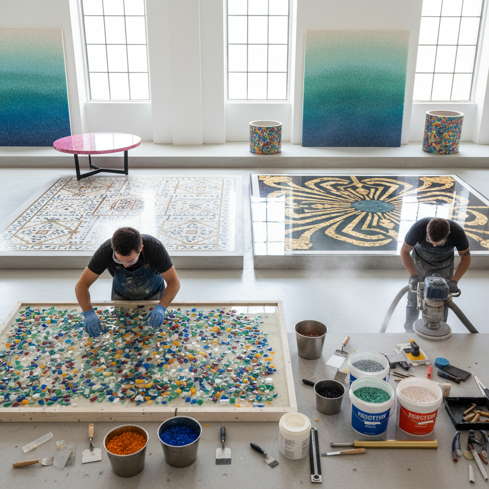

# Terrazzo Art 水磨石艺术

> "Terrazzo is the art of the aggregate — marble chips, glass fragments, and stone pieces scattered into a matrix of cement or resin, then ground and polished until the surface reveals a galaxy of color and pattern, each floor a unique constellation of embedded fragments." — Unknown

## 概述

水磨石（Terrazzo）是一种将碎石、大理石碎片、玻璃碎片或其他骨料（aggregate）嵌入水泥或树脂基质中，然后研磨抛光至光滑表面的复合材料和装饰技法。水磨石起源于15世纪的威尼斯——工人们将大理石加工的废料碎片嵌入粘土基底中，创造出经济实用又美观的地面。

传统水磨石（cementitious terrazzo）使用水泥作为基质；现代水磨石（epoxy terrazzo）使用环氧树脂，允许更薄的施工层和更丰富的色彩。水磨石的骨料可以是：大理石碎片、花岗岩碎片、石英、玻璃碎片、贝壳、金属碎片等。水磨石可以通过铜条或锌条分隔出图案和区域。当代水磨石艺术已经从地面装饰扩展到家具、产品设计和纯艺术领域。

## 核心特征

| 特征 | 描述 |
|------|------|
| 骨料 | 碎石/玻璃嵌入 |
| 研磨 | 研磨抛光表面 |
| 基质 | 水泥或树脂基质 |
| 耐久 | 极其耐久 |
| 图案 | 随机或设计图案 |
| 多样 | 骨料种类多样 |

## 视觉特征

- **斑点**：碎片的斑点效果
- **光滑**：研磨后的光滑表面
- **色彩**：丰富的色彩组合
- **随机**：随机的碎片分布
- **光泽**：抛光的光泽
- **纹理**：独特的纹理感

## 代表作品

| 作品 | 艺术家 | 年代 | 意义 |
|------|--------|------|------|
| *Venetian terrazzo floors* | 威尼斯工匠 | 15世纪起 | 水磨石的起源 |
| *Art Deco terrazzo* | Various | 1920-30年代 | 装饰艺术风格水磨石 |
| *Mid-century modern terrazzo* | Various | 1950-60年代 | 现代主义水磨石 |
| *Contemporary terrazzo design* | Various | 当代 | 当代水磨石设计 |
| *Terrazzo furniture* | Various | 当代 | 水磨石家具 |

## 历史时间线

| 时期 | 事件 |
|------|------|
| 15世纪 | 威尼斯水磨石的起源 |
| 18世纪 | 水磨石传播到欧洲各地 |
| 1920-30年代 | 装饰艺术风格的水磨石 |
| 1950-60年代 | 现代主义建筑中的水磨石 |
| 1970-90年代 | 水磨石的衰落期 |
| 2010年代至今 | 水磨石的全球复兴 |

## 中国语境

水磨石在中国有广泛的应用历史——20世纪中后期中国的公共建筑（学校、医院、工厂）大量使用水磨石地面。近年来，随着全球水磨石复兴潮流，中国的室内设计和建筑装饰中重新流行水磨石——从高端商业空间到家居设计，水磨石以更精致、更艺术化的面貌回归。中国的设计师将水磨石与中国传统材料和审美结合，创作具有当代中国特色的水磨石作品。

## AI生成概念图

## 与其他风格的关系

- **Mosaic** → 马赛克
- **Concrete Art** → 混凝土艺术
- **Interior Design** → 室内设计
- **Material Design** → 材料设计
- **Architecture** → 建筑
- **Product Design** → 产品设计

---

*浮光艺志 | Chronicle of Artistry*
