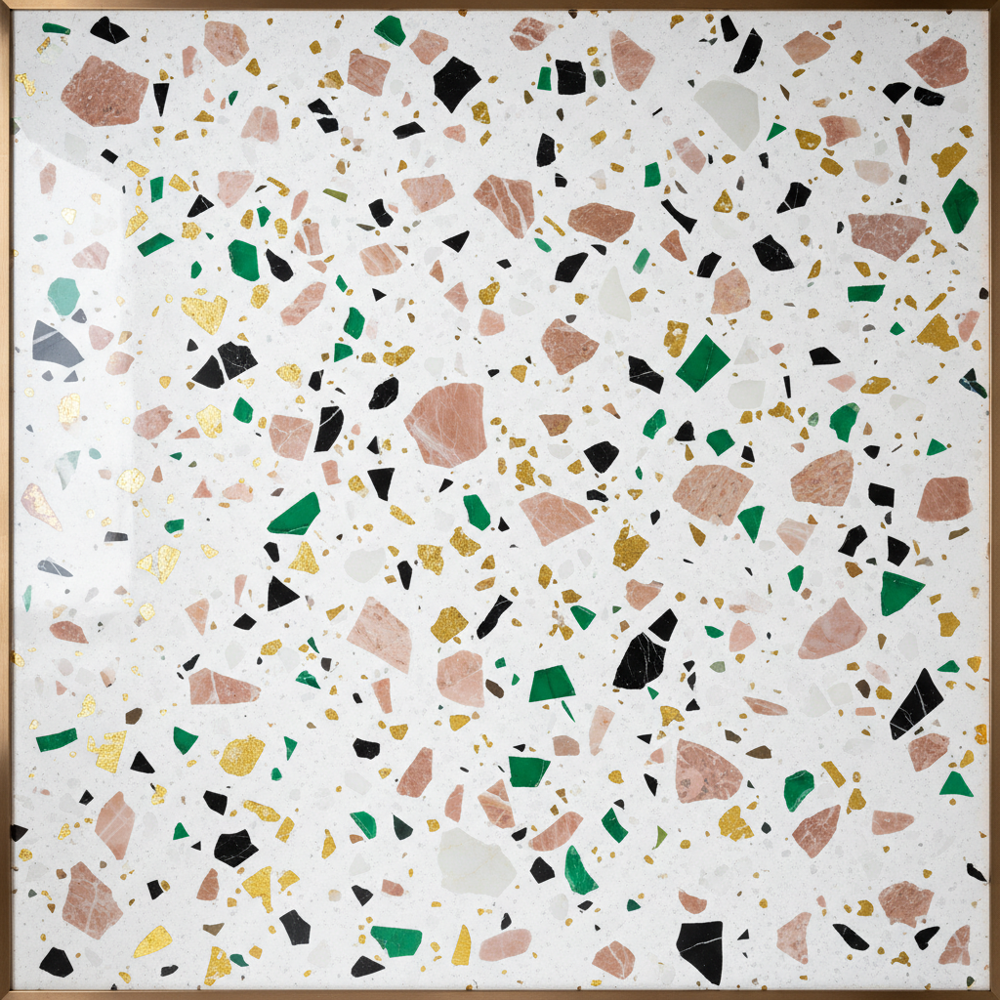

# Terrazzo 水磨石

> "Terrazzo is the art of making beauty from fragments — a floor that tells a story of transformation." — Unknown

## 概述

水磨石（Terrazzo）是将碎石、大理石、玻璃或其他骨料嵌入水泥或树脂基底中，经过研磨和抛光后形成光滑装饰表面的建筑装饰艺术。从15世纪威尼斯工人用大理石废料创造的"穷人的大理石"，到20世纪现代主义建筑的标志性地面，再到当代设计中的terrazzo复兴热潮，水磨石以其独特的碎片美学和无限的色彩组合可能性成为最持久的装饰艺术形式之一。

水磨石的哲学在于：废料可以变成珍宝——碎片通过重新组合和打磨，获得了超越原材料的美。

## 核心特征

| 特征 | 描述 |
|------|------|
| 碎片 | 使用碎石和骨料 |
| 嵌入 | 碎片嵌入基底材料 |
| 研磨 | 研磨至光滑平面 |
| 抛光 | 抛光产生光泽 |
| 耐久 | 极其耐久——可用数百年 |
| 建筑性 | 主要用于建筑装饰 |

## 视觉特征

- **碎片**：随机分布的碎片图案
- **光滑**：研磨后的光滑表面
- **色彩**：多种颜色的碎片组合
- **随机**：自然随机的分布美感
- **光泽**：抛光后的柔和光泽
- **规模**：从地面到墙面的大尺度

## 代表作品

| 作品 | 艺术家 | 年代 | 意义 |
|------|--------|------|------|
| *Venetian terrazzo* | 威尼斯工匠 | 15世纪+ | 水磨石的起源 |
| *Art Deco terrazzo* | 匿名 | 1920s-30s | 装饰艺术风格 |
| *Mid-century terrazzo* | 匿名 | 1950s-60s | 现代主义建筑 |
| *Dallas-Fort Worth Airport* | — | 1974 | 大型水磨石地面 |
| *Contemporary terrazzo* | Various | 2010s+ | 当代水磨石复兴 |

## 历史时间线

| 时期 | 事件 |
|------|------|
| 古代 | 早期的碎石地面 |
| 15世纪 | 威尼斯——现代水磨石的诞生 |
| 18世纪 | 水磨石传播到欧洲各地 |
| 1920s-30s | Art Deco时期的水磨石 |
| 1950s-60s | 现代主义建筑的广泛使用 |
| 1980s-90s | 水磨石的暂时衰落 |
| 2010s+ | 当代设计中的水磨石复兴 |

## 中国语境

水磨石在中国有广泛的应用历史——从1950年代开始，水磨石地面在中国的公共建筑、学校和医院中大量使用。虽然一度被视为"过时"的材料，但近年来水磨石在中国的室内设计和建筑中经历了强烈的复兴。当代中国设计师将水磨石与现代美学结合，创造出新的视觉语言。中国传统的"磨石子"工艺与水磨石有相似之处。

## AI生成概念图

## 与其他风格的关系

- **Mosaic** → 马赛克与水磨石有碎片逻辑相似
- **Architecture** → 建筑是水磨石的主要载体
- **Concrete Art** → 混凝土艺术与水磨石有材料相似
- **Pattern Design** → 水磨石图案影响当代设计
- **Interior Design** → 室内设计中的水磨石应用
- **Sustainable Art** → 废料利用的可持续精神

---

*浮光艺志 | Chronicle of Artistry*
