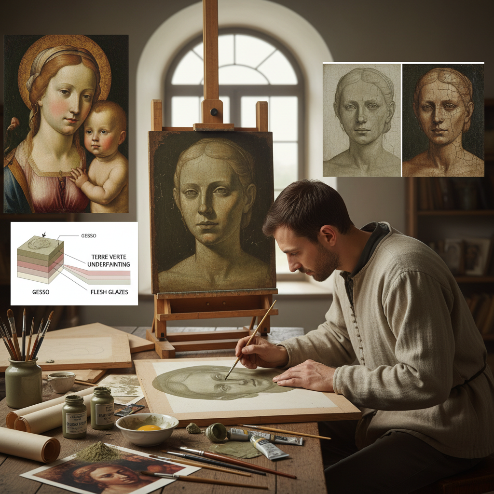

# Terre Verte Painting 绿土底色画

> "Terre verte is the old masters' secret foundation — a muted olive-green earth pigment painted as an underpainting beneath flesh tones, its cool green neutralizing the warm pinks and ochres layered above to create skin that glows with the complex translucency of living tissue, a technique so effective that when Renaissance panels age and upper layers thin, the green ghost beneath emerges like a memory of the painter's method." — Unknown

## 概述

绿土底色画（Terre Verte Painting）是一种使用天然绿土颜料（terre verte，也称为green earth/绿土）作为底色层（underpainting）的古典绘画技法。在文艺复兴时期的蛋彩画和早期油画中，画家们在画人物肤色之前，先用terre verte（一种灰绿色的天然矿物颜料）画出面部和身体的阴影和中间调——这层绿色底色在后续叠加的暖色肤色层下方起到"光学中和"的作用，使肤色呈现出自然的冷暖变化和透明感。

Terre verte的化学成分主要是含铁的硅酸盐矿物（如海绿石和青磷石）。这种颜料的特点是：颜色柔和不刺眼、半透明、干燥速度快、与其他颜料兼容性好。Terre verte底色技法在13-15世纪的意大利蛋彩画中最为普遍——乔托、马萨乔、波提切利等大师都使用这种技法。当上层颜料因年代久远而变薄时，底层的绿色会透出来——这就是为什么许多古老的文艺复兴绘画中人物面部呈现绿色调。

## 核心特征

| 特征 | 描述 |
|------|------|
| 绿土 | 天然绿土矿物颜料 |
| 底色 | 作为底色层使用 |
| 肤色 | 用于肤色的底层 |
| 光学 | 光学中和效果 |
| 透明 | 半透明的叠加 |
| 古典 | 古典大师技法 |

## 视觉特征

- **绿灰**：柔和的绿灰色底层
- **透明**：透明叠加的效果
- **肤色**：自然的肤色表现
- **冷暖**：冷暖色的光学混合
- **古典**：古典绘画的质感
- **深度**：色彩的光学深度

## 代表作品

| 作品 | 艺术家 | 年代 | 意义 |
|------|--------|------|------|
| *Ognissanti Madonna* | Giotto | 约1310 | 乔托的绿土底色 |
| *The Birth of Venus* | Sandro Botticelli | 约1485 | 波提切利的肤色技法 |
| *Holy Trinity* | Masaccio | 1427 | 马萨乔的绿土底色 |
| *Annunciation* | Fra Angelico | 约1440 | 安杰利科的绿土技法 |
| *Contemporary terre verte studies* | Various | 当代 | 当代绿土底色实践 |

## 历史时间线

| 时期 | 事件 |
|------|------|
| 古代 | 绿土颜料的早期使用 |
| 13世纪 | 乔托等早期大师的应用 |
| 14-15世纪 | 蛋彩画中的标准技法 |
| 16世纪 | 油画技法逐渐取代 |
| 当代 | 古典技法的学术研究和复兴 |

## 中国语境

绿土底色画在中国的西方绘画教育中有一定的学术地位——中国的美术院校在教授古典油画技法时会介绍terre verte底色技法。中国的一些写实油画家在创作中借鉴文艺复兴时期的底色技法。中国的敦煌壁画修复研究中发现，古代画工也使用类似的绿色矿物颜料作为底色。中国的传统绘画中虽然没有完全相同的技法，但中国画的"三矾九染"层层叠加的方法与terre verte的光学叠加原理有相通之处。

## AI生成概念图

## 与其他风格的关系

- **Egg Tempera** → 蛋彩画
- **Underpainting** → 底色画
- **Renaissance Art** → 文艺复兴艺术
- **Oil Painting** → 油画
- **Glazing** → 罩染
- **Classical Realism** → 古典写实

---

*浮光艺志 | Chronicle of Artistry*
