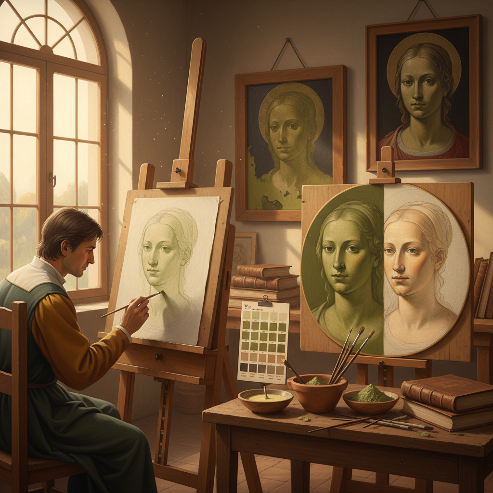

# Terre Verte Underpainting 绿土底层画法

> "Terre verte underpainting is the quiet foundation upon which Renaissance flesh was built — a cool green earth beneath warm skin tones, giving portraits that luminous, living depth that no single layer of paint could ever achieve alone." — Unknown

## 概述

绿土底层画法（Terre Verte Underpainting）是一种源自中世纪和文艺复兴时期的绘画技法——在绘制人物肤色之前，先用绿土颜料（terre verte，一种天然绿色矿物颜料）涂抹底层。绿色底层与后续叠加的暖色肤色形成互补，产生自然、有深度的肤色效果。这种技法在意大利被称为"verdaccio"。

绿土底层画法的原理基于色彩互补——绿色是红色的互补色，人类肤色偏暖（含红色和黄色），在绿色底层上叠加半透明的暖色，绿色会中和过度的红色，产生更自然、更有深度的肤色。这种技法被乔托、波提切利、达芬奇等文艺复兴大师广泛使用。在蛋彩画（tempera）时代尤为重要，因为蛋彩画的半透明特性使底层颜色能透过上层显现。

## 核心特征

| 特征 | 描述 |
|------|------|
| 绿土 | 使用天然绿土颜料 |
| 底层 | 作为底层使用 |
| 互补 | 绿色与肤色互补 |
| 深度 | 产生色彩深度 |
| 透明 | 利用半透明叠加 |
| 古典 | 文艺复兴经典技法 |

## 视觉特征

- **绿色**：底层的绿色调
- **深度**：多层次的色彩深度
- **自然**：自然的肤色效果
- **透明**：半透明的层次感
- **古典**：古典绘画的质感
- **微妙**：微妙的色彩变化

## 代表作品

| 作品 | 艺术家 | 年代 | 意义 |
|------|--------|------|------|
| *Ognissanti Madonna* | Giotto | 1310 | 早期绿土底层法 |
| *Birth of Venus* | Botticelli | 1485 | 蛋彩画绿土底层 |
| *Madonna of the Rocks* | Leonardo | 1483 | 达芬奇的底层技法 |
| *Sistine Chapel* | Michelangelo | 1512 | 湿壁画中的绿土底层 |
| *Various tempera panels* | Various | 中世纪 | 中世纪蛋彩画传统 |

## 历史时间线

| 时期 | 事件 |
|------|------|
| 古代 | 绿土颜料的使用 |
| 中世纪 | 绿土底层法在蛋彩画中的标准化 |
| 14世纪 | 乔托等画家的系统使用 |
| 15世纪 | 文艺复兴时期的广泛应用 |
| 16世纪 | 油画兴起后的逐渐减少 |
| 当代 | 古典技法复兴中的重新学习 |

## 中国语境

绿土底层画法作为西方古典绘画技法，在中国的油画教育中有一定的介绍。中国的古典写实油画教育中，一些教师会教授这种文艺复兴时期的底层技法。中国的一些写实画家在创作人物肖像时会使用类似的底层处理方法。中国的美术学院在讲授西方美术史和技法史时，会介绍绿土底层法作为文艺复兴绘画技法的重要组成部分。

## AI生成概念图

## 与其他风格的关系

- **Grisaille** → 灰色底层画法
- **Glazing** → 罩染法
- **Tempera** → 蛋彩画
- **Oil Painting** → 油画
- **Verdaccio** → 意大利绿底法
- **Underpainting** → 底层画法

---

*浮光艺志 | Chronicle of Artistry*
