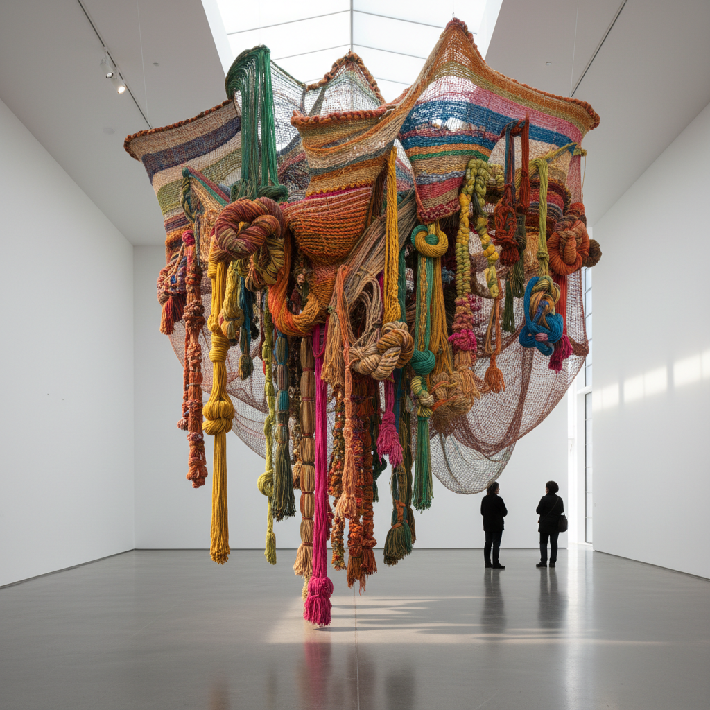

# Textile Art 纺织艺术

> "Thread is my medium, as oil is to a painter." — Sheila Hicks

## 概述

纺织艺术（Textile Art / Fiber Art）是以纤维材料——线、纱、布、毛、丝——为主要媒介的艺术创作。它跨越了工艺与纯艺术的边界，从传统的编织、刺绣、拼布发展为当代的大型装置、雕塑和概念作品。

纺织艺术的历史比绘画更古老，但长期被归类为"工艺"而非"艺术"。20世纪后半叶，女性主义运动和后现代主义的等级解构使纺织艺术获得了艺术界的正式认可。

## 核心特征

| 特征 | 描述 |
|------|------|
| 纤维媒介 | 线、纱、布、毛、丝等柔性材料 |
| 手工过程 | 编织、刺绣、缝纫、打结等手工技法 |
| 触觉性 | 强调材料的触感和物理性 |
| 时间性 | 缓慢的、重复的、冥想式的制作过程 |
| 性别政治 | 挑战"女红=低等"的等级制度 |
| 跨文化 | 每种文化都有独特的纺织传统 |

## 视觉特征

- **材料**：羊毛、棉、丝、麻、合成纤维、金属线
- **技法**：编织、刺绣、钩针、毡化、拼布、打结
- **质感**：柔软的、有机的、可触摸的
- **色彩**：染色的丰富色谱、天然纤维的素雅
- **尺度**：从微型刺绣到建筑尺度的装置
- **形态**：平面织物、立体雕塑、悬挂装置

## 代表作品

| 作品 | 艺术家 | 年代 | 意义 |
|------|--------|------|------|
| *Abakan* series | Magdalena Abakanowicz | 1960s-70s | 巨型织物雕塑——纺织艺术的解放 |
| *The Dinner Party* | Judy Chicago | 1974-79 | 刺绣桌布——女性主义里程碑 |
| *Minimes* | Sheila Hicks | 1950s+ | 微型编织——纺织的亲密性 |
| *Untitled (Sisal)* | Olga de Amaral | 1970s+ | 金箔与纤维的融合 |
| *Coral Forest* | Joana Vasconcelos | 2010s | 钩针珊瑚——手工艺的当代转化 |
| *Network of Stoppages* | El Anatsui | 2000s+ | 金属瓶盖编织的巨型挂毯 |

## 历史时间线

| 时期 | 事件 |
|------|------|
| 远古 | 纺织是人类最古老的技术之一 |
| 中世纪 | 挂毯作为叙事和装饰的高级形式 |
| 1919 | 包豪斯纺织工坊——现代纺织设计 |
| 1962 | Lausanne国际挂毯双年展——纺织艺术的国际化 |
| 1960s-70s | Abakanowicz——纺织从平面走向雕塑 |
| 1970s | 女性主义运动——纺织作为政治媒介 |
| 1990s | 纺织艺术进入主流当代艺术 |
| 2000s | El Anatsui——非洲纺织的全球认可 |
| 2010s-至今 | 纺织艺术的全面复兴和博物馆化 |

## 子类型

| 子类型 | 特征 |
|--------|------|
| 编织艺术 | 经纬交织的平面和立体作品 |
| 刺绣艺术 | 针线在布面上的绘画 |
| 拼布艺术 | 布片拼接的几何和叙事 |
| 纤维雕塑 | 纤维材料的三维造型 |
| 装置纺织 | 建筑尺度的纤维装置 |
| 概念纺织 | 以纺织为概念而非仅仅媒介 |

## 中国语境

中国有世界上最丰富的纺织传统——丝绸、刺绣（苏绣、湘绣、蜀绣、粤绣）、织锦、扎染、蜡染。当代中国纺织艺术家如梁绍基（蚕丝装置）、林天苗（线的装置）将传统材料转化为当代语言。中国的非遗保护运动使传统纺织技艺获得新的关注，而年轻设计师将传统纹样和技法融入当代时尚和艺术。

## 争议与遗产

- **争议**：纺织是工艺还是艺术？这个问题本身就是性别歧视的产物
- **劳动问题**：手工纺织的极端耗时——是冥想还是剥削？
- **文化挪用**：西方艺术家使用非西方纺织传统的伦理
- **遗产**：永久打破了艺术与工艺的等级制度
- **当代回响**：慢时尚、手工复兴、可持续材料、编织社区

## AI生成概念图

## 与其他风格的关系

- **Pattern and Decoration** → P&D运动为纺织艺术的艺术地位正名
- **Feminist Art** → 女性主义艺术将纺织作为政治媒介
- **Arts and Crafts** → 工艺美术运动是纺织艺术的现代先驱
- **Minimalism** → 极简主义的重复性与编织的重复性相通
- **Installation Art** → 大型纤维装置是装置艺术的重要分支
- **Bio Art** → 生物材料（蚕丝、菌丝）连接纺织与生物艺术

---

*浮光艺志 | Chronicle of Artistry*
