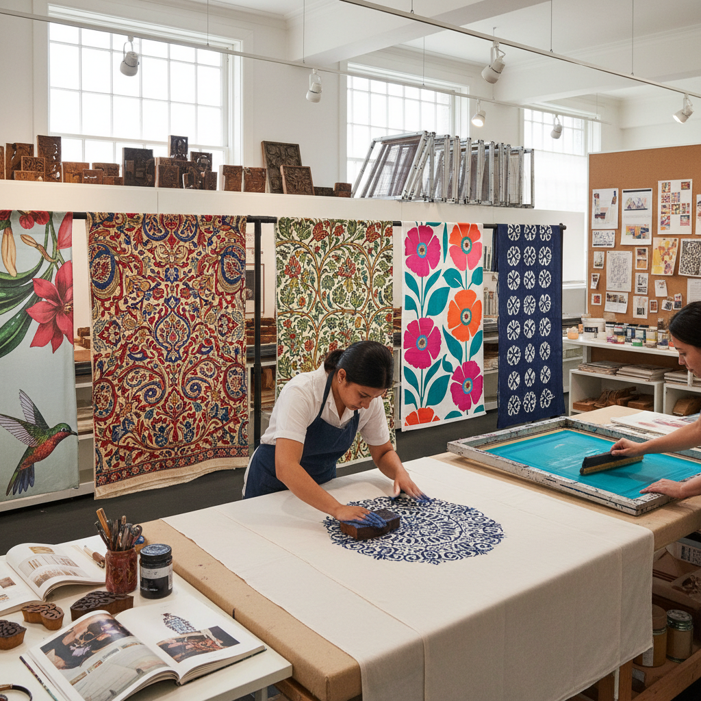

# Textile Printing 纺织印花

> "Textile printing is the marriage of art and industry — patterns conceived in the mind of the designer, translated through blocks, screens, or rollers, and multiplied across yards of fabric to clothe the world in color and pattern." — Unknown

## 概述

纺织印花（Textile Printing）是将图案和色彩通过各种印刷方法施加到织物表面的技术和艺术。与染色（将整块织物浸入染料）不同，印花是将颜色精确地施加到织物的特定区域，形成图案。纺织印花是人类最古老的装饰艺术之一，也是现代纺织工业的核心技术。

纺织印花包括多种方法：木版印花（block printing，使用雕刻木版）、丝网印花（screen printing，使用丝网模板）、滚筒印花（roller printing，使用雕刻金属滚筒）、数字印花（digital printing，使用喷墨技术）、转移印花（transfer printing，使用热转印）等。纺织印花的历史可追溯到数千年前——印度的木版印花、中国的蓝印花布、日本的型染都是古老的纺织印花传统。

## 核心特征

| 特征 | 描述 |
|------|------|
| 图案 | 精确的图案施加 |
| 重复 | 可重复印刷 |
| 多样 | 多种印花方法 |
| 工业 | 可工业化生产 |
| 设计 | 需要图案设计 |
| 色彩 | 丰富的色彩表现 |

## 视觉特征

- **图案**：精确的图案
- **重复**：重复的花纹
- **色彩**：丰富的色彩
- **精确**：精确的套色
- **多样**：多样的风格
- **平面**：平面的装饰效果

## 代表作品

| 作品 | 艺术家 | 年代 | 意义 |
|------|--------|------|------|
| *Indian block prints* | 印度工匠 | 传统 | 印度木版印花 |
| *William Morris textiles* | William Morris | 19世纪 | 工艺美术运动 |
| *Marimekko prints* | Various | 1960s起 | 芬兰现代印花 |
| *Liberty prints* | Various | 19世纪起 | 英国印花传统 |
| *Contemporary digital prints* | Various | 当代 | 数字印花艺术 |

## 历史时间线

| 时期 | 事件 |
|------|------|
| 古代 | 最早的木版印花（印度） |
| 中世纪 | 纺织印花在亚洲的发展 |
| 17-18世纪 | 印花棉布在欧洲的流行 |
| 工业革命 | 滚筒印花的发明 |
| 20世纪 | 丝网印花的普及 |
| 当代 | 数字印花技术的革命 |

## 中国语境

纺织印花在中国有极其悠久的历史——中国的蓝印花布是世界上最古老的纺织印花传统之一。中国的木版印花、蜡染印花、扎染印花都有数千年的历史。中国是世界上最大的纺织品生产国，纺织印花工业极为发达。中国的纺织设计教育中，印花设计是核心课程之一。中国的当代纺织设计师在传统印花技法的基础上融合现代设计理念和数字技术。

## AI生成概念图

## 与其他风格的关系

- **Block Printing** → 木版印花
- **Screen Printing** → 丝网印刷
- **Digital Printing** → 数字印花
- **Pattern Design** → 图案设计
- **Resist Dyeing** → 防染技法
- **Fashion Design** → 时装设计

---

*浮光艺志 | Chronicle of Artistry*
