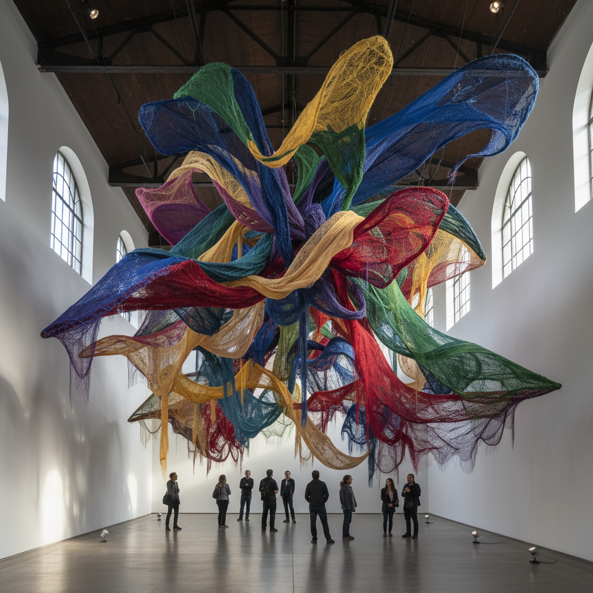

# Textile Sculpture 纺织雕塑

> **时期：** 1960年代–至今  
> **关键词：** 软雕塑、纤维装置、编织结构、身体与空间、材料实验

## 概述

Textile Sculpture（纺织雕塑）是将传统纺织工艺提升为当代雕塑和装置艺术的运动。从马格达莱纳·阿巴卡诺维奇的巨型编织装置到当代艺术家用针织、钩编、缝纫创造的大型空间作品，纺织雕塑挑战了"工艺"与"艺术"的界限，将柔软的纤维材料转化为具有纪念碑性的三维形态。

## 风格特征

- **软性结构**：柔软材料创造的三维形态
- **重力美学**：悬挂、垂坠、堆叠的自然形态
- **触觉邀请**：材料本身激发的触摸欲望
- **规模转换**：微小工艺放大为建筑尺度
- **身体隐喻**：纤维与人体的亲密关联

## 代表人物与作品

- 马格达莱纳·阿巴卡诺维奇《Abakans》系列
- 希拉·希克斯（色彩纤维装置）
- 安妮特·梅萨热（软雕塑装置）
- 尼克·凯夫《Soundsuits》

## 概念图

