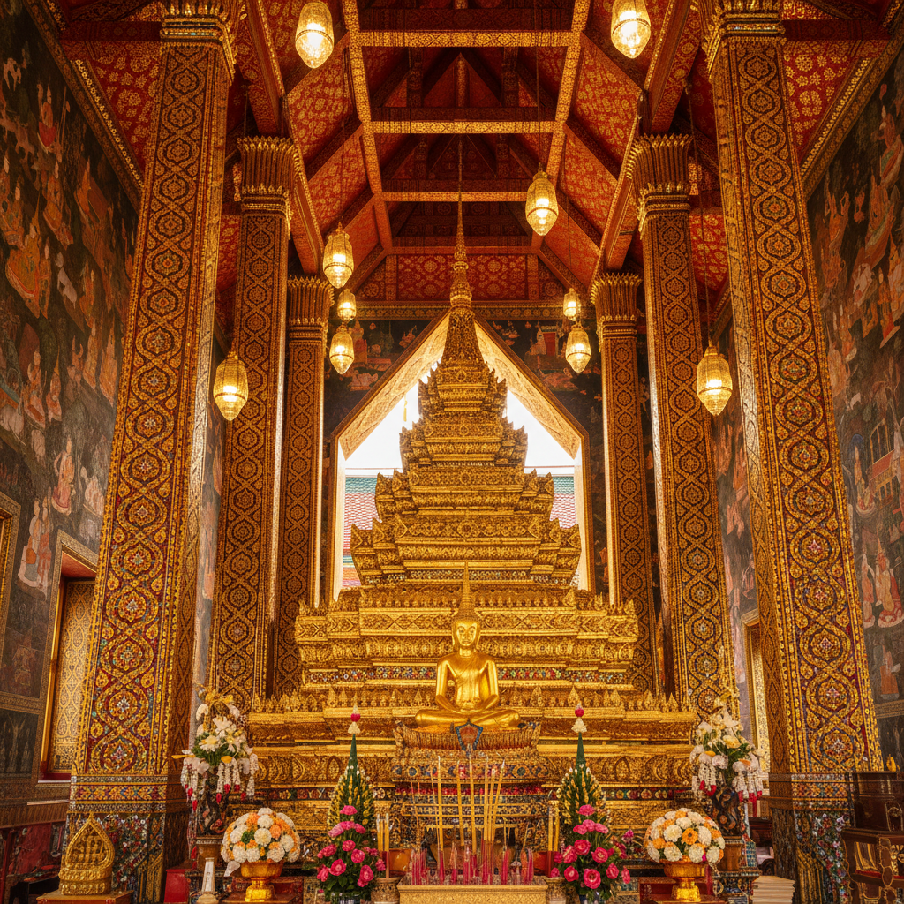

# Thai Temple Art 泰国寺庙艺术 | ศิลปะวัด

> **"金色的尖顶刺向天空——每一寸墙壁都在讲述佛陀的故事。"**

## 概述

泰国寺庙艺术（Thai Temple Art / ศิลปะวัด）是东南亚最华丽的宗教艺术传统之一，融合了上座部佛教信仰、印度教神话、泰族本土审美和皇家赞助，创造出一套独特的视觉语言。从曼谷大皇宫的金碧辉煌到清迈古寺的素雅壁画，泰国寺庙艺术以其精致的金箔装饰、火焰形尖顶、优雅的佛像造型和叙事性壁画闻名于世。

## 时间线

| 时期 | 特征 |
|------|------|
| 陀罗钵地 (6–11世纪) | 印度笈多风格影响，圆润佛像 |
| 素可泰 (13–15世纪) | 泰国佛像的黄金时代，"行走佛" |
| 阿瑜陀耶 (14–18世纪) | 华丽装饰，高棉影响 |
| 曼谷/拉达那哥辛 (1782–至今) | 集大成，大皇宫和玉佛寺 |

## 核心元素

### 建筑
- **尖顶 (Chedi/Stupa)**：佛塔，金色或白色
- **多层屋顶 (Chofa)**：鸟形脊饰，火焰般的曲线
- **纳迦 (Naga)**：蛇形栏杆，守护寺庙
- **金色装饰**：镀金、贴金箔、镶嵌玻璃

### 壁画
- 佛本生故事（Jataka）的连续叙事
- 三界宇宙观的图解
- 鲜艳矿物颜料和金箔
- 多场景并置的叙事方式

### 佛像
- 素可泰风格：椭圆脸、细长眉、微笑
- 七种标准姿态（坐、立、行、卧等）
- 手印（Mudra）的精确象征意义
- 金色或青铜材质

## 视觉特征

- 金色为主的华丽色调
- 火焰形曲线（Kranok纹样）无处不在
- 精致的镶嵌玻璃马赛克
- 多层叠加的屋顶轮廓
- 红色、绿色、金色的经典配色
- 极致精细的装饰覆盖每一寸表面

## 与其他风格的关系

| 风格 | 关系 |
|------|------|
| 印度笈多艺术 | 佛像造型的源头 |
| 高棉/吴哥艺术 | 建筑和装饰的重要影响 |
| 缅甸寺庙艺术 | 同属上座部佛教传统 |
| 中国寺庙建筑 | 屋顶形式的互相影响 |
| Art Deco | 1930年代泰国建筑受Art Deco影响 |

## 概念图

---

*浮光艺志 | Chronicle of Artistry*
