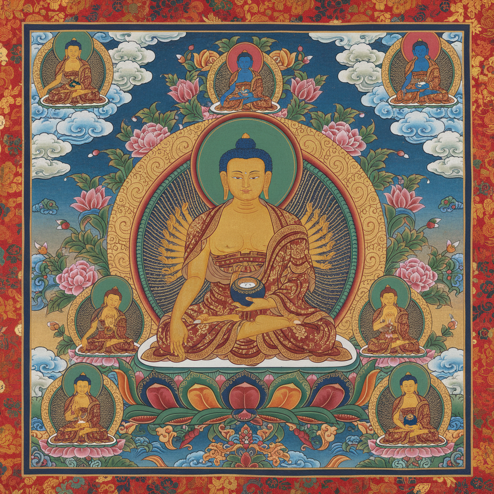

# Tibetan Thangka 唐卡

> "A thangka is a window to enlightenment." — Traditional saying

## 概述

唐卡（Thangka）是藏传佛教的传统卷轴画，以矿物颜料和金粉在棉布或丝绸上绘制佛像、曼陀罗和宗教叙事。唐卡不仅是艺术品，更是冥想的工具和宗教教学的视觉辅助。

唐卡的绘制本身就是一种修行——画师必须遵循严格的度量经（iconometry），每一个比例、每一个手印、每一种色彩都有精确的宗教含义。

## 核心特征

| 特征 | 描述 |
|------|------|
| 宗教功能 | 冥想辅助和宗教教学工具 |
| 严格度量 | 佛像比例遵循度量经规定 |
| 矿物颜料 | 金粉、朱砂、石青、石绿等天然颜料 |
| 曼陀罗 | 宇宙秩序的几何图示 |
| 叙事层次 | 中心主尊+周围故事场景 |
| 装裱传统 | 丝绸锦缎装裱的卷轴形式 |

## 视觉特征

- **构图**：中心对称——主尊居中，眷属环绕
- **色彩**：浓烈的矿物色——金、红、蓝、绿
- **金色**：大量金粉勾线和填色
- **细节**：极其精细的装饰纹样
- **背景**：祥云、莲花、火焰、山水
- **比例**：严格的宗教度量比例

## 代表作品

| 作品 | 年代 | 意义 |
|------|------|------|
| *释迦牟尼佛唐卡* | 各时期 | 最常见的唐卡主题 |
| *时轮金刚曼陀罗* | 各时期 | 最复杂的曼陀罗 |
| *绿度母唐卡* | 各时期 | 慈悲的象征 |
| *生死轮回图* | 各时期 | 六道轮回的教学图 |
| *药师佛唐卡* | 各时期 | 治愈与健康 |

## 真实作品（公共领域）

| 作品 | 来源 |
|------|------|
| 藏传佛教唐卡 | [Rubin Museum](https://rubinmuseum.org/collection) |
| 曼陀罗唐卡 | [Met Museum](https://www.metmuseum.org/art/collection/search#!?q=thangka) |
| 历代唐卡 | [Himalayan Art Resources](https://www.himalayanart.org/) |

## AI生成概念图

## 与其他风格的关系

- **Buddhist Art** → 藏传佛教艺术的核心形式
- **Indian Miniature** → 共享南亚细密画传统
- **Mandala** → 曼陀罗是唐卡的重要类型
- **Icon Painting** → 与东正教圣像画的功能平行
