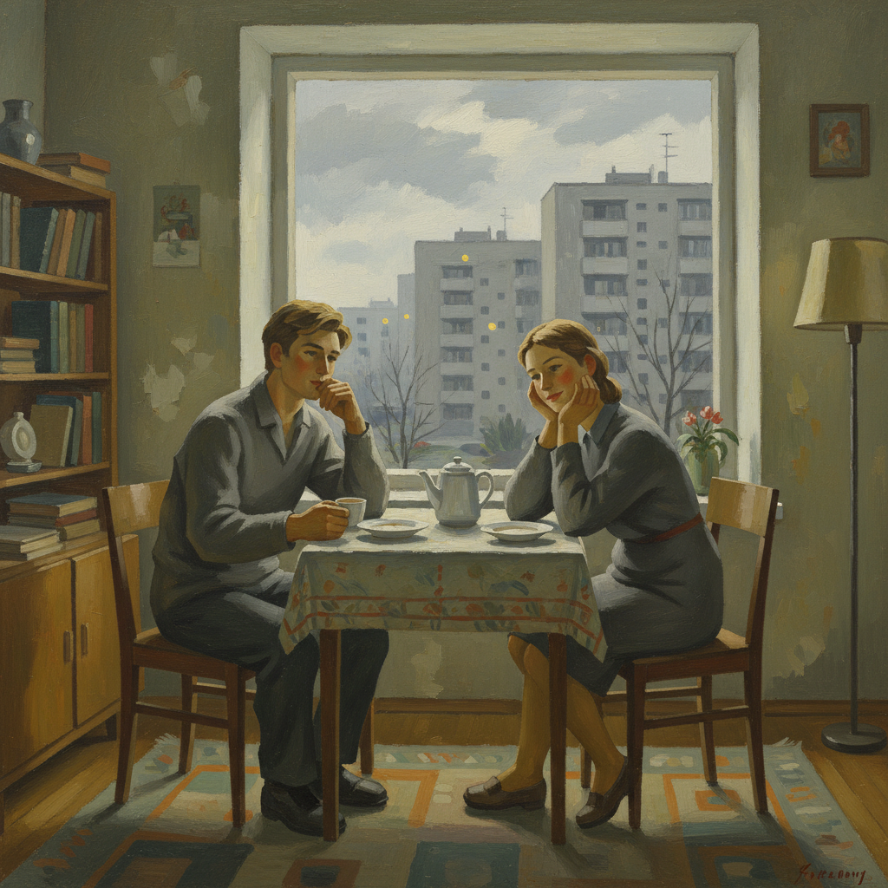

# 解冻时期艺术 · Thaw Art

> "冰层下的河流终于发出了声音。" —— 伊利亚·爱伦堡

## 概述

解冻时期艺术（Thaw Art / Искусство оттепели）是1953年斯大林去世后至1960年代中期苏联文化"解冻"时期涌现的艺术潮流。这一时期以赫鲁晓夫的政治松动为背景，艺术家们开始突破社会主义现实主义的僵化教条，探索个人表达、形式实验和真诚的情感叙事。解冻时期是苏联艺术从斯大林主义向多元化过渡的关键节点，孕育了严厉风格、非官方艺术等后续运动。

## 核心特征

| 特征 | 描述 |
|------|------|
| 时期 | 1953年–1968年 |
| 地域 | 莫斯科、列宁格勒、全苏联 |
| 媒介 | 油画、雕塑、版画、电影、文学 |
| 核心理念 | 以真诚取代虚伪，以个人视角取代集体叙事 |
| 色彩 | 从斯大林时期的"红光亮"转向灰调、土色、冷色 |

## 视觉特征

- **去英雄化**：描绘普通人的日常生活而非领袖与英雄
- **形式探索**：重新接触印象派、表现主义等被禁止的现代手法
- **真诚的情感**：画面传达真实的忧郁、孤独、沉思
- **简化与概括**：摆脱学院派的繁琐细节，追求造型的力量
- **城市与乡村并重**：关注工业化进程中的人与环境

## 代表作品

| 作品 | 艺术家 | 年代 | 类型 |
|------|--------|------|------|
| 《筏工》 | 尼古拉·安德罗诺夫 | 1961 | 油画 |
| 《春天》 | 阿尔卡季·普拉斯托夫 | 1954 | 油画 |
| 《新莫斯科》 | 尤里·皮缅诺夫 | 1937/重评1950s | 油画 |
| 《地质勘探者》 | 帕维尔·尼科诺夫 | 1962 | 油画 |
| 《雁南飞》 | 米哈伊尔·卡拉托佐夫 | 1957 | 电影 |

## 发展时间线

| 时期 | 事件 |
|------|------|
| 1953 | 斯大林去世，文化管控开始松动 |
| 1954 | 爱伦堡发表小说《解冻》，命名这一时代 |
| 1956 | 赫鲁晓夫秘密报告，去斯大林化开始 |
| 1957 | 莫斯科世界青年联欢节，苏联艺术家接触西方现代艺术 |
| 1958-1962 | 解冻艺术创作高峰期 |
| 1962 | 马涅日展览事件，赫鲁晓夫怒斥抽象艺术 |
| 1964 | 赫鲁晓夫下台，文化政策收紧 |
| 1968 | 布拉格之春被镇压，解冻彻底结束 |

## 中国语境

苏联解冻时期与中国"百花齐放"运动（1956-1957）几乎同步发生，但中国的文化开放远比苏联短暂。1980年代中国改革开放后的"伤痕美术"和"乡土现实主义"在精神上更接近苏联解冻艺术——都是在意识形态松动后，艺术家以真诚的个人视角重新审视社会现实。陈丹青《西藏组画》（1980）的朴素真实感与解冻时期绘画有深层共鸣。

## AI 概念图

*AI 生成概念图：解冻时期艺术风格*

## 关联词条

- [[severe-style-art]] - 严厉风格
- [[soviet-nonconformist-art]] - 苏联非官方艺术
- [[russian-realism-art]] - 俄罗斯现实主义
- [[russian-impressionism-art]] - 俄罗斯印象主义

---

*浮光艺志 · Chronicle of Artistry*
