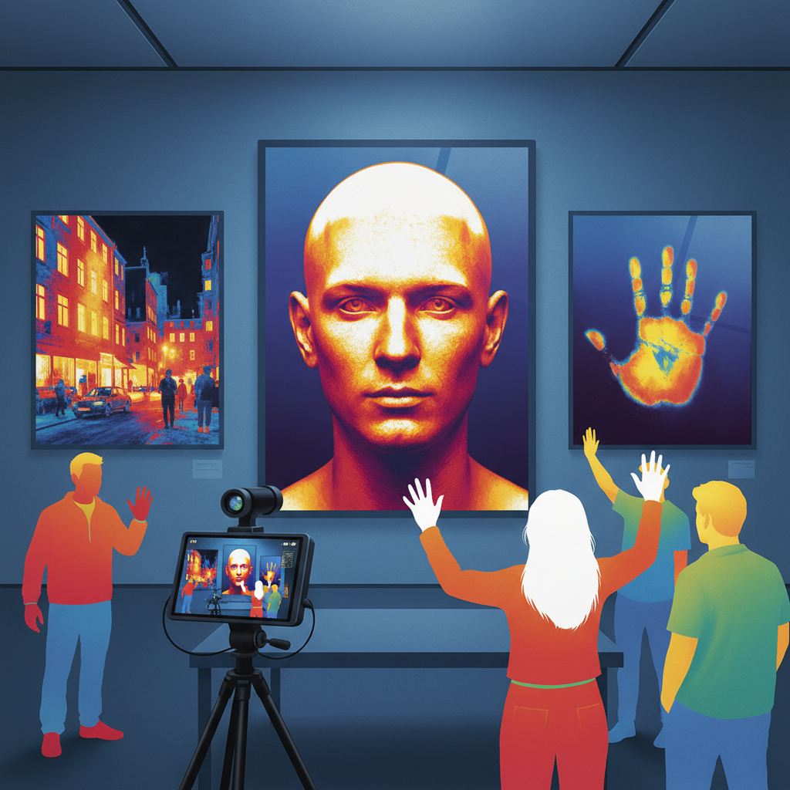

# Thermal Art 热成像艺术

> "Thermal art reveals the invisible warmth of the world — it shows us that everything radiates, that every living body is a furnace, that every building leaks heat like blood from a wound, that the sun's warmth lingers in stone long after sunset, and that the cold of space seeps into everything that faces the night sky. A thermal camera sees what no eye can see: the heat signature of life itself, the energy flowing through all things, the temperature map of existence." — Unknown

## 概述

热成像艺术（Thermal Art）是利用热成像技术——探测物体发出的红外辐射并将温度差异转化为可见图像——进行艺术创作的实践。热成像揭示了一个肉眼完全看不到的世界：每个物体都在发射红外辐射，温度越高辐射越强。

热成像艺术的实践包括：1）热肖像——用热成像相机拍摄人体的热分布图；2）建筑热成像——揭示建筑的热量泄漏和能量流动；3）热痕迹——记录人或物体离开后留下的热痕迹；4）热景观——用热成像拍摄自然景观的温度分布；5）热行为——记录人体在不同情绪和活动状态下的热变化；6）热抽象——将热成像的色彩映射作为抽象艺术。

## 核心特征

| 特征 | 描述 |
|------|------|
| 不可见 | 揭示不可见的热 |
| 温度 | 温度的可视化 |
| 辐射 | 红外辐射 |
| 生命 | 生命的热信号 |
| 能量 | 能量的流动 |
| 痕迹 | 热的痕迹 |

## 视觉特征

- **伪彩色**：热成像的伪彩色映射
- **轮廓**：热轮廓的柔和边缘
- **渐变**：温度的渐变过渡
- **对比**：冷热的强烈对比
- **幽灵**：人体的幽灵般呈现
- **抽象**：高度抽象的图像

## 代表作品

| 作品 | 艺术家 | 年代 | 意义 |
|------|--------|------|------|
| *Thermal portraits* | Various | 2000年代 | 热肖像 |
| *Heat trace art* | Various | 2010年代 | 热痕迹艺术 |
| *Building thermography* | Various | 2000年代 | 建筑热成像 |
| *Thermal landscapes* | Various | 2010年代 | 热景观 |
| *Body heat art* | Various | 当代 | 体温艺术 |

## 历史时间线

| 时期 | 事件 |
|------|------|
| 1800 | Herschel发现红外辐射 |
| 1960年代 | 军用热成像技术 |
| 2000年代 | 民用热成像相机普及 |
| 2010年代 | 手机热成像附件 |
| 当代 | 热成像艺术的独立发展 |

## 中国语境

热成像艺术在中国有独特的技术和文化背景。中国在红外和热成像技术领域有大量研发——从军事应用到民用安防、从建筑节能检测到医疗诊断。中国传统医学中的"寒热"概念——中医通过触诊感知体表温度变化来诊断疾病——与热成像技术有深刻的对应。中国传统文化中对"气"的理解——气的流动产生温度变化——也与热成像揭示的能量流动相呼应。中国当代的一些艺术家在探索热成像艺术：用热成像记录中国城市的能量消耗模式、将中医的"寒热"诊断与热成像肖像结合、以及用热成像揭示中国传统建筑的热工性能之美。

## AI生成概念图

## 与其他风格的关系

- **Infrared Photography** → 红外摄影
- **Data Art** → 数据艺术
- **Science Art** → 科学艺术
- **Body Art** → 身体艺术
- **Invisible Art** → 不可见艺术
- **Electromagnetic Art** → 电磁艺术

---

*浮光艺志 | Chronicle of Artistry*
