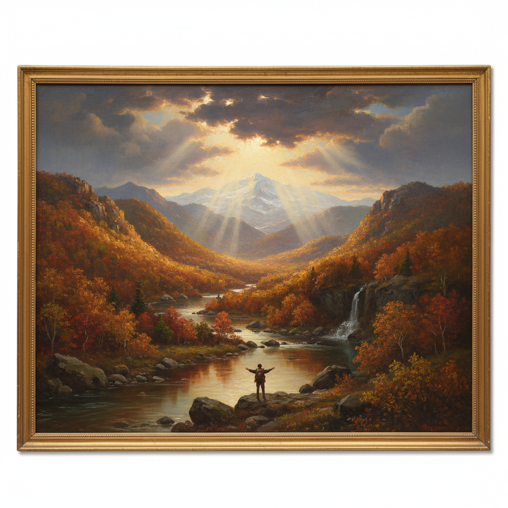

# Thomas Cole 托马斯·科尔

> "We are still in Eden; the wall that shuts us out of the garden is our own ignorance and folly." — Thomas Cole

## 概述

托马斯·科尔（Thomas Cole，1801–1848）是美国哈德逊河画派的创始人，美国风景画传统的奠基者。他以描绘美国东部荒野——卡茨基尔山脉、哈德逊河谷——的壮丽风景闻名，同时创作了《帝国的历程》等寓言系列，将美国自然的崇高与文明兴衰的哲思融为一体。

## 核心特征

| 特征 | 描述 |
|------|------|
| 美国荒野 | 卡茨基尔山脉的原始森林 |
| 崇高美学 | 自然的宏大与人的渺小 |
| 寓言叙事 | 文明兴衰的系列画作 |
| 秋色光辉 | 新英格兰秋天的金红色 |
| 道德风景 | 自然作为精神启示 |
| 画派创始 | 哈德逊河画派的精神领袖 |

## 代表作品

| 作品 | 年代 | 意义 |
|------|------|------|
| *The Course of Empire* | 1833–36 | 文明五阶段的史诗寓言 |
| *The Oxbow* | 1836 | 荒野与文明的对比 |
| *The Voyage of Life* | 1842 | 人生四季的寓言 |
| *View from Mount Holyoke* | 1836 | 美国风景画的里程碑 |

## AI生成概念图

## 与其他风格的关系

- **Hudson River School** → 画派创始人
- **Romanticism** → 美国浪漫主义的代表
- **Bierstadt** → 影响了第二代西部画家
- **Luminism** → 为光辉主义奠定基础
