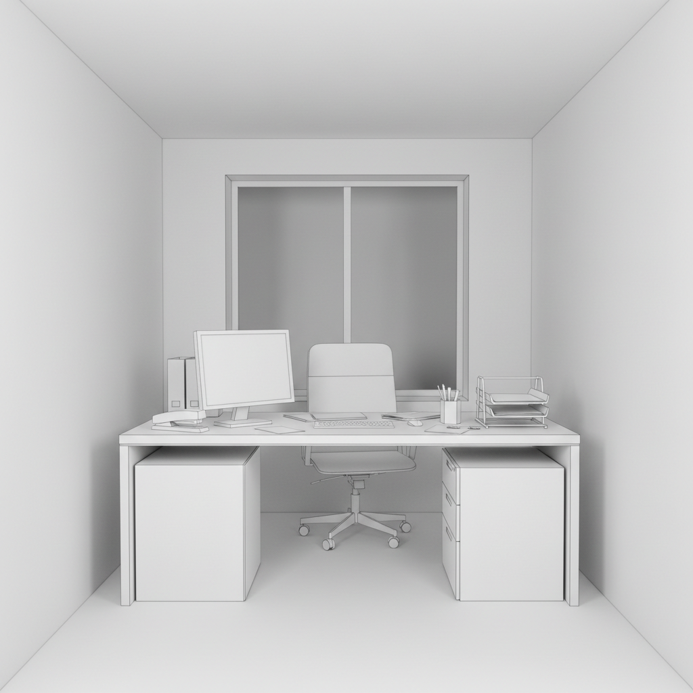

# Thomas Demand 托马斯·德曼德

> **时期：** 1964–至今  
> **关键词：** 纸模型摄影、再造现实、无人空间、媒体图像考古

## 概述

Thomas Demand 是德国艺术家，以独特的工作方法闻名：他根据新闻照片或历史图像，用纸和纸板1:1重建整个场景，然后拍摄这个纸模型，最后销毁模型。最终的照片看似真实空间，细看却发现所有表面都是空白的纸——没有文字、没有纹理、没有痕迹。

## 风格特征

- **纸板重建**：所有场景都是纸和纸板的1:1模型
- **无文字表面**：书本、报纸、屏幕上没有任何文字
- **无人在场**：空间中从不出现人物
- **媒体考古**：重建的场景来自著名新闻事件
- **不可思议的平滑**：真实与虚假之间的认知裂缝

## 代表作品

- *Office*（1995，基于斯塔西档案室）
- *Presidency*（2008）
- *Grotto*（2006）
- *Pacific Sun*（2012，动画）

## 概念图

