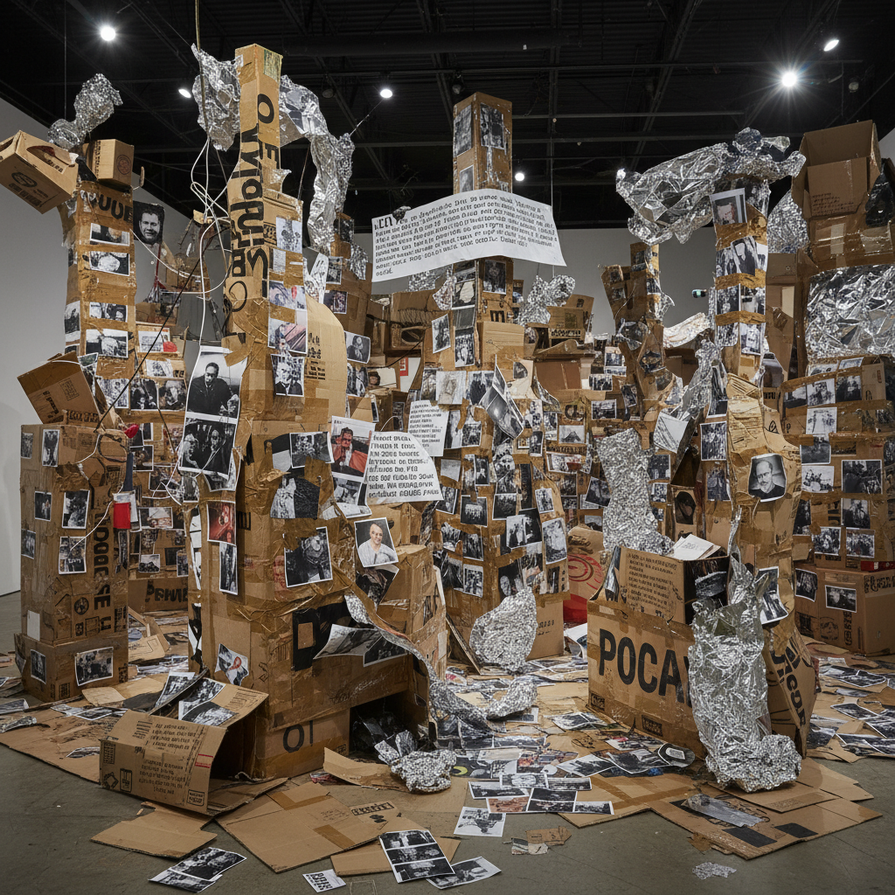

# Thomas Hirschhorn 托马斯·赫希洪

> **时期：** 1957–至今  
> **关键词：** 胶带美学、纸板装置、过度堆积、政治哲学

## 概述

Thomas Hirschhorn 是瑞士艺术家，以用廉价日常材料（纸板、胶带、铝箔、打印图片）创造巨大的、混乱的装置而闻名。他的作品将哲学文本、暴力图像、消费品和手工制作混合在一起，创造出一种"穷人美学"——刻意粗糙、过度堆积、拒绝精致。

## 风格特征

- **廉价材料**：纸板、包装胶带、铝箔、塑料薄膜
- **过度堆积**：信息和物品的洪流式堆积
- **棕色胶带**：标志性的棕色包装胶带连接一切
- **哲学引用**：德勒兹、巴塔耶、葛兰西等哲学家的文本
- **暴力与消费并置**：战争图像与消费品共存

## 代表作品

- *Bataille Monument*（2002，卡塞尔文献展）
- *Gramsci Monument*（2013，纽约布朗克斯）
- *Flamme éternelle*（2014）
- *In-Between*（2015）

## 概念图

