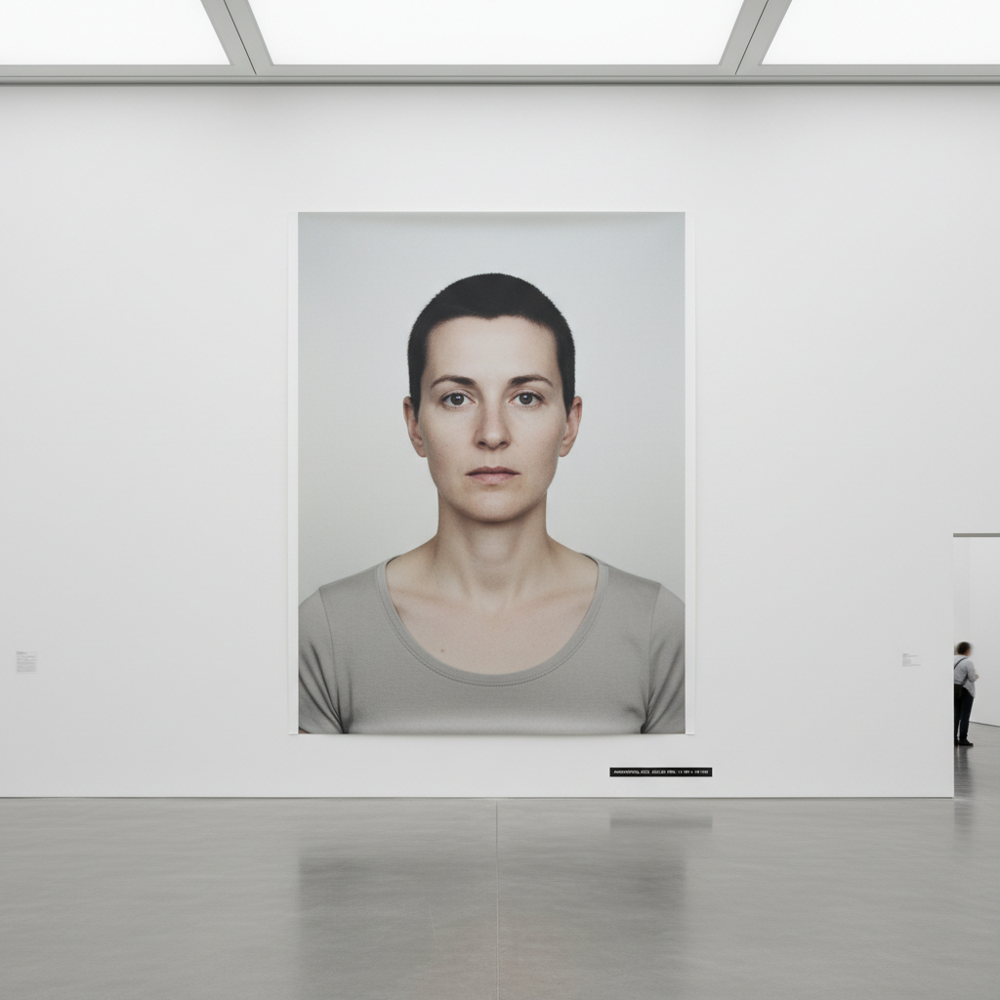

# Thomas Ruff 托马斯·鲁夫

> **流派**: 当代摄影 · 杜塞尔多夫学派  
> **时期**: 1958–至今 德国  
> **关键词**: 巨幅肖像、数字操控、互联网图像、摄影本体论

## 概述

托马斯·鲁夫是杜塞尔多夫学派（贝歇尔学生）中最具实验精神的摄影师。他不断质疑摄影的本质——照片是否等于真实？他的巨幅护照式肖像消除了一切情感暗示；他的"夜景"系列用夜视仪拍摄；他的"jpeg"系列将网络图片放大到像素崩溃；他的"底片"系列将照片反转为负片。每个系列都是对摄影媒介的一次解剖。

## 视觉特征

- **巨幅肖像**: 超大尺寸的正面护照照，表情中性
- **像素化**: 故意放大低分辨率图像直到像素可见
- **夜视绿**: 用军用夜视设备拍摄的绿色调画面
- **色彩反转**: 将正片转为负片的诡异色彩
- **去情感化**: 刻意冷静、客观、无表情的呈现

## 代表作品

- 《肖像》(Portraits) 系列 (1986–)
- 《夜景》(Nacht) 系列 (1992–)
- 《jpeg》系列 (2004–)
- 《底片》(Negatives) 系列
- 《火星》(m.a.r.s.) 系列 (2011)

## 历史影响

鲁夫系统性地拆解了摄影的每一个假设——真实性、客观性、清晰度、作者性。他证明了摄影不是透明的窗户，而是一种可以被无限操控和质疑的语言系统。

## 相关风格

- [Andreas Gursky 安德烈亚斯·古尔斯基](andreas-gursky.md)
- [Düsseldorf School 杜塞尔多夫学派](dusseldorf-school.md)
- [Conceptual Photography 观念摄影](conceptual-photography.md)
