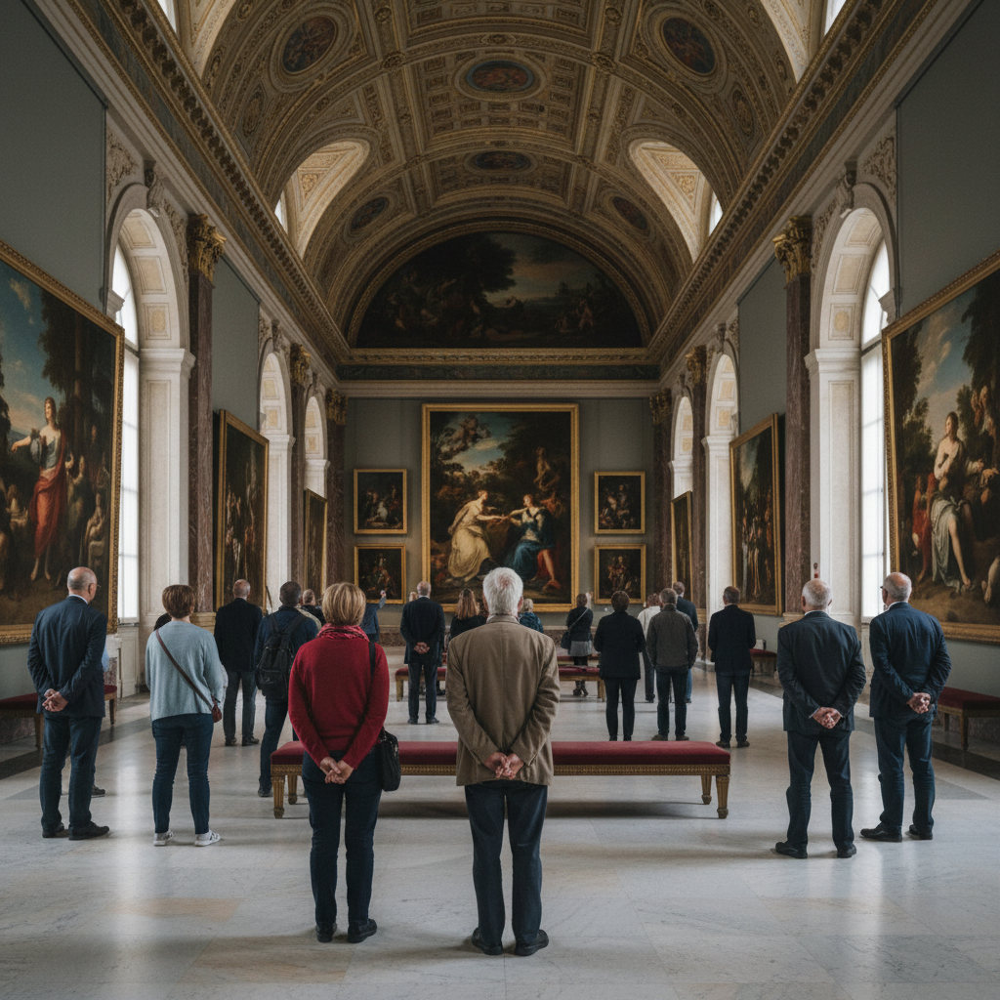

# Thomas Struth 托马斯·施特鲁特

> **时期：** 1954–至今  
> **关键词：** 博物馆摄影、城市街景、家庭肖像、技术景观

## 概述

Thomas Struth 是德国摄影师，杜塞尔多夫学派的代表人物。他以大画幅、高清晰度的摄影记录博物馆中的观众、世界各地的城市街道、家庭群像和高科技设施，探索人与空间、文化和技术之间的关系。

## 风格特征

- **大画幅高清**：极高的细节分辨率和巨大的打印尺寸
- **博物馆系列**：拍摄观众观看名画的场景，形成"观看的观看"
- **无人街景**：清晨空旷的城市街道，建筑作为主角
- **正面性**：正面、对称、冷静的构图
- **技术崇高**：火箭发射台、粒子加速器等高科技景观

## 代表作品

- *Museum Photographs*系列（1989–至今）
- *Unconscious Places*（街景系列）
- *Family Portraits*系列
- *Paradise*系列（丛林）

## 概念图

