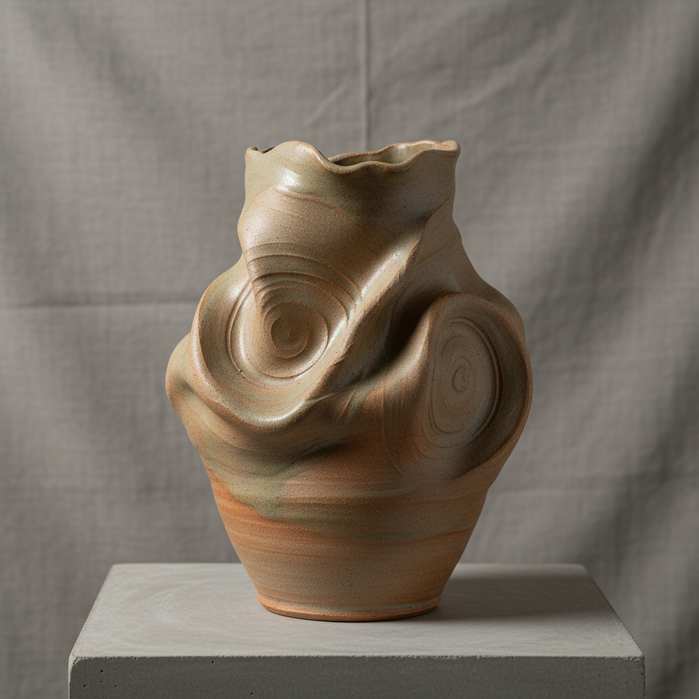

# Thrown and Altered Art 拉坯变形艺术

> "Thrown and altered is the wheel's geometry deliberately broken — a cylinder pulled on the spinning wheel then cut, folded, pushed, paddled, or stretched while still soft into forms that remember their circular origin but have been liberated from it, the tension between mechanical perfection and human gesture visible in every curve that was once a circle, order and chaos negotiating on the surface of wet clay." — Unknown

## 概述

拉坯变形艺术（Thrown and Altered Art）是一种先在陶轮上拉制基本器形，然后在坯体仍然柔软时通过切割、折叠、推压、拍打、拉伸等手法改变其形态的陶瓷创作技法。这种技法结合了拉坯的精确性和手工变形的自由度——器物保留了圆形拉坯的痕迹和张力，同时获得了手工干预带来的有机形态和个性表达。

拉坯变形艺术的核心要素包括：1）拉坯基础——在陶轮上拉制基本形；2）湿态变形——在坯体柔软时进行改变；3）切割重组——切开后重新组合；4）推压变形——用手或工具推压改变形态；5）张力保留——保留拉坯的圆形张力；6）有机形态——获得自由的有机造型；7）对比美学——规则与不规则的对比。

## 核心特征

| 特征 | 描述 |
|------|------|
| 拉坯起始 | 从陶轮拉坯开始 |
| 湿态变形 | 在柔软时改变形态 |
| 张力保留 | 保留圆形的张力 |
| 有机形态 | 自由的有机造型 |
| 对比美学 | 规则与不规则的对比 |
| 个性表达 | 每件作品独特 |

## 视觉特征

- **圆形记忆**：可见的圆形拉坯痕迹
- **有机变形**：自由的有机形态变化
- **切割痕迹**：切割和重组的痕迹
- **推压凹陷**：手指或工具的推压痕
- **不对称**：打破对称的自由造型
- **动态感**：充满动感的形态

## 代表作品

| 作品 | 艺术家/文化 | 年代 | 意义 |
|------|-------------|------|------|
| *Peter Voulkos作品* | Peter Voulkos | 20世纪 | 拉坯变形的先驱 |
| *Ken Price作品* | Ken Price | 20世纪 | 变形陶瓷雕塑 |
| *当代拉坯变形* | 各地陶艺家 | 当代 | 技法的广泛应用 |
| *日本变形茶碗* | 日本陶艺家 | 各时期 | 日本变形传统 |
| *功能性变形器* | 当代陶艺家 | 当代 | 功能与变形的结合 |

## 历史时间线

| 时期 | 事件 |
|------|------|
| 古代 | 早期的拉坯后变形实践 |
| 16世纪 | 日本茶碗的有意变形 |
| 1950年代 | Peter Voulkos的革命性探索 |
| 1970年代 | 拉坯变形成为主流技法 |
| 当代 | 拉坯变形的多元化发展 |

## 中国语境

拉坯变形在中国当代陶艺中有广泛应用。中国传统陶瓷虽然以规整对称为主流审美，但也有变形的传统——如唐代的花口碗、宋代的葵口盘等，都是在拉坯后通过压制形成花瓣形口沿。中国当代陶艺家大量使用拉坯变形技法——将拉坯的精确性与手工变形的自由度结合，创造出既有中国传统器形基因又有当代个性表达的作品。拉坯变形技法在中国陶艺教育中是重要的教学内容——它帮助学生理解从规则到自由、从控制到释放的创作过程。

## AI生成概念图

## 与其他风格的关系

- **Wheel Throwing** → 拉坯
- **Abstract Expressionism** → 抽象表现主义
- **Sculptural Ceramics** → 雕塑陶瓷
- **Wabi-Sabi** → 侘寂美学
- **Studio Pottery** → 工作室陶艺
- **Organic Form** → 有机形态

---

*浮光艺志 | Chronicle of Artistry*
