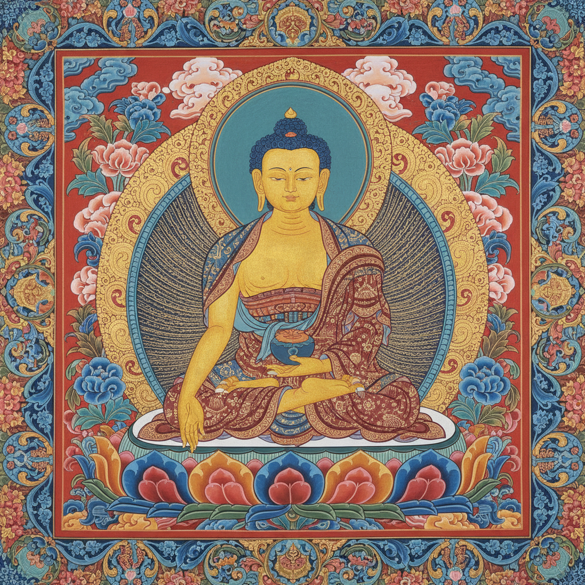

# 藏传佛教艺术 · Tibetan Art

> "每一笔色彩都是修行，每一尊佛像都是觉悟的化身。" —— 藏传佛教格言

## 概述

藏传佛教艺术（Tibetan Art）是7世纪以来在青藏高原及周边地区发展出的独特宗教视觉艺术体系，融合了印度佛教艺术、尼泊尔纽瓦尔工艺、中原汉地绘画和中亚游牧民族装饰传统。以唐卡（thangka）绘画、壁画、铜鎏金造像、酥油花和坛城（mandala）沙画为核心，藏传佛教艺术是世界上最精密、最系统化的宗教视觉传统之一，每一个图像元素都严格遵循经典仪轨（iconometry）。

## 核心特征

| 特征 | 描述 |
|------|------|
| 时期 | 7世纪–至今 |
| 地域 | 西藏、青海、甘肃、四川、云南、蒙古、尼泊尔、不丹 |
| 媒介 | 矿物颜料唐卡、壁画、铜鎏金造像、酥油花、沙坛城 |
| 核心理念 | 以精密的视觉形式承载佛法教义与修行观想 |
| 色彩 | 金色、群青蓝、朱砂红、石绿、白色 |

## 视觉特征

- **严格的度量经**：佛像比例遵循精确的数学规范
- **矿物颜料**：使用金粉、朱砂、石青、石绿等天然矿物
- **层次化空间**：中心主尊、周围眷属、背景净土的层级构图
- **装饰性极强**：繁复的莲花座、背光、华盖、飘带
- **叙事连环**：佛传故事和本生故事的连续画面

## 代表作品

| 作品 | 地点/流派 | 年代 | 类型 |
|------|-----------|------|------|
| 布达拉宫壁画 | 拉萨 | 17世纪 | 壁画 |
| 白居寺十万佛塔壁画 | 江孜 | 15世纪 | 壁画 |
| 勉唐派唐卡 | 西藏中部 | 15世纪至今 | 唐卡绘画 |
| 噶玛噶赤派唐卡 | 西藏东部 | 16世纪至今 | 唐卡绘画 |
| 塔尔寺酥油花 | 青海 | 明代至今 | 酥油雕塑 |

## 发展时间线

| 时期 | 事件 |
|------|------|
| 7世纪 | 松赞干布时期，佛教传入西藏 |
| 8世纪 | 赤松德赞建桑耶寺，印度和中原画风并存 |
| 11-12世纪 | 后弘期，尼泊尔纽瓦尔风格影响增强 |
| 15世纪 | 勉唐派创立，藏族本土画风成熟 |
| 16世纪 | 噶玛噶赤派融入汉地工笔技法 |
| 17世纪 | 五世达赖时期，布达拉宫艺术巅峰 |
| 当代 | 唐卡艺术列入非物质文化遗产，传承与创新并行 |

## 中国语境

藏传佛教艺术是中国多民族艺术宝库的重要组成部分。唐卡绘画2006年列入国家级非物质文化遗产名录。历史上，藏传佛教艺术与汉地艺术的交流极为密切——元代阿尼哥将尼泊尔-藏式造像风格带入大都；明清宫廷大量制作藏传佛教造像和唐卡；噶玛噶赤画派直接融入了中原工笔山水技法。当代热贡唐卡（青海同仁）是中国最活跃的传统绘画传承基地之一。

## AI 概念图

*AI 生成概念图：藏传佛教艺术风格*

## 关联词条

- [[persian-miniature-art]] - 波斯细密画
- [[russian-icon-art]] - 俄罗斯圣像画
- [[mughal-miniature-art]] - 莫卧儿细密画

---

*浮光艺志 · Chronicle of Artistry*
