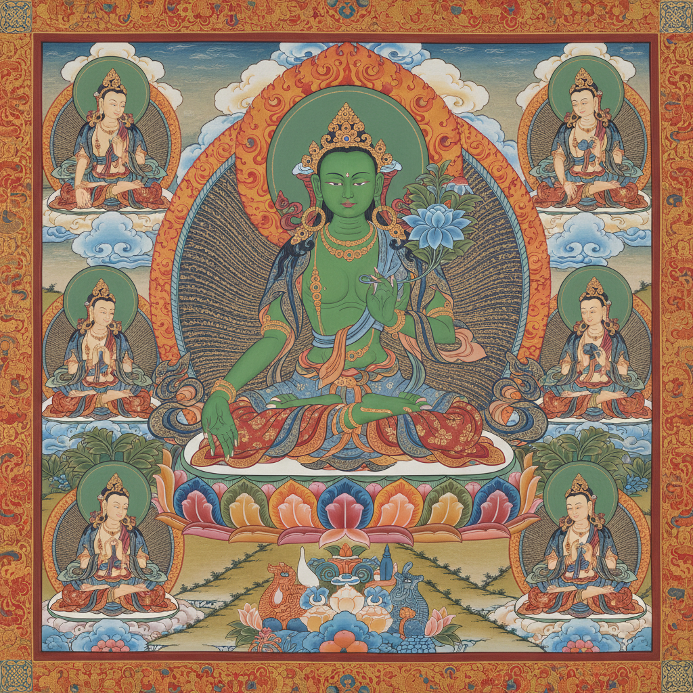

# Tibetan Thangka 藏传唐卡

> **"一幅唐卡就是一座可以随身携带的寺庙。"**

## 概述

唐卡（Thangka / Tangka）是藏传佛教独特的卷轴画艺术，起源于7世纪吐蕃时期，在西藏、尼泊尔、蒙古、不丹等藏传佛教文化圈中传承至今。唐卡以矿物颜料和金粉绘制在棉布或丝绸上，描绘佛陀、菩萨、护法神、曼陀罗等宗教主题，既是修行观想的辅助工具，也是藏族视觉艺术的最高成就。2006年被列入中国国家级非物质文化遗产。

## 主要类型

| 类型 | 特征 |
|------|------|
| 彩绘唐卡 | 矿物颜料绘制，最常见 |
| 金唐卡 | 金色底上用线条勾勒 |
| 黑唐卡 | 黑色底上用金线描绘 |
| 红唐卡 | 朱砂红底 |
| 刺绣唐卡 | 丝线刺绣 |
| 缂丝唐卡 | 织造工艺 |
| 贴花唐卡 | 绸缎拼贴 |

## 核心特征

- **度量经**：严格的人体比例规范（佛像的每个部位都有精确尺寸）
- **矿物颜料**：青金石蓝、朱砂红、石绿、金粉等天然矿物
- **开光仪式**：完成后需由高僧开光加持
- **观想功能**：修行者通过凝视唐卡进入冥想
- **叙事性**：一幅画中可包含多个时空场景
- **象征体系**：每个颜色、手印、法器都有特定含义

## 主要画派

| 画派 | 特征 |
|------|------|
| 勉唐派 (Menri) | 15世纪，线条流畅，色彩淡雅 |
| 钦则派 (Khyenri) | 15世纪，构图紧凑，色彩浓烈 |
| 噶玛嘎孜派 (Karma Gadri) | 16世纪，受汉地工笔画影响 |
| 尼泊尔派 (Newari) | 早期风格，印度-尼泊尔传统 |

## 视觉特征

- 中心对称构图（主尊居中，眷属环绕）
- 极致精细的线条描绘
- 鲜艳饱和的矿物色彩
- 大量金色的使用（金粉、金箔）
- 云纹、火焰、莲花等装饰元素
- 曼陀罗的几何宇宙图式
- 锦缎装裱的卷轴形式

## 与其他风格的关系

| 风格 | 关系 |
|------|------|
| 印度佛教壁画 | 唐卡的源头（阿旃陀石窟） |
| 尼泊尔纽瓦尔画 | 早期唐卡的直接影响 |
| 中国工笔画 | 噶玛嘎孜派受汉地影响 |
| 波斯细密画 | 共享精细描绘和矿物颜料 |
| 敦煌壁画 | 共享佛教图像学传统 |
| 曼陀罗艺术 | 唐卡中的核心图式 |

## 概念图

---

*浮光艺志 | Chronicle of Artistry*
