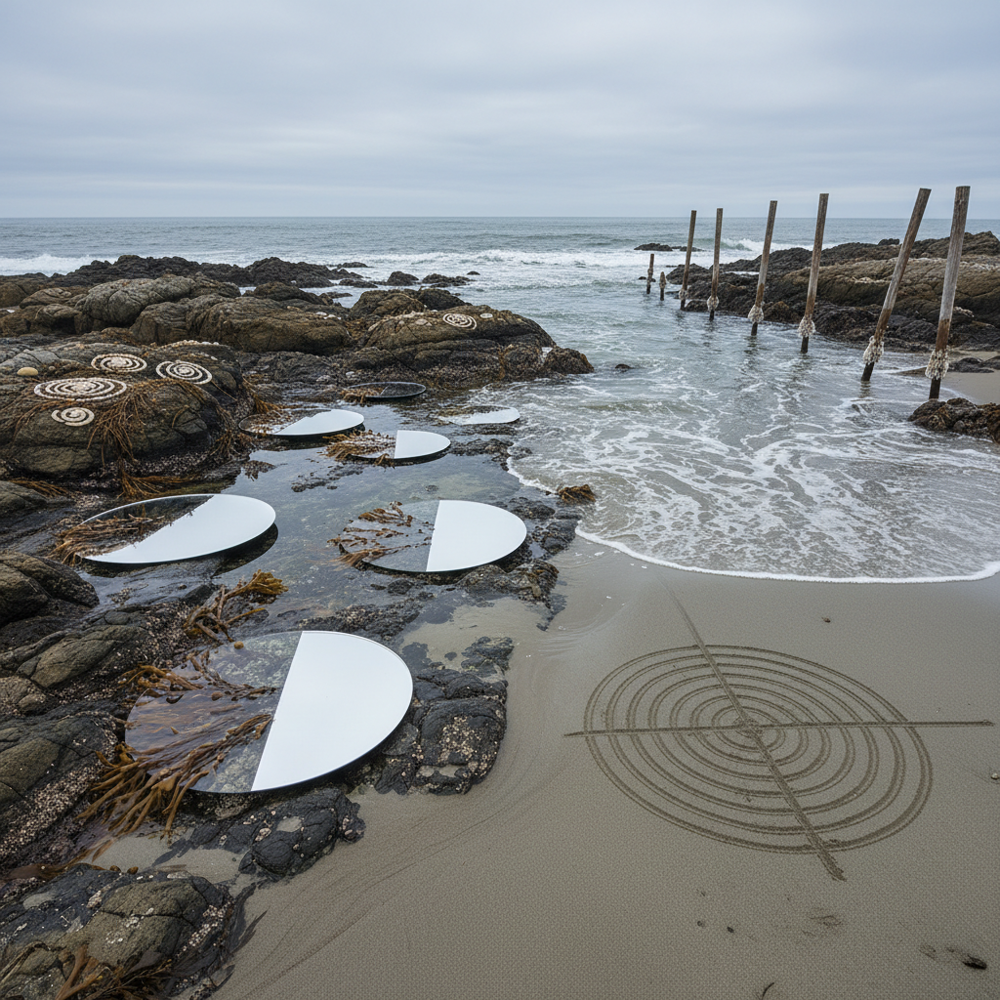

# Tide Art 潮汐艺术

> "Tide art works with the oldest clock on Earth — the gravitational pull of the moon that has been raising and lowering the seas twice daily for four billion years, creating a rhythm more ancient than any life, more reliable than any human timekeeper, and more powerful than any human force. To make art with the tides is to collaborate with cosmic gravity itself, to let the moon be your co-creator, to accept that your work will be made and unmade twice every day, forever." — Unknown

## 概述

潮汐艺术（Tide Art）是以海洋潮汐——月球和太阳引力引起的海水周期性涨落——为媒介、时间框架和合作力量的艺术实践。潮汐是地球上最古老、最可预测的自然节律之一，每天两次改变海岸线的面貌。

潮汐艺术的实践包括：1）潮间带创作——在潮间带（高潮线和低潮线之间的区域）创作会被潮水淹没和露出的作品；2）潮汐擦除——创作会被涨潮冲走的临时作品，接受消失作为作品的一部分；3）潮汐标记——记录和可视化潮汐的高度变化和长期趋势；4）潮汐时间——以潮汐周期（而非钟表时间）作为作品的时间框架；5）海平面上升——用潮汐数据的长期变化来表达气候变化导致的海平面上升。

## 核心特征

| 特征 | 描述 |
|------|------|
| 周期 | 潮汐周期 |
| 消失 | 作品的消失 |
| 引力 | 宇宙引力 |
| 时间 | 潮汐时间 |
| 海岸 | 海岸线 |
| 临时 | 临时性 |

## 视觉特征

- **水线**：潮汐留下的水线
- **沙滩**：沙滩上的创作
- **淹没**：被水淹没的作品
- **痕迹**：潮水留下的痕迹
- **贝壳**：潮间带的生物
- **月亮**：月亮与潮汐的关系

## 代表作品

| 作品 | 艺术家 | 年代 | 意义 |
|------|--------|------|------|
| *Tidal installations* | Various | 2000年代 | 潮汐装置 |
| *Beach drawings* | Various | 2010年代 | 沙滩绘画 |
| *Sea level markers* | Various | 2010年代 | 海平面标记 |
| *Intertidal sculptures* | Various | 2010年代 | 潮间带雕塑 |
| *Tidal data art* | Various | 当代 | 潮汐数据艺术 |

## 历史时间线

| 时期 | 事件 |
|------|------|
| 古代 | 人类对潮汐的观察和利用 |
| 1970年代 | 大地艺术中的海岸创作 |
| 2000年代 | 潮汐艺术的独立发展 |
| 2010年代 | 与气候变化的结合 |
| 当代 | 海平面上升的艺术回应 |

## 中国语境

潮汐艺术在中国有独特的文化和地理基础。中国拥有漫长的海岸线和丰富的潮汐文化——从钱塘江大潮的壮观景象（被称为"天下第一潮"），到沿海渔民世代依赖的潮汐知识，到中国传统文化中"潮起潮落"的人生哲学。中国传统诗词中有大量关于潮汐的意象——"春江潮水连海平，海上明月共潮生"（张若虚）。中国当代的一些艺术家在探索潮汐艺术：在中国海岸线上创作潮间带作品、用中国沿海城市的潮汐数据表达海平面上升的威胁、以及将中国传统的"观潮"文化与当代环境艺术结合。

## AI生成概念图

## 与其他风格的关系

- **Land Art** → 大地艺术
- **Eco-Art** → 生态艺术
- **Ephemeral Art** → 短暂艺术
- **Time-Based Art** → 时基艺术
- **Ocean Art** → 海洋艺术
- **Weather Art** → 气象艺术

---

*浮光艺志 | Chronicle of Artistry*
