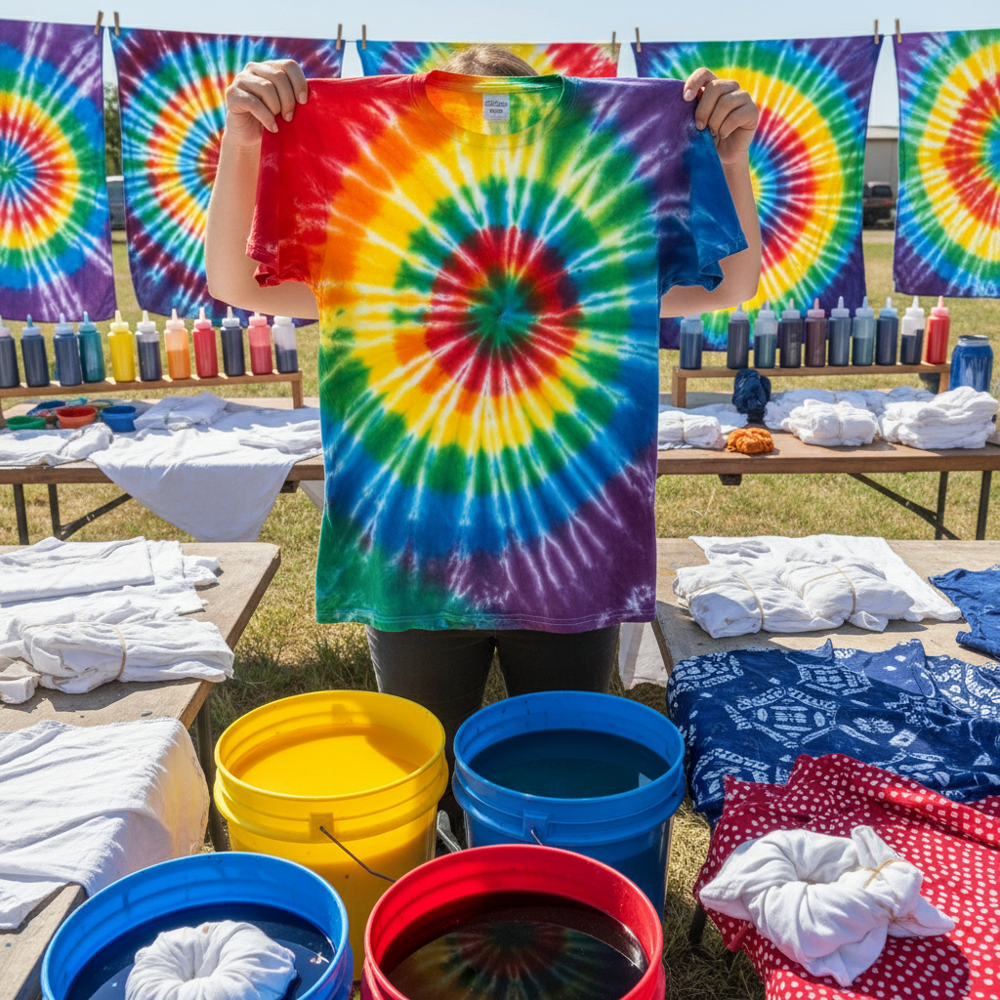

# Tie Dye Art 扎染艺术

> "Tie dye is controlled chaos — the artist binds, folds, twists, and clamps fabric to resist the dye, then surrenders to the chemistry of color meeting cloth. No two pieces are ever identical because the dye finds its own path through the folds, creating patterns that are half-planned and half-discovered. It is collaboration between human intention and liquid physics." — Unknown

## 概述

扎染艺术（Tie Dye Art）是通过将织物进行捆扎、折叠、缝缀或夹压后浸入染料中，利用物理阻隔产生图案的染色艺术形式——被阻隔的部分不着色或着色较浅，形成独特的花纹和色彩渐变效果。扎染是世界上最古老和最广泛分布的纺织装饰技法之一。

扎染艺术的实践包括：1）日本绞染（Shibori）——日本传统的精细扎染技法；2）非洲扎染（Adire）——西非约鲁巴族的靛蓝扎染；3）印度扎染（Bandhani）——印度的点扎染技法；4）嬉皮扎染——1960年代反文化运动的彩虹扎染；5）中国扎染——云南白族等少数民族的传统扎染；6）冰染——用冰块融化染料的现代技法；7）当代扎染——将扎染作为当代艺术和时尚媒介的创作。

## 核心特征

| 特征 | 描述 |
|------|------|
| 防染 | 物理阻隔防染原理 |
| 独特 | 每件作品独一无二 |
| 渐变 | 自然的色彩渐变 |
| 偶然 | 偶然性的美感 |
| 手工 | 纯手工操作 |
| 古老 | 数千年的历史 |

## 视觉特征

- **放射**：放射状的图案
- **渐变**：色彩的自然渐变
- **对称**：折叠产生的对称
- **有机**：有机的不规则形态
- **鲜艳**：鲜艳的色彩组合
- **纹理**：织物的褶皱纹理

## 代表作品

| 作品 | 艺术家/传统 | 年代 | 意义 |
|------|-------------|------|------|
| *Japanese Shibori* | 日本传统 | 8世纪至今 | 日本绞染 |
| *Bandhani textiles* | 印度传统 | 古代至今 | 印度点扎染 |
| *Grateful Dead tie dye* | 嬉皮文化 | 1960s | 嬉皮扎染文化 |
| *Bai tie dye* | 云南白族 | 古代至今 | 中国白族扎染 |
| *Contemporary shibori* | Various | 当代 | 当代绞染艺术 |

## 历史时间线

| 时期 | 事件 |
|------|------|
| 古代 | 世界各地独立发展扎染技术 |
| 8世纪 | 日本绞染技法的成熟 |
| 中世纪 | 非洲和亚洲扎染传统的发展 |
| 1960年代 | 嬉皮运动使扎染全球流行 |
| 当代 | 扎染的时尚复兴和艺术化 |

## 中国语境

扎染艺术在中国有悠久的传统——中国是世界上最早使用扎染技法的文明之一。云南大理白族的扎染是中国最著名的扎染传统——被列入国家级非物质文化遗产名录。白族扎染以蓝白两色为主——使用天然的板蓝根染料，图案以蝴蝶、花卉和几何纹样为主。中国的扎染历史可追溯到秦汉时期——出土的扎染织物证明了这一技法的古老。除白族外，中国的苗族、彝族等少数民族也有各自的扎染传统。中国当代的一些设计师将传统扎染与现代时尚相结合——创造出既有民族特色又具现代感的服装和家居产品。中国的扎染产业在大理等地形成了完整的产业链——从种植染料植物到手工扎染再到旅游销售。

## AI生成概念图

## 与其他风格的关系

- **Shibori** → 日本绞染
- **Batik** → 蜡染艺术
- **Textile Art** → 纺织艺术
- **Indigo Dyeing** → 靛蓝染色
- **Folk Art** → 民间艺术
- **Fashion Design** → 时尚设计

---

*浮光艺志 | Chronicle of Artistry*
