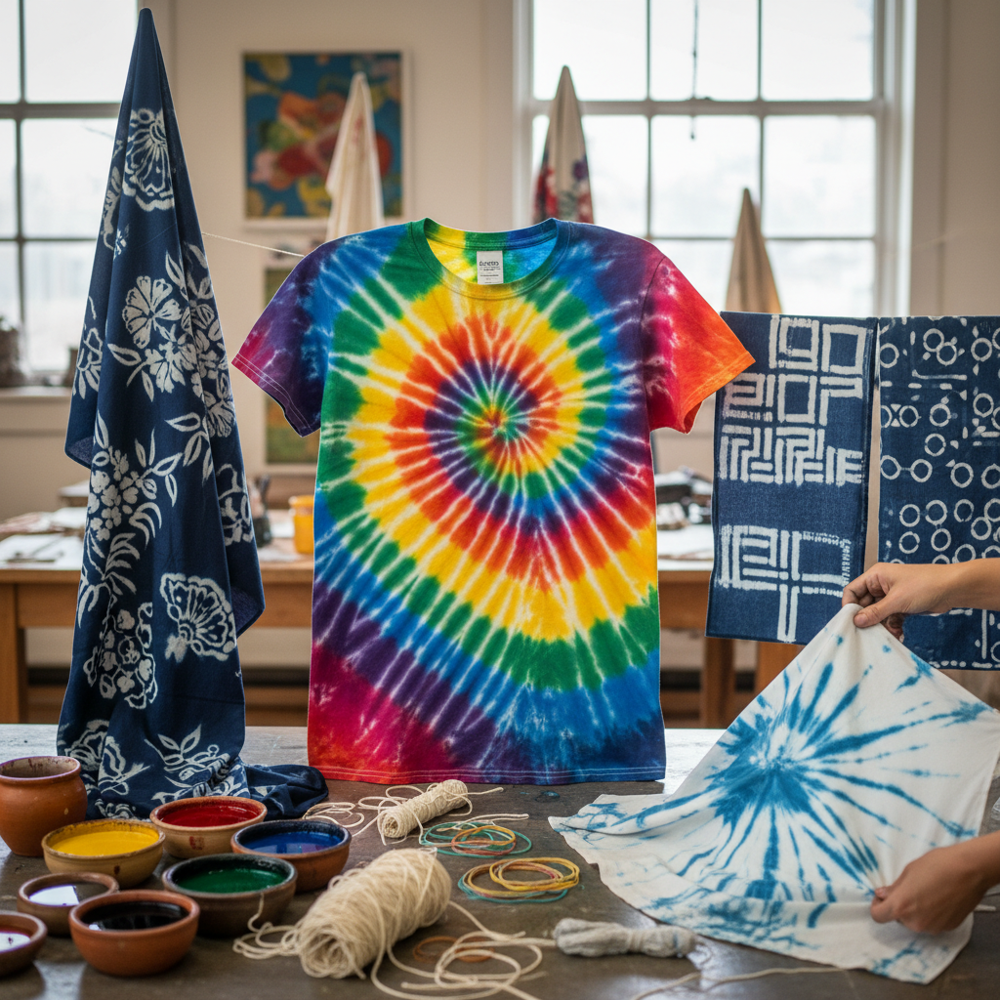

# Tie-Dye 扎染

> "Tie-dye is painting with resistance — where thread binds fabric, color cannot reach, and patterns emerge from absence." — Unknown

## 概述

扎染（Tie-Dye）是通过捆扎、折叠、夹压等方式在织物上创造防染区域，然后浸入染料中，使被束缚的部分不着色而形成图案的染色技法。扎染是"防染"（resist dyeing）技法家族中最直观的一种——通过物理性地阻止染料渗透来创造图案。从日本的绞り（Shibori）到非洲的Adire，从印度的Bandhani到中国的扎染，几乎每个文化都独立发展出了自己的扎染传统。

扎染的哲学在于：约束创造自由——正是因为绳结的束缚，才产生了自由流动的色彩图案；控制与偶然的对话创造出不可预测的美。

## 核心特征

| 特征 | 描述 |
|------|------|
| 防染 | 物理性防染原理 |
| 捆扎 | 通过捆扎创造图案 |
| 浸染 | 浸入染料着色 |
| 偶然 | 结果有偶然性 |
| 唯一 | 每件都独一无二 |
| 简单 | 基本技法简单 |

## 视觉特征

- **放射**：放射状的图案
- **渐变**：色彩的自然渐变
- **对比**：染色与留白的对比
- **有机**：有机的不规则图案
- **鲜艳**：鲜艳的色彩
- **唯一**：每件不同的图案

## 代表作品

| 作品 | 艺术家 | 年代 | 意义 |
|------|--------|------|------|
| *Japanese Shibori* | 匿名 | 传统 | 日本绞染 |
| *Indian Bandhani* | 匿名 | 传统 | 印度扎染 |
| *African Adire* | 匿名 | 传统 | 非洲扎染 |
| *1960s counterculture* | Various | 1960s | 嬉皮文化扎染 |
| *Contemporary tie-dye* | Various | 当代 | 当代扎染艺术 |

## 历史时间线

| 时期 | 事件 |
|------|------|
| 公元前4000年 | 最早的扎染证据（秘鲁） |
| 6-8世纪 | 日本绞染的发展 |
| 传统 | 中国大理白族扎染 |
| 传统 | 印度Bandhani的传统 |
| 1960s | 嬉皮文化中的流行 |
| 当代 | 时尚界的扎染复兴 |

## 中国语境

中国有悠久的扎染传统——云南大理白族扎染是国家级非物质文化遗产，以蓝白两色的靛蓝扎染最为著名。白族扎染使用板蓝根等天然植物染料，图案以蝴蝶、花卉、几何纹样为主。此外，贵州苗族、四川彝族等少数民族也有各自的扎染传统。当代中国的扎染不仅是旅游纪念品，也被时装设计师和纺织艺术家用于当代创作。大理周城被称为"扎染之乡"。

## AI生成概念图

## 与其他风格的关系

- **Shibori** → 日本绞染
- **Batik** → 蜡染（另一种防染）
- **Ikat** → 经纬扎染
- **Resist Dyeing** → 防染技法总称
- **Textile Art** → 纺织艺术
- **Indigo Dyeing** → 靛蓝染色

---

*浮光艺志 | Chronicle of Artistry*
