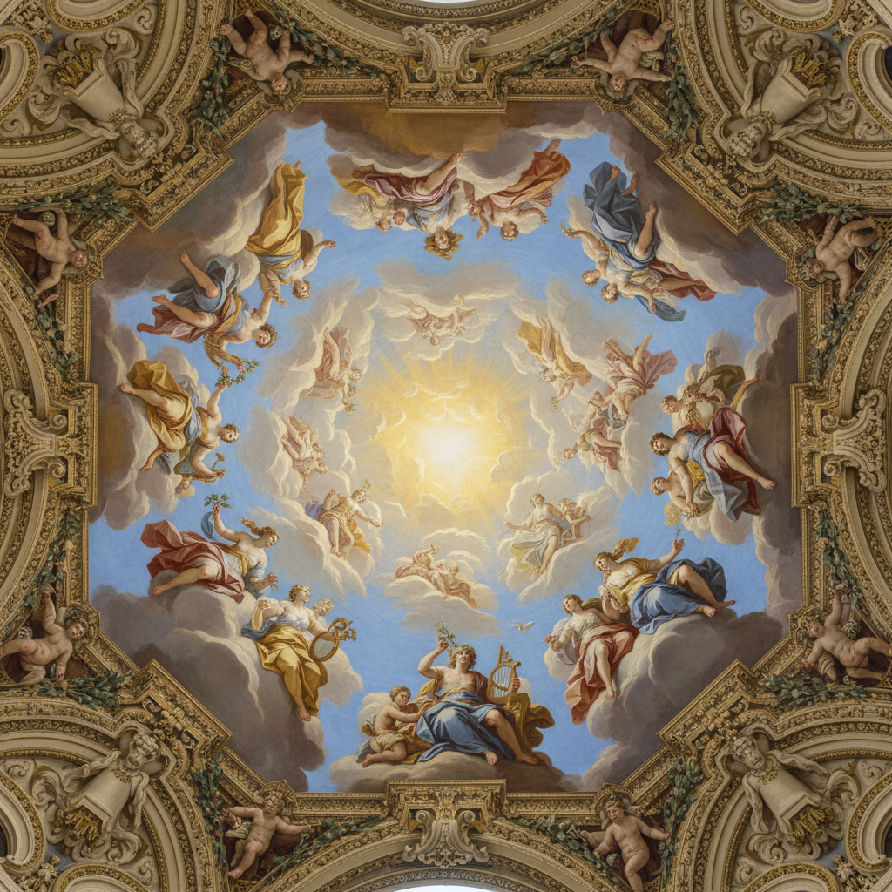

# Giovanni Battista Tiepolo 提埃波罗

> "The painter must try to succeed in what others have not attempted." — G.B. Tiepolo

## 概述

乔瓦尼·巴蒂斯塔·提埃波罗（Giovanni Battista Tiepolo，1696–1770）是意大利威尼斯画派晚期的巨匠，被誉为18世纪最伟大的壁画家。他以天顶画闻名——明亮的色彩、戏剧性的透视、轻盈飘逸的人物在无限天空中翱翔，将巴洛克的宏大与洛可可的优雅完美融合。

## 核心特征

| 特征 | 描述 |
|------|------|
| 天顶幻觉 | 仰视透视创造无限天空 |
| 明亮色彩 | 金色、天蓝、珍珠白的轻盈调性 |
| 飘逸人物 | 在云端飞翔的神话人物 |
| 戏剧构图 | 大胆的对角线和螺旋运动 |
| 光的魔术 | 威尼斯阳光般的透明光辉 |
| 宏大叙事 | 神话、宗教、历史的壮丽场景 |

## 代表作品

| 作品 | 年代 | 意义 |
|------|------|------|
| *Würzburg Residence Ceiling* | 1752–53 | 欧洲最大天顶画之一 |
| *The Banquet of Cleopatra* | 1743–44 | 威尼斯色彩的极致 |
| *Apollo and the Continents* | 1752 | 巴洛克幻觉主义的巅峰 |
| *The Immaculate Conception* | 1767–69 | 宗教画的轻盈升华 |

## AI生成概念图

## 与其他风格的关系

- **Veronese** → 继承威尼斯色彩传统
- **Baroque** → 巴洛克天顶画的最后辉煌
- **Rococo** → 洛可可轻盈优雅的代表
- **Fragonard** → 影响了法国洛可可画家
