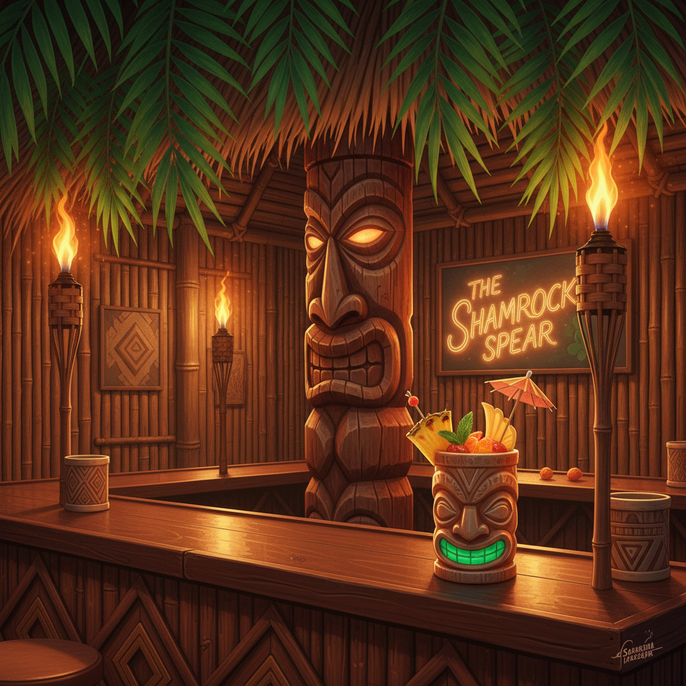

# Tiki 提基文化



> **"竹子、朗姆酒、火山杯——战后美国人想象中的'热带天堂'。"**

## 概述

| 维度 | 描述 |
|------|------|
| 时期 | 1930s–1970s/复兴至今 |
| 别名 | Tiki Culture, Polynesian Pop, Tiki Bar Aesthetic |
| 核心色彩 | 热带绿、竹黄、火山红、海洋蓝、日落橙 |
| 关键元素 | 提基雕像、竹子/藤编、热带花卉、火山杯、波利尼西亚图腾 |
| 代表人物 | Don the Beachcomber, Trader Vic, Shag (Josh Agle) |
| 关联风格 | American Kitsch, Lowbrow Art, Mid-Century Modern, Exotica |

---

## 历史脉络

| 年份 | 事件 |
|------|------|
| 1934 | Don the Beachcomber 开业——第一家Tiki酒吧 |
| 1944 | Trader Vic's——Tiki文化商业化 |
| 1950s | Tiki全盛期——酒吧、餐厅、酒店、家居 |
| 1959 | 夏威夷成为美国第50州——Tiki热潮巅峰 |
| 1970s | Tiki衰落——被视为"过时"和"文化挪用" |
| 1990s | Tiki复兴——怀旧+收藏+亚文化 |
| 2020s | 当代Tiki——反思殖民主义的同时保留美学 |

### 核心哲学

Tiki文化的精神是**"逃离现实——哪怕只是一杯鸡尾酒的时间"**：
- 逃避 = 需要（"战后的美国人需要一个'天堂'"）
- 想象 = 真实（"这不是真正的波利尼西亚——是美国人梦中的波利尼西亚"）
- 氛围 = 一切（"竹子+火把+朗姆酒 = 你已经在热带了"）
- 手工 = 魅力（"每个Tiki杯都是独一无二的雕塑"）
- "Tiki是美国最成功的'氛围设计'——用装饰创造一个完整的世界"

---

## 视觉语法

### 色彩系统

```
主色：
  热带绿 (#228B22) — 棕榈、丛林
  竹黄 (#DAA520) — 竹子、藤编
  火山红 (#B22222) — 火把、岩浆
  海洋蓝 (#006994) — 太平洋

辅色：
  日落橙 (#FF4500) — 黄昏、热带
  花卉粉 (#FF69B4) — 鸡蛋花
  椰子棕 (#8B4513) — 木头、椰壳

规则：
  - 暖色为主
  - 自然材质色
  - 热带饱和度
  - 火光/日落氛围

质感：
  竹子 — 编织、节理
  木雕 — 提基图腾
  藤编 — 家具、装饰
  火光 — 温暖、闪烁
```

### 标志性元素

| 类别 | 元素 |
|------|------|
| 图腾 | 提基雕像、波利尼西亚面具、图腾柱 |
| 植物 | 棕榈树、鸡蛋花、芙蓉花、竹子 |
| 器物 | 火山杯、竹杯、河豚灯、火把 |
| 材料 | 竹子、藤、木头、贝壳、草 |
| 饮品 | 朗姆酒鸡尾酒、伞签、水果装饰 |
| 态度 | 逃避、热带、手工、怀旧、氛围 |

---

## 与千禧怀旧的关系

### Tiki复兴
- 1990s-2020s: Tiki酒吧在全球复兴
- 收藏文化——vintage Tiki杯价值数千美元
- "Tiki是最早的'沉浸式体验设计'"
- 与Lowbrow Art的深度交叉（Shag, Tiki Farm）

### 文化反思
- 当代Tiki面临"文化挪用"的批评
- "如何保留美学魅力同时尊重原住民文化？"
- 从"异国情调"到"设计史研究"的转变

---

## 中国语境

- 中国城市中的Tiki酒吧文化
- 热带度假酒店的Tiki元素
- 与中国"海岛度假"美学的交叉
- 作为"美式复古"的一个分支在中国的流行

---

## 设计应用

| 场景 | 应用方式 |
|------|----------|
| 餐饮 | Tiki酒吧+热带餐厅+鸡尾酒+氛围 |
| 品牌 | 朗姆酒+度假+热带+手工+复古 |
| 家居 | 户外+派对+收藏+装饰 |
| 活动 | 主题派对+音乐节+沉浸式体验 |

---

## 相关风格

← [American Kitsch 美国媚俗](american-kitsch.md) | [Lowbrow Art 低俗艺术](lowbrow-art.md) →

↑ [返回千禧怀旧目录](README.md) | [返回总目录](../README.md)
