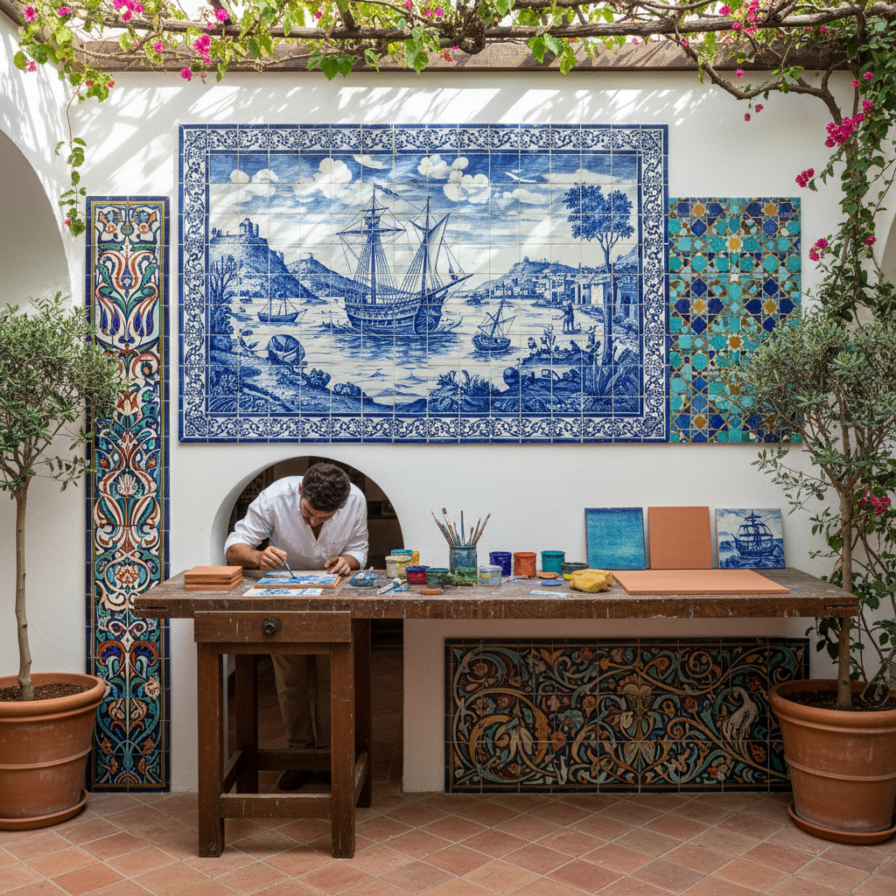

# Tile Art 瓷砖艺术

> "A tile is a pixel made permanent — a single colored square that means nothing alone but everything in combination. Tile by tile, civilizations have written their stories on walls and floors: the geometric infinities of Islamic architecture, the narrative panels of Portuguese azulejos, the Arts and Crafts gardens of William De Morgan, the subway mosaics of New York. Tiles outlast the buildings they decorate, carrying color through centuries." — Unknown

## 概述

瓷砖艺术（Tile Art）是以瓷砖为媒介进行装饰和艺术创作的艺术形式——通过在瓷砖上绘画、雕刻、上釉或将瓷砖组合成图案，创造出装饰性的墙面、地面和建筑表面。瓷砖艺术是伊斯兰建筑、葡萄牙文化和世界各地建筑装饰中最重要的艺术形式之一。

瓷砖艺术的实践包括：1）手绘瓷砖——在瓷砖上手工绘画；2）几何瓷砖——伊斯兰风格的几何图案瓷砖；3）叙事瓷砖——讲述故事的瓷砖壁画（如葡萄牙azulejo）；4）马赛克瓷砖——用小块瓷砖拼贴图案；5）浮雕瓷砖——带有立体浮雕的瓷砖；6）釉彩瓷砖——利用釉料色彩变化的瓷砖；7）当代瓷砖艺术——将瓷砖作为当代艺术媒介的创作。

## 核心特征

| 特征 | 描述 |
|------|------|
| 耐久 | 极其耐久的材料 |
| 色彩 | 釉料的丰富色彩 |
| 重复 | 图案的重复和组合 |
| 建筑 | 与建筑紧密结合 |
| 防水 | 防水防潮的特性 |
| 模块 | 模块化的组合方式 |

## 视觉特征

- **几何**：精确的几何图案
- **色彩**：鲜艳的釉彩色彩
- **重复**：图案的无限重复
- **光泽**：釉面的光泽感
- **网格**：瓷砖的网格结构
- **叙事**：叙事性的图像内容

## 代表作品

| 作品 | 艺术家/地点 | 年代 | 意义 |
|------|-------------|------|------|
| *Alhambra tiles* | 格拉纳达 | 14世纪 | 伊斯兰几何瓷砖 |
| *Portuguese azulejos* | 葡萄牙 | 16世纪至今 | 葡萄牙蓝白瓷砖 |
| *Iznik tiles* | 土耳其 | 15-17世纪 | 伊兹尼克瓷砖 |
| *De Morgan tiles* | William De Morgan | 19世纪 | 工艺美术运动瓷砖 |
| *Subway tile art* | Various | 20世纪至今 | 地铁瓷砖艺术 |

## 历史时间线

| 时期 | 事件 |
|------|------|
| 古代 | 美索不达米亚的釉砖 |
| 中世纪 | 伊斯兰几何瓷砖的发展 |
| 15-17世纪 | 伊兹尼克和葡萄牙瓷砖的黄金时代 |
| 19世纪 | 工艺美术运动的瓷砖复兴 |
| 当代 | 瓷砖作为当代艺术媒介 |

## 中国语境

瓷砖艺术在中国有独特的发展脉络——中国是瓷器的发源地，但中国传统建筑中瓷砖的使用方式与伊斯兰和欧洲有所不同。中国传统建筑中的琉璃瓦和琉璃砖是中国特有的瓷砖艺术形式——故宫的九龙壁就是琉璃砖艺术的杰作。中国的瓷砖产业是世界上最大的——佛山是全球最大的瓷砖生产基地。中国当代的一些艺术家和设计师在探索瓷砖的艺术化——将传统青花瓷的美学融入现代瓷砖设计。中国的地铁系统中也开始出现瓷砖艺术——一些城市的地铁站用瓷砖壁画展示当地文化和历史。中国的建筑陶瓷设计正在从纯功能性向艺术性转变——越来越多的设计师将瓷砖视为建筑表面的艺术画布。

## AI生成概念图

## 与其他风格的关系

- **Mosaic Art** → 马赛克艺术
- **Islamic Art** → 伊斯兰艺术
- **Ceramic Art** → 陶瓷艺术
- **Architectural Decoration** → 建筑装饰
- **Pattern Design** → 图案设计
- **Azulejo** → 葡萄牙瓷砖

---

*浮光艺志 | Chronicle of Artistry*
