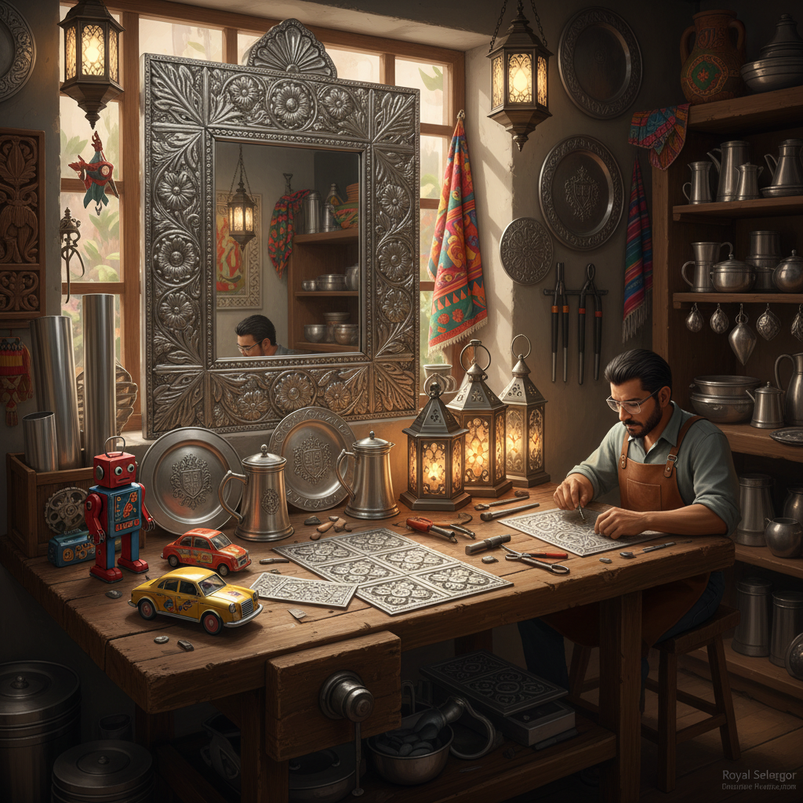

# Tin Art 锡艺术

> "Tin is the democratic metal — soft enough to work with simple tools, bright enough to catch the light, cheap enough for common use, yet capable of extraordinary beauty in skilled hands. From Mexican tin mirrors to Malaysian pewter, from tin ceiling tiles to tin toys, this humble metal has been shaped into art by cultures around the world, proving that preciousness is not a prerequisite for beauty." — Unknown

## 概述

锡艺术（Tin Art）是以锡或锡合金（如白铁皮、马口铁、锡箔、白镴）为主要材料进行艺术创作的实践——利用锡的柔软性、可塑性、银白色光泽和低熔点创造各种艺术形式。锡艺术是一种亲民的金属艺术，在世界各地的民间传统中都有重要地位。

锡艺术的实践包括：1）锡箔浮雕——在锡箔上压制浮雕图案；2）马口铁工艺——用镀锡铁皮制作装饰品和器皿；3）锡铸造——用锡铸造小型雕塑和器皿；4）白镴器——用锡合金（pewter）制作的器皿和装饰品；5）锡天花板——装饰性的压花锡天花板瓦片；6）墨西哥锡艺——墨西哥传统的锡镜框和装饰品；7）锡玩具——用马口铁制作的玩具（锡兵等）。

## 核心特征

| 特征 | 描述 |
|------|------|
| 柔软 | 极其柔软易加工 |
| 银白 | 银白色的光泽 |
| 亲民 | 材料廉价易得 |
| 可塑 | 可压制、可铸造 |
| 防腐 | 良好的防腐性 |
| 低熔 | 低熔点易铸造 |

## 视觉特征

- **银白**：锡的银白色光泽
- **反射**：抛光后的反射效果
- **浮雕**：压制的浮雕图案
- **民间**：民间艺术的质朴感
- **几何**：压花的几何图案
- **复古**：复古的视觉风格

## 代表作品

| 作品 | 艺术家 | 年代 | 意义 |
|------|--------|------|------|
| *Mexican tin mirrors* | 墨西哥传统 | 殖民时期至今 | 墨西哥锡镜 |
| *Pewter vessels* | 欧洲传统 | 中世纪至今 | 白镴器皿 |
| *Tin ceiling tiles* | 美国传统 | 19世纪至今 | 锡天花板 |
| *Tin toys* | 德国/日本传统 | 19-20世纪 | 锡玩具 |
| *Malaysian pewter* | 马来西亚传统 | 19世纪至今 | 马来西亚锡器 |

## 历史时间线

| 时期 | 事件 |
|------|------|
| 青铜时代 | 锡作为青铜合金成分 |
| 中世纪 | 白镴器皿的流行 |
| 19世纪 | 马口铁工业化生产 |
| 殖民时期 | 墨西哥锡艺的发展 |
| 当代 | 锡作为当代艺术材料 |

## 中国语境

锡艺术在中国有悠久的历史。中国云南个旧是世界著名的"锡都"，有两千多年的锡矿开采历史。中国传统的锡器制作以精美著称——锡茶叶罐、锡酒壶、锡烛台等都是传统锡艺的代表。中国的"打锡"工艺——用锤打和焊接技法制作锡器——在福建、广东等地有悠久传统。中国潮汕地区的锡器制作已被列入非物质文化遗产。中国当代的锡艺术家将传统锡器工艺与现代设计结合，创作出融合传统美学与当代审美的锡艺术品。马来西亚的皇家雪兰莪（Royal Selangor）锡器品牌也与中国锡矿工人的历史有深厚渊源。

## AI生成概念图

## 与其他风格的关系

- **Metal Art** → 金属艺术
- **Folk Art** → 民间艺术
- **Pewter Art** → 白镴艺术
- **Copper Art** → 铜艺术
- **Craft Art** → 工艺美术
- **Industrial Art** → 工业艺术

---

*浮光艺志 | Chronicle of Artistry*
