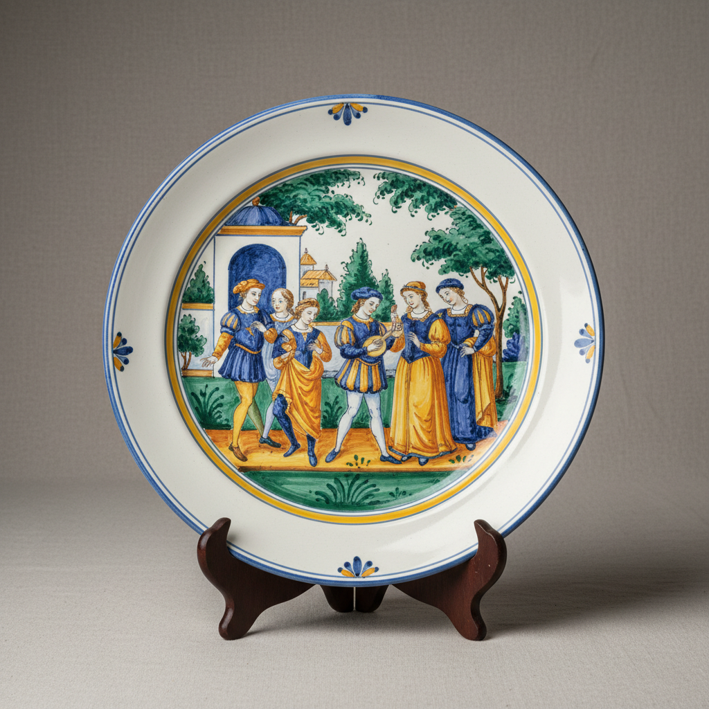

# Tin Glaze Art 锡釉艺术

> "Tin glaze is opacity's gift to ceramics — a white opaque surface created by adding tin oxide to a lead glaze, transforming rough earthenware into a blank canvas as white as paper, ready to receive painted decoration in the brilliant colors of metallic oxides, the technique that gave birth to majolica, faience, and delftware, a single chemical innovation that changed the face of European ceramics forever." — Unknown

## 概述

锡釉艺术（Tin Glaze Art）是一种在铅釉中添加氧化锡使釉面变为不透明白色的陶瓷釉料技术和装饰艺术。锡釉的发明是陶瓷史上最重要的技术突破之一——它使得粗糙的陶器表面获得了如同白纸般的不透明白色底色，为在其上进行彩绘装饰提供了完美的画布。锡釉技术催生了伊斯兰陶瓷、意大利马约利卡、法国法恩斯和荷兰代尔夫特等辉煌的陶瓷传统。

锡釉艺术的核心要素包括：1）不透明白色——氧化锡产生的白色；2）彩绘画布——为彩绘提供白色底色；3）伊斯兰起源——源自伊斯兰世界；4）欧洲传播——传入欧洲后的繁荣；5）多种传统——马约利卡法恩斯代尔夫特；6）金属氧化物彩绘——钴铜锰等金属彩绘；7）技术革命——改变了陶瓷装饰的可能性。

## 核心特征

| 特征 | 描述 |
|------|------|
| 不透明白色 | 氧化锡的白色 |
| 彩绘画布 | 白色底色画布 |
| 伊斯兰起源 | 源自伊斯兰世界 |
| 欧洲传播 | 欧洲的繁荣发展 |
| 多种传统 | 多个地区传统 |
| 技术革命 | 改变装饰可能性 |

## 视觉特征

- **白色底色**：不透明的白色釉面
- **彩绘装饰**：鲜艳的彩绘图案
- **蓝白为主**：蓝色彩绘最为常见
- **手绘笔触**：可见的手绘笔触
- **釉面质感**：略带粗糙的釉面质感
- **色彩鲜艳**：金属氧化物的鲜艳色彩

## 代表作品

| 作品 | 艺术家/文化 | 年代 | 意义 |
|------|-------------|------|------|
| *伊斯兰锡釉陶* | 伊斯兰世界 | 9世纪起 | 锡釉的起源 |
| *意大利马约利卡* | 意大利 | 15-16世纪 | 欧洲锡釉的辉煌 |
| *法国法恩斯* | 法国 | 16-18世纪 | 法国锡釉传统 |
| *荷兰代尔夫特* | 荷兰 | 17世纪 | 蓝白锡釉的经典 |
| *西班牙锡釉* | 西班牙 | 各时期 | 伊比利亚传统 |

## 历史时间线

| 时期 | 事件 |
|------|------|
| 9世纪 | 伊斯兰世界发明锡釉 |
| 13世纪 | 锡釉传入西班牙和意大利 |
| 15-16世纪 | 意大利马约利卡的辉煌 |
| 17世纪 | 荷兰代尔夫特的繁荣 |
| 18世纪 | 锡釉逐渐被瓷器取代 |

## 中国语境

锡釉技术虽然不是中国的发明，但中国陶瓷对锡釉陶器的发展有深远的间接影响。伊斯兰世界发明锡釉的动机之一就是模仿中国白瓷的外观——在无法获得瓷土的情况下，用锡釉使陶器表面变白。荷兰代尔夫特陶器更是直接模仿中国青花瓷——其蓝白装饰风格完全受中国瓷器的启发。中国瓷器通过贸易传入欧洲后，激发了欧洲陶工用锡釉技术模仿中国瓷器的热潮。这种文化交流是双向的——中国的"克拉克瓷"等外销瓷也受到了伊斯兰和欧洲装饰风格的影响。锡釉陶器的历史证明了中国陶瓷对世界陶瓷发展的深远影响。

## AI生成概念图

## 与其他风格的关系

- **Majolica** → 马约利卡
- **Faience** → 法恩斯
- **Delftware** → 代尔夫特
- **Islamic Ceramics** → 伊斯兰陶瓷
- **Blue and White** → 青花
- **Lead Glaze** → 铅釉

---

*浮光艺志 | Chronicle of Artistry*
