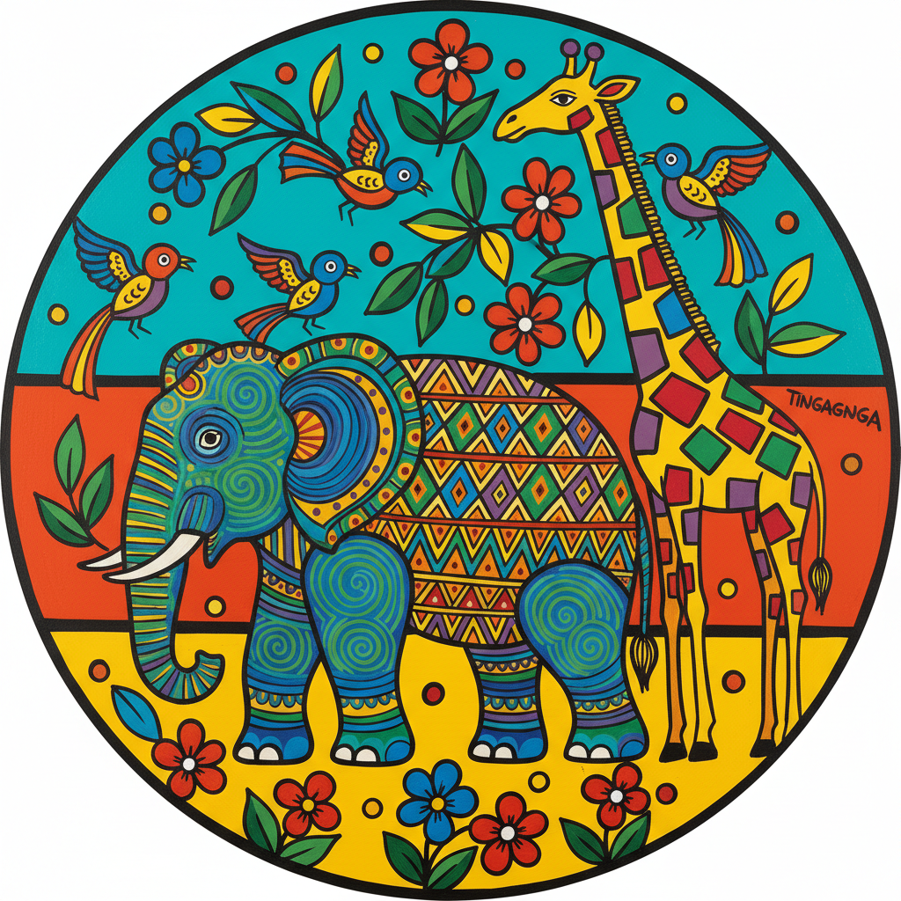

# Tingatinga 廷加廷加绘画

> **"用自行车漆画出非洲的灵魂——坦桑尼亚街头诞生的艺术运动。"**

## 概述

廷加廷加绘画（Tingatinga Art）是坦桑尼亚最著名的当代民间绘画流派，由Edward Said Tingatinga（1932–1972）于1960年代末在达累斯萨拉姆创立。Tingatinga用廉价的自行车珐琅漆在硬纸板上作画，以鲜艳的色彩和简化的动物形象描绘东非的野生动物和日常生活。尽管创始人在1972年被警察误杀，年仅40岁，但他的学生和追随者将这一风格发展成为坦桑尼亚最重要的文化出口之一。

## 核心特征

- **自行车漆**：使用廉价的珐琅漆（后改用丙烯）
- **鲜艳色彩**：高饱和度的蓝、绿、红、黄
- **动物主题**：非洲野生动物的程式化描绘
- **装饰性填充**：动物身体内部填满点、线、花纹
- **平面化**：无透视深度，装饰性优先
- **正面/侧面**：动物多为侧面，眼睛正面
- **单色背景**：通常是纯色或渐变背景

## 常见题材

| 题材 | 特征 |
|------|------|
| 非洲动物 | 大象、长颈鹿、狮子、斑马 |
| 鸟类 | 色彩斑斓的热带鸟 |
| 海洋生物 | 鱼、章鱼、海龟 |
| 村庄生活 | 日常场景、市场 |
| 精灵世界 | Shetani（精灵/恶魔）形象 |
| 风景 | 乞力马扎罗山、草原 |

## 视觉特征

- 鲜艳饱和的珐琅漆色彩
- 动物身体内的装饰性图案填充
- 简化但富有表现力的动物造型
- 纯色或渐变的背景
- 大眼睛的正面凝视
- 欢快乐观的整体氛围

## 与其他风格的关系

| 风格 | 关系 |
|------|------|
| 素人艺术/Art Naïf | 共享非学院派的直觉表达 |
| Gond Art（印度） | 共享动物内部的装饰性填充 |
| 海地绘画 | 共享加勒比/非洲裔民间绘画传统 |
| Pop Art | 共享鲜艳色彩和大众化 |
| 当代非洲艺术 | Tingatinga是非洲当代艺术市场的先驱 |

## 概念图

---

*浮光艺志 | Chronicle of Artistry*
