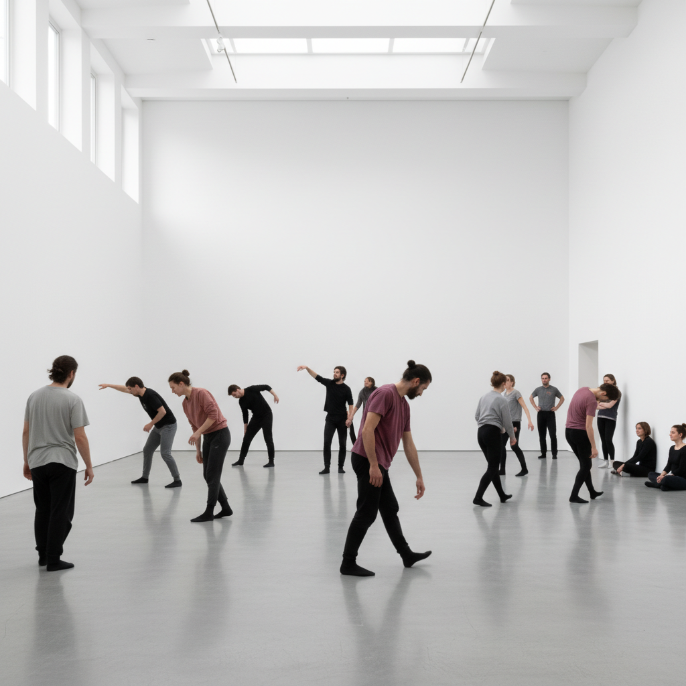

# Tino Sehgal 蒂诺·塞加尔

> **时期：** 1976–至今  
> **关键词：** 构建情境、无物质艺术、活体雕塑、口头传递

## 概述

Tino Sehgal 是英德双籍艺术家，以完全非物质的艺术作品闻名。他的作品没有任何物理痕迹——没有标签、没有目录、没有照片记录、没有书面合同——只有活人在展厅中执行的"构建情境"：唱歌、对话、舞蹈、亲吻。

## 风格特征

- **零物质**：不产生任何物理对象或文档
- **口头传递**：作品通过口头指令传授给表演者
- **构建情境**：观众进入时触发表演者的行动
- **对话性**：许多作品邀请观众参与对话
- **反商品**：拒绝艺术的商品化和档案化

## 代表作品

- *This is propaganda*（2002）
- *Kiss*（2002）
- *This progress*（2006）
- *These Associations*（2012，泰特涡轮大厅）

## 概念图

